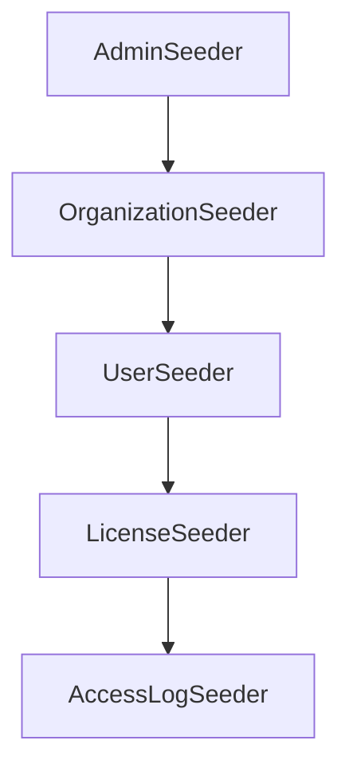

# 数据库种子脚本使用指南

## 概述

数据库种子脚本用于初始化系统必要的基础数据和测试数据。经过重构的种子脚本系统具有清晰的模块化架构、统一的接口和灵活的配置选项，支持不同环境下的数据生成需求。

## 目录

- [核心特性](#核心特性)
- [快速开始](#快速开始)
- [命令详解](#命令详解)
- [使用场景](#使用场景)
- [环境变量配置](#环境变量配置)
- [架构说明](#架构说明)
- [最佳实践](#最佳实践)
- [故障排除](#故障排除)

## 核心特性

### 🎯 模块化设计

- **单一职责**：每个种子脚本负责特定领域的数据
- **依赖管理**：自动处理数据生成的依赖顺序
- **错误隔离**：单个模块失败不影响其他模块

### 🚀 智能执行

- **环境感知**：根据环境自动调整数据生成策略
- **增量更新**：避免重复创建已存在的数据
- **完整性验证**：自动验证生成数据的完整性

### 🛠️ 灵活配置

- **命令行接口**：丰富的命令和选项支持
- **环境变量**：支持通过环境变量自定义配置
- **批量处理**：支持批量创建和清理操作

## 快速开始

### 创建完整数据集

```bash
# 根据当前环境自动生成完整数据
pnpm db:seed

# 或明确指定完整模式
pnpm db:seed full
```

### 仅创建必要数据

```bash
# 创建管理员账号
pnpm db:seed:admin

# 创建组织和部门结构
pnpm db:seed:org
```

### 开发环境快速设置

```bash
# 快速生成开发环境数据
pnpm db:quick

# 生成指定数量的数据
pnpm db:seed user --count 50
```

### 查看数据状态

```bash
# 查看当前数据统计
pnpm db:seed:stats

# 验证数据完整性
pnpm db:seed:validate
```

## 命令详解

### 基础命令

| 命令                   | 描述                       | 示例                   |
| ---------------------- | -------------------------- | ---------------------- |
| `pnpm db:seed`         | 执行完整的种子脚本（默认） | `pnpm db:seed`         |
| `pnpm db:seed:admin`   | 仅创建管理员账号           | `pnpm db:seed:admin`   |
| `pnpm db:seed:org`     | 仅创建组织和部门           | `pnpm db:seed:org`     |
| `pnpm db:seed:user`    | 仅创建用户数据             | `pnpm db:seed:user`    |
| `pnpm db:seed:license` | 仅创建授权码数据           | `pnpm db:seed:license` |
| `pnpm db:seed:logs`    | 仅创建访问日志数据         | `pnpm db:seed:logs`    |

### 环境特定命令

| 命令                | 描述             | 示例                |
| ------------------- | ---------------- | ------------------- |
| `pnpm db:seed:dev`  | 开发环境完整数据 | `pnpm db:seed:dev`  |
| `pnpm db:seed:test` | 测试环境数据     | `pnpm db:seed:test` |
| `pnpm db:seed:prod` | 生产环境最小数据 | `pnpm db:seed:prod` |

### 管理命令

| 命令                    | 描述                           | 示例                    |
| ----------------------- | ------------------------------ | ----------------------- |
| `pnpm db:seed:clean`    | 清理所有测试数据（保留管理员） | `pnpm db:seed:clean`    |
| `pnpm db:seed:stats`    | 显示数据统计信息               | `pnpm db:seed:stats`    |
| `pnpm db:seed:validate` | 验证数据完整性                 | `pnpm db:seed:validate` |
| `pnpm db:quick`         | 快速生成开发数据               | `pnpm db:quick`         |

### 高级选项

```bash
# 自定义数据数量
pnpm db:seed user --count 100

# 强制执行（忽略已存在数据）
pnpm db:seed --force

# 不创建预设数据
pnpm db:seed --no-presets

# 生成真实访问模式
pnpm db:seed full --realistic

# 清理包括管理员在内的所有数据
pnpm db:seed clean --no-preserve-admin

# 静默执行
pnpm db:seed --silent

# 显示帮助信息
pnpm db:seed --help
```

## 使用场景

### 🏗️ 项目初始化

```bash
# 首次部署系统
pnpm db:init
pnpm db:seed:prod  # 生产环境
# 或
pnpm db:seed:dev   # 开发环境
```

### 🧪 开发调试

```bash
# 清理并重新生成开发数据
pnpm db:seed:clean
pnpm db:quick

# 添加更多测试用户
pnpm db:seed user --count 20

# 生成真实访问模式进行测试
pnpm db:seed logs --realistic
```

### 🔍 测试准备

```bash
# 准备测试环境
pnpm db:seed:test

# 验证测试数据
pnpm db:seed:validate
```

### 📊 数据分析

```bash
# 查看当前数据分布
pnpm db:seed:stats

# 生成大量数据进行性能测试
pnpm db:seed full --count 1000
```

## 环境变量配置

### 管理员账号配置

| 环境变量         | 说明           | 默认值              |
| ---------------- | -------------- | ------------------- |
| `ADMIN_EMAIL`    | 管理员邮箱     | `admin@example.com` |
| `ADMIN_PASSWORD` | 管理员密码     | `Admin@123`         |
| `ADMIN_NAME`     | 管理员显示名称 | `系统管理员`        |

### 执行行为配置

| 环境变量       | 说明         | 默认值        |
| -------------- | ------------ | ------------- |
| `NODE_ENV`     | 运行环境     | `development` |
| `AUTO_CONFIRM` | 自动确认操作 | `false`       |

### 配置示例

```bash
# .env 文件配置
ADMIN_EMAIL=admin@yourcompany.com
ADMIN_PASSWORD=SecurePassword123
ADMIN_NAME=技术总监
NODE_ENV=development
AUTO_CONFIRM=true

# 使用自定义配置运行
pnpm db:seed
```

## 架构说明

### 目录结构

```
src/prisma/seeds/
├── core/                    # 核心抽象和类型定义
│   ├── base-factory.ts      # 数据工厂基类
│   ├── base-seeder.ts       # 种子脚本基类
│   └── types.ts             # 类型定义
├── factories/               # 数据工厂（数据生成逻辑）
│   ├── access-log.factory.ts
│   ├── department.factory.ts
│   ├── license.factory.ts
│   ├── organization.factory.ts
│   └── user.factory.ts
├── seeders/                 # 种子脚本（业务逻辑）
│   ├── admin.seeder.ts
│   ├── organization.seeder.ts
│   ├── user.seeder.ts
│   ├── license.seeder.ts
│   └── access-log.seeder.ts
├── utils/                   # 工具类
│   └── cli.util.ts
├── main.ts                  # 主入口脚本
└── orchestrator.ts          # 执行编排器
```

### 核心组件

#### BaseSeeder

- 提供统一的种子脚本接口
- 标准化的错误处理和日志记录
- 自动的前置/后置验证

#### SeedOrchestrator

- 管理种子脚本的执行顺序
- 处理脚本间的依赖关系
- 提供批量操作和统计功能

#### Factory Classes

- 负责具体的数据生成逻辑
- 支持批量创建和错误重试
- 提供数据完整性验证

### 依赖关系



## 最佳实践

### 🎯 环境策略

**生产环境**

- 仅创建必要的基础数据
- 使用 `pnpm db:seed:prod`
- 避免创建大量测试数据

**开发环境**

- 创建丰富的测试数据
- 使用 `pnpm db:seed:dev` 或 `pnpm db:quick`
- 定期清理和重新生成数据

**测试环境**

- 创建标准化的测试数据集
- 使用 `pnpm db:seed:test`
- 确保数据的一致性和可重复性

### 🔄 日常开发流程

```bash
# 1. 初始化开发环境
pnpm dev:db
pnpm db:seed:dev

# 2. 日常开发中添加测试数据
pnpm db:seed user --count 10

# 3. 需要重新开始时
pnpm db:seed:clean
pnpm db:quick

# 4. 检查数据状态
pnpm db:seed:stats
```

### 📋 数据管理

- **定期备份**：重要数据生成前备份现有数据
- **版本控制**：种子脚本变更要进行版本控制
- **文档更新**：新增种子脚本要更新使用文档
- **测试验证**：种子脚本修改后要进行充分测试

## 故障排除

### 常见问题

**Q: 种子脚本执行失败，显示"数据库连接失败"**

A: 检查数据库服务状态和连接配置：

```bash
# 检查数据库服务
pnpm db:dev:up

# 验证连接
pnpm prisma db push
```

**Q: 管理员账号创建失败**

A: 检查环境变量配置和数据库约束：

```bash
# 查看当前配置
echo $ADMIN_EMAIL
echo $ADMIN_NAME

# 清理后重新创建
pnpm db:seed:clean --no-preserve-admin
pnpm db:seed:admin
```

**Q: 数据验证失败**

A: 运行完整性检查和数据统计：

```bash
# 检查数据状态
pnpm db:seed:stats
pnpm db:seed:validate

# 重新生成有问题的数据
pnpm db:seed [specific-seeder] --force
```

**Q: 种子脚本执行很慢**

A: 优化执行策略：

```bash
# 使用快速模式
pnpm db:quick

# 减少数据量
pnpm db:seed user --count 10

# 跳过预设数据
pnpm db:seed --no-presets
```

### 调试技巧

**启用详细日志**

```bash
# 查看详细执行过程
DEBUG=* pnpm db:seed

# 不使用静默模式
pnpm db:seed --no-silent
```

**分步执行**

```bash
# 逐个执行种子脚本
pnpm db:seed:admin
pnpm db:seed:org
pnpm db:seed:user
```

**数据检查**

```bash
# 查看数据库内容
pnpm prisma:studio

# 检查特定表
pnpm db:seed:stats
```
