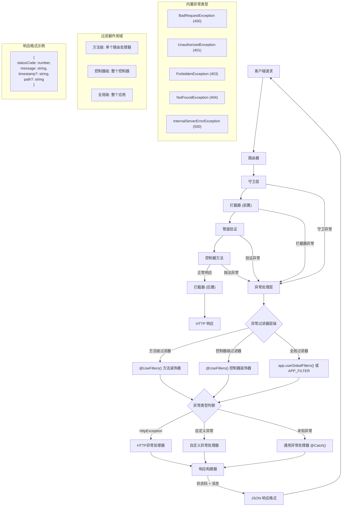

# 异常过滤器

Nest 提供了完善的**异常处理机制**，用于统一捕获并处理应用中未显式处理的异常。当业务逻辑中抛出的异常未被捕获时，Nest 会自动拦截该异常，并生成格式化的响应返回给客户端，从而提高了系统的健壮性和用户体验。



这一机制的默认实现由框架内置的**全局异常过滤器**（Global Exception Filter）负责，它专门处理 `HttpException` 及其所有子类的异常。如果抛出的异常不是 `HttpException` 类型，框架将退回至默认的处理策略，返回以下格式的标准 JSON 响应：

```json
{
  "statusCode": 500,
  "message": "Internal server error"
}
```

Nest 对第三方库 `http-errors` 提供了有限的兼容性支持，只要异常对象中包含 `statusCode` 和 `message` 这两个属性，框架就能提取这些信息并构造对应的响应。否则，系统将回退至默认的 `InternalServerErrorException` 处理策略。

## 抛出标准异常

Nest 提供了内置的 `HttpException` 类（由 `@nestjs/common` 模块导出），用于在处理 HTTP 请求时统一返回结构化的错误响应。在开发 RESTful 或 GraphQL API 时，推荐使用该类抛出符合 HTTP 规范的异常，以实现一致且可预测的错误处理机制。

以下是一个基于 `CatsController` 中 `findAll()` 方法的示例。假设由于某种原因，该方法需要返回一个「禁止访问」的错误，可以按如下方式处理：

```ts filename='cats.controller.ts'
@Get()
async findAll() {
  throw new HttpException('禁止访问', HttpStatus.FORBIDDEN)
}
```

<CalloutInfo>
  `HttpStatus` 是由 `@nestjs/common` 提供的枚举类型，用于语义化地表示常见的 HTTP
  状态码，例如 `HttpStatus.OK`（200）、`HttpStatus.FORBIDDEN`（403）等。
</CalloutInfo>

当客户端调用上述接口时，返回的响应体如下：

```json
{
  "statusCode": 403,
  "message": "禁止访问"
}
```

### `HttpException` 的构造函数参数

`HttpException` 构造函数接收两个必填参数：

- `response`：定义返回给客户端的响应体内容，可以是字符串或对象。
- `status`：HTTP 状态码，建议使用 `HttpStatus` 枚举值来增强代码的可维护性。

Nest 会基于这两个参数自动生成如下格式的响应结构：

- `statusCode`：即 `status` 指定的 HTTP 状态码。
- `message`：如果 `response` 为字符串，则作为该字段的值；如果为对象，则会尝试根据状态码生成默认信息。

你可以仅传入字符串（如 `'Forbidden'`）来设置简单的错误消息，也可以传入一个对象，自定义完整的响应结构。

### 自定义响应体与错误根因

`HttpException` 构造函数支持传入第三个参数 `options`，其中可以包含一个 `cause` 字段，用于记录触发该异常的原始错误。该字段不会出现在最终的响应体中，但非常适合用于日志记录和错误追踪。

示例如下：

```ts filename='cats.controller.ts'
@Get()
async findAll() {
  try {
    await this.service.findAll()
  } catch (error) {
    throw new HttpException(
      {
        status: HttpStatus.FORBIDDEN,
        error: '这是一条自定义错误消息',
      },
      HttpStatus.FORBIDDEN,
      { cause: error },
    )
  }
}
```

上述代码中，我们自定义了异常的响应体结构，并通过 `cause` 保留了原始错误信息，便于后续的日志记录和问题排查。实际返回结果如下：

```json
{
  "status": 403,
  "error": "这是一条自定义错误消息"
}
```

## 异常日志记录

在默认配置下，Nest 提供的全局异常过滤器不会将框架内置的异常（如 `HttpException` 及其子类）输出到控制台。这类异常通常代表可预期的业务错误，因此不会被视为系统级错误进行记录。同样，协议层的异常（如 `WsException` 和 `RpcException`）也不会被自动记录。

这类异常最终都继承自 `@nestjs/common` 包中导出的抽象基类 `IntrinsicException`。Nest 正是借助这一继承体系来区分**可预期异常**与**非预期异常**，从而决定是否需要记录日志。

如果你希望将这些可预期异常也记录到日志中，可以通过自定义异常过滤器的方式实现。具体的实现步骤将在下一节中介绍。

## 自定义异常

在绝大多数场景中，Nest 提供的内置 HTTP 异常类已经能够满足常规需求，只有在需要表达更细致的业务语义，或携带额外的元数据时，才建议实现自定义异常类。

为保持异常结构的一致性，建议定义一套符合业务语义的异常类体系，并统一继承自 `HttpException`。如此一来，Nest 的内建异常处理机制便可自动识别并格式化这些异常的响应内容，无需额外配置。

例如，定义一个代表「禁止访问」的异常类：

```ts filename='forbidden.exception.ts'
export class ForbiddenException extends HttpException {
  constructor() {
    super('Forbidden', HttpStatus.FORBIDDEN)
  }
}
```

由于 `ForbiddenException` 继承自 `HttpException`，它能够被框架的内置异常处理器正确识别和格式化，因此我们可以直接在控制器方法中抛出该异常：

```ts filename='cats.controller.ts'
@Get()
async findAll() {
  throw new ForbiddenException()
}
```

当异常被抛出后，Nest 会自动返回相应的 HTTP 响应（包括状态码和错误信息），并根据配置的日志策略记录相关信息，无需额外手动处理。

## 内置 HTTP 异常类

Nest 提供了一组内置的标准 HTTP 异常类，它们均继承自基础类 `HttpException`，并由 `@nestjs/common` 包导出。这些异常类对应常见的 HTTP 状态码，便于在应用中快速抛出语义明确的错误响应。常用异常类包括但不限于：

- `BadRequestException`
- `UnauthorizedException`
- `NotFoundException`
- `ForbiddenException`
- `NotAcceptableException`
- `RequestTimeoutException`
- `ConflictException`
- `GoneException`
- `HttpVersionNotSupportedException`
- `PayloadTooLargeException`
- `UnsupportedMediaTypeException`
- `UnprocessableEntityException`
- `InternalServerErrorException`
- `NotImplementedException`
- `ImATeapotException`
- `MethodNotAllowedException`
- `BadGatewayException`
- `ServiceUnavailableException`
- `GatewayTimeoutException`
- `PreconditionFailedException`

这些异常类的构造函数中支持传入一个 `options` 参数，用于同时指定异常的 `cause`（错误原因）和 `description`（描述信息）。例如：

```ts
throw new BadRequestException('发生了一些错误', {
  cause: new Error(),
  description: '错误描述信息',
})
```

上述代码会返回以下结构的 HTTP 响应体：

```json
{
  "message": "发生了一些错误",
  "error": "错误描述信息",
  "statusCode": 400
}
```

通过使用内置异常类，你可以更规范地表达服务中的错误状态。

## 异常过滤器

Nest 内置的异常过滤器已覆盖绝大多数常见异常处理场景，但在某些特殊情况下，你可能需要更**精细化**的控制，比如需要自定义日志记录或根据运行环境返回差异化的 JSON 响应。这时，自定义异常过滤器就能派上用场了，它可以让你精准掌控异常处理逻辑及最终返回给客户端的响应格式。

以下示例展示了一个用于捕获 `HttpException` 的自定义异常过滤器，并演示了如何手动定义响应内容。为了实现这一目标，我们需要获取底层平台的原始 `Request` 和 `Response` 对象：

- `Request` 可用于提取请求路径、方法等信息，便于记录日志。
- `Response` 则用于自定义响应结构，通过 `response.json()` 方法返回数据。

```ts filename='http-exception.filter.ts'
import {
  ArgumentsHost,
  ExceptionFilter,
  Catch,
  HttpException,
} from '@nestjs/common'
import type { Request, Response } from 'express'

@Catch(HttpException)
export class HttpExceptionFilter implements ExceptionFilter {
  catch(exception: HttpException, host: ArgumentsHost) {
    const ctx = host.switchToHttp()
    const response = ctx.getResponse<Response>()
    const request = ctx.getRequest<Request>()

    const status = exception.getStatus()

    response.status(status).json({
      statusCode: status,
      timestamp: new Date().toISOString(),
      path: request.url,
    })
  }
}
```

所有异常过滤器都需实现通用接口 `ExceptionFilter<T>`，并定义 `catch(exception: T, host: ArgumentsHost)` 方法，其中泛型参数 `T` 表示要捕获的异常类型。

装饰器 `@Catch(HttpException)` 用于标注当前过滤器专门处理 `HttpException` 类型的异常。你也可以传入多个异常类（以逗号分隔），让过滤器支持处理多种异常类型。

<CalloutInfo type="warning" title="平台差异">
  如果你使用的是 `@nestjs/platform-fastify`，应将 `response.json()` 替换为
  `response.send()`，并确保引入自 `fastify` 的正确类型定义。
</CalloutInfo>

### `ArgumentsHost` 参数

在 `catch()` 方法中，我们通常会接收两个参数：

- `exception`：表示当前捕获到的异常对象；
- `host`：一个 `ArgumentsHost` 实例，用于封装请求上下文信息。

`ArgumentsHost` 是由 Nest 提供的通用上下文适配器，可统一处理多种运行环境（如 HTTP、微服务、WebSocket 等）下的参数访问逻辑，从而构建可跨多场景复用的异常过滤器。关于其原理和应用，我们会在[执行上下文](/fundamentals/execution-context)章节中展开讲解。

在本示例中，我们通过 `host` 对象，获取到原始控制器方法中传入的 `Request` 和 `Response` 对象。得益于 `ArgumentsHost` 提供的便捷辅助方法，这一操作简单直观。

## 绑定异常过滤器

要将自定义的异常过滤器应用到特定的路由处理方法中，可使用 `@UseFilters()` 装饰器。例如，将自定义的 `HttpExceptionFilter` 绑定到 `CatsController` 的 `create()` 方法：

```ts filename='cats.controller.ts'
import { UseFilters } from '@nestjs/common'

@Post()
@UseFilters(new HttpExceptionFilter())
async create(@Body() createCatDto: CreateCatDto) {
  throw new ForbiddenException()
}
```

`@UseFilters()` 接收一个或多个异常过滤器的**实例**，多个实例可通过逗号分隔传入。上述示例中，我们直接传入了 `HttpExceptionFilter` 的实例。

实际上，也可以**传入过滤器类本身**，而非其实例。此时，Nest 会自动完成实例化，并支持依赖注入：

```ts filename='cats.controller.ts'
@Post()
@UseFilters(HttpExceptionFilter)
async create(@Body() createCatDto: CreateCatDto) {
  throw new ForbiddenException()
}
```

<CalloutInfo type="success">
  推荐使用「传入过滤器类本身」的方式进行绑定。这样不仅可以启用依赖注入，还能在模块内复用同一个实例，降低内存开销。
</CalloutInfo>

上面的例子展示了将过滤器绑定在方法层级，即该过滤器仅作用于 `create()` 方法。事实上，异常过滤器可以根据需求绑定在以下三个作用域：

- **方法级**：仅对单个处理方法生效。
- **控制器级**：作用于整个控制器的所有处理方法。
- **全局级**：应用于整个应用程序的所有请求处理流程。

### 控制器级绑定

要将过滤器作用于整个控制器，只需将其绑定在控制器装饰器上：

```ts filename='cats.controller.ts'
@Controller()
@UseFilters(new HttpExceptionFilter())
export class CatsController {}
```

此方式会让 `HttpExceptionFilter` 作用于 `CatsController` 中的所有路由处理方法。

### 全局级绑定

如果希望过滤器作用于整个应用，可以在 `main.ts` 中将其注册为全局过滤器：

```ts filename='main.ts'
async function bootstrap() {
  const app = await NestFactory.create(AppModule)
  app.useGlobalFilters(new HttpExceptionFilter()) // [!code hl]
  await app.listen(process.env.PORT ?? 3000)
}
```

<CalloutInfo type="warning">
  通过 `useGlobalFilters()` 注册的过滤器不会应用于 WebSocket
  网关或混合应用中的相关逻辑。
</CalloutInfo>

需要注意的是，**使用 `useGlobalFilters()` 注册的过滤器无法注入依赖**，因为它们并不处于 Nest 的模块上下文中。如果你需要注入服务或其他依赖，建议通过模块提供者的方式注册全局过滤器：

```ts filename='app.module.ts'
import { Module } from '@nestjs/common'
import { APP_FILTER } from '@nestjs/core'

@Module({
  providers: [
    {
      provide: APP_FILTER,
      useClass: HttpExceptionFilter,
    },
  ],
})
export class AppModule {}
```

通过 `APP_FILTER` 注册的异常过滤器会作为全局过滤器生效，无论它是在哪个模块中注册的。通常建议在定义该过滤器的模块中进行注册，以保持模块职责的清晰划分。需要注意的是，`useClass` 只是注册方式之一，更多高级用法请参见[自定义提供者](/fundamentals/custom-providers)。

如需同时注册多个全局过滤器，只需将它们一并添加到 `providers` 数组中即可。

## 捕获所有异常

如果你希望统一处理所有未被显式捕获的异常（无论其具体类型），可以在 `@Catch()` 装饰器中省略参数，直接使用 `@Catch()`。这样定义的异常过滤器将拦截所有类型的异常，成为全局兜底的异常处理机制。

以下示例展示了一个**平台无关**的异常过滤器实现。它通过 Nest 提供的 [HTTP 适配器](/faq/http-adapter)构建响应，而无需依赖具体平台的请求和响应对象。

```ts
import {
  ArgumentsHost,
  ExceptionFilter,
  Catch,
  HttpException,
  HttpStatus,
} from '@nestjs/common'
import { HttpAdapterHost } from '@nestjs/core'

@Catch()
export class CatchEverythingFilter implements ExceptionFilter {
  constructor(private readonly httpAdapterHost: HttpAdapterHost) {}

  catch(exception: unknown, host: ArgumentsHost): void {
    // 注意：某些场景下 httpAdapter 可能尚未初始化，建议在方法内部获取。
    const { httpAdapter } = this.httpAdapterHost

    const ctx = host.switchToHttp()

    const httpStatus =
      exception instanceof HttpException
        ? exception.getStatus()
        : HttpStatus.INTERNAL_SERVER_ERROR

    const responseBody = {
      statusCode: httpStatus,
      timestamp: new Date().toISOString(),
      path: httpAdapter.getRequestUrl(ctx.getRequest()),
    }

    httpAdapter.reply(ctx.getResponse(), responseBody, httpStatus)
  }
}
```

<CalloutInfo>
  若同时注册了「全局异常过滤器」（用于捕获所有异常）和**特定异常类型的过滤器**，请确保将「全局过滤器」注册在优先位置。否则，特定异常可能会被前者截获，从而导致专用过滤器失效。
</CalloutInfo>

## 继承内置异常过滤器

在实际开发中，我们通常会根据业务需求实现自定义异常过滤器。但在某些场景下，你可能只需在框架默认的异常处理逻辑基础上，进行少量扩展或调整。

此时，可以通过继承 `BaseExceptionFilter`，在子类中调用其 `catch()` 方法，从而复用默认逻辑，并按需扩展：

```ts filename='all-exceptions.filter.ts'
import { Catch, ArgumentsHost } from '@nestjs/common'
import { BaseExceptionFilter } from '@nestjs/core'

@Catch()
export class AllExceptionsFilter extends BaseExceptionFilter {
  catch(exception: unknown, host: ArgumentsHost) {
    super.catch(exception, host)
  }
}
```

<CalloutInfo type="warning">
  如果你打算在方法级或控制器级使用继承自 `BaseExceptionFilter`
  的过滤器，**请勿使用 `new` 手动创建实例**，应交由 Nest
  的依赖注入机制自动完成实例化。
</CalloutInfo>

### 注册为全局异常过滤器

推荐使用以下两种方式之一，将继承自 `BaseExceptionFilter` 的异常过滤器设置为全局过滤器：

#### 方式一：手动注入 `HttpAdapter` 实例

```ts
async function bootstrap() {
  const app = await NestFactory.create(AppModule)

  const { httpAdapter } = app.get(HttpAdapterHost)
  app.useGlobalFilters(new AllExceptionsFilter(httpAdapter))

  await app.listen(process.env.PORT ?? 3000)
}
```

#### 方式二：使用 `APP_FILTER` 令牌注册为全局过滤器

此方式更契合 Nest 的依赖注入设计。具体用法详见：[绑定异常过滤器](#绑定异常过滤器)小节。
