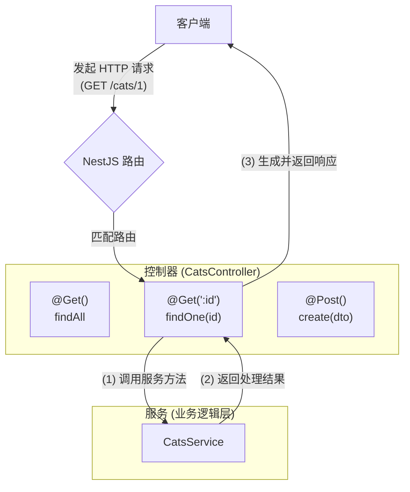

# 控制器

**控制器**（Controller）负责接收客户端的请求（request）并返回相应的响应（response），是处理请求流程中的关键组成部分。

每个控制器的核心职责，是根据**路由机制**（Routing）处理特定类型的请求。Nest 会根据配置好的路由规则，将请求定向至对应的控制器方法。通常，一个控制器包含多个路由处理方法，用于执行不同的业务逻辑。

在 Nest 中创建基础控制器，需要借助类和装饰器（Decorator）。装饰器用于为类添加必要的元数据，使框架能够建立请求路径与控制器方法之间的映射关系。

<CalloutInfo>
  如果你希望快速创建带有内置[校验（Validation）](/techniques/validation)逻辑的 CRUD 控制器，可以使用 CLI
  提供的资源[生成器](/recipes/crud-generator)命令：`nest g resource [name]`。

该命令会自动生成包含控制器、服务、DTO 和模块等文件的完整结构，帮助你快速搭建标准的 REST 接口。

</CalloutInfo>



## 路由

在以下示例中，我们使用了 `@Controller()` 装饰器，它是定义控制器的必要元素。我们为该控制器指定了一个可选的路由前缀 `cats`。通过在 `@Controller()` 中设置路径前缀，可以将相关路由归类至统一路径下，从而减少重复代码。例如，如果希望所有与猫（cat）实体相关的路由都集中在 `/cats` 路径下，只需在装饰器中传入 `cats` 作为前缀，便无需在每个处理方法中重复指定路径的公共部分。

```ts filename='cats.controller.ts'
import { Controller, Get } from '@nestjs/common'

@Controller('cats')
export class CatsController {
  @Get()
  findAll(): string {
    return '该操作返回所有猫'
  }
}
```

<CalloutInfo>
  <div>你可以通过 CLI 命令 `nest g controller [name]` 快速生成一个新的控制器文件。</div>
</CalloutInfo>

`@Get()` 是一个 HTTP 请求方法装饰器，应用于 `findAll()` 方法前，告知 Nest 应为该方法创建一个 GET 请求的路由处理器。这个路由的完整路径由两部分组成：控制器的路径前缀（如果有）以及方法装饰器中定义的路径字符串。在本例中，由于控制器设置了前缀 `cats`，而 `@Get()` 未指定额外路径，因此 Nest 会将 `GET /cats` 请求映射到该方法。

再举一个例子：若控制器前缀为 `cats`，且方法装饰器为` @Get('breed')`，那么该处理器将响应 `GET /cats/breed` 请求。

当有 GET 请求发送到上述路由时，Nest 会将请求分发给用户自定义的 `findAll()` 方法。需要注意的是，这里的方法名 `findAll` 只是示例用法，并非强制要求，开发者可以自定义任意方法名。虽然每个处理器都必须通过方法进行定义，但 Nest 并不会对方法名称本身赋予任何特殊含义。

该方法最终会返回一个 200 状态码以及对应的响应内容（此处为字符串）。为什么会有这样的行为？为了解释这一点，我们需要先介绍 Nest 提供的两种响应处理方式。

| 方式                                                      | 说明                                                                                                                                                                                                                                                                                                                                                                                                                                                                 |
| :-------------------------------------------------------- | :------------------------------------------------------------------------------------------------------------------------------------------------------------------------------------------------------------------------------------------------------------------------------------------------------------------------------------------------------------------------------------------------------------------------------------------------------------------- |
| <div className='whitespace-nowrap'>标准方式（推荐）</div> | 使用 Nest 提供的标准响应机制时，当处理器返回 JavaScript 对象或数组，框架会自动将其序列化为 JSON 并发送给客户端。如果返回的是原始类型（如 `string`、`number` 或 `boolean`），则会直接发送该值，而不会进行序列化。这种方式简洁直观 —— 你只需返回一个值，Nest 会自动完成后续的响应处理。<br /><br />默认情况下，响应状态码为 200，但对于 POST 请求，默认状态码为 201。如需修改默认状态码，可在方法上添加 `@HttpCode(...)` 装饰器（详见[自定义状态码](#自定义状态码)）。 |
| <div className='whitespace-nowrap'>库特定方式</div>       | Nest 也支持直接使用底层 HTTP 库（如 Express）提供的原生[响应对象](https://expressjs.com/en/api.html#res)。在方法参数中通过 `@Res()` 装饰器注入响应对象（例如：`findAll(@Res() response)`），即可使用该对象提供的响应方法，如 `response.status(200).send()`。这种方式允许你完全控制响应行为，适合处理更复杂或特定场景下的需求。但请注意，一旦使用原生响应对象，Nest 将不再自动处理响应，因此需自行管理状态码、响应头和返回内容。                                      |

<CalloutInfo type="warning">
当处理器中使用了 `@Res()` 或 `@Next()` 装饰器时，Nest 会自动识别你正在采用库特定的响应处理方式。一旦使用该方式，标准方式将被**禁用**，Nest 将不再自动处理响应内容。

如果你希望仅部分使用原生响应对象（例如仅用于设置 Cookie 或响应头），而其余部分仍由 Nest 自动处理，可以通过在 `@Res({ passthrough: true })` 中启用 `passthrough` 选项来实现混合使用。

</CalloutInfo>

## 请求对象

在实际开发中，处理器（Handler）通常需要访问来自客户端的请求信息。Nest 提供了访问底层 HTTP 平台（默认为 Express）原始[请求对象](https://expressjs.com/en/api.html#req)的能力。你只需在方法参数中使用 `@Req()` 装饰器，Nest 就会自动注入对应的请求对象。

```ts filename='cats.controller.ts'
import { Controller, Get, Req } from '@nestjs/common'
import { Request } from 'express'

@Controller('cats')
export class CatsController {
  @Get()
  findAll(@Req() request: Request): string {
    return '该操作返回所有猫'
  }
}
```

<CalloutInfo>
  如果你希望在代码中使用 Express 的类型定义（例如：`request: Request`），请确保安装了
  [`@types/express`](https://www.npmjs.com/package/@types/express) 类型声明包。
</CalloutInfo>

请求对象代表一次完整的 HTTP 请求，包含查询字符串、路由参数、请求头、请求体等属性（详见[官方文档](https://expressjs.com/en/api.html#req)）。在大多数场景中，你无需直接操作这些底层属性，而是可以使用 Nest 提供的专用装饰器，如 `@Body()`、`@Query()` 等，从中提取所需的数据。下表列出了常用装饰器及其在 Express 中所对应的原始对象或属性：

| 装饰器                                | 对应 Express 对象/属性              |
| ------------------------------------- | ----------------------------------- |
| `@Request()` / `@Req()`               | `req`                               |
| `@Response()` / `@Res()`<sup>\*</sup> | `res`                               |
| `@Next()`                             | `next`                              |
| `@Session()`                          | `req.session`                       |
| `@Param(key?: string)`                | `req.params` / `req.params[key]`    |
| `@Body(key?: string)`                 | `req.body` / `req.body[key]`        |
| `@Query(key?: string)`                | `req.query` / `req.query[key]`      |
| `@Headers(name?: string)`             | `req.headers` / `req.headers[name]` |
| `@Ip()`                               | `req.ip`                            |
| `@HostParam()`                        | `req.hosts`                         |

<sup>*</sup> `@Res()` 是 `@Response()` 的别名，二者均用于获取底层平台的原生 `response`
对象接口。为兼容不同的底层 HTTP 平台（如 Express 或 Fastify），Nest
提供了这两个装饰器。使用它们时，建议同时引入底层库的类型声明包（如
@types/express），以获得更完整的类型提示。

请注意，一旦在处理器方法中注入了 `@Res()` 或 `@Response()`，Nest 将启用**库特定模式**（library-specific mode）。在此模式下，你需要手动处理响应的返回（如调用 `res.json(...)` 或 `res.send(...)`），否则请求将不会自动结束，可能导致客户端长时间等待或服务挂起。

<CalloutInfo>

如需了解如何创建自己的参数装饰器，请参考[自定义装饰器](/custom-decorators)章节。

</CalloutInfo>

## 资源

在前文中，我们定义了一个用于获取猫资源的端点（GET 路由）。在实际应用中，通常还需要提供用于创建新记录的接口。以下是一个 POST 处理器的示例：

```ts filename='cats.controller.ts'
import { Controller, Get, Post } from '@nestjs/common'

@Controller('cats')
export class CatsController {
  @Post()
  create(): string {
    return '该操作将添加一只新猫'
  }

  @Get()
  findAll(): string {
    return '该操作返回所有猫'
  }
}
```

Nest 为所有标准的 HTTP 方法都提供了相应的装饰器：`@Get()`、`@Post()`、`@Put()`、`@Delete()`、`@Patch()`、`@Options()` 和 `@Head()`。此外，还可以使用 `@All()` 装饰器定义一个处理所有 HTTP 方法的通用端点。

## 路由通配符

Nest 同样支持基于模式的路由匹配。你可以使用星号（`*`）作为通配符，匹配路径末尾的任意字符组合。例如，以下的 `findAll()` 方法将匹配所有以 `abcd/` 开头的路由，不论其后跟随什么内容。

```ts
@Get('abcd/*')
findAll() {
  return '该路由使用了通配符';
}
```

路径模式 `'abcd/*'` 可以匹配 `abcd/`、`abcd/123`、`abcd/abc` 等多种情况。需要注意，连字符（`-`）和点（`.`）在字符串路径中会按字面意义进行匹配。

这种通配符写法适用于 Express 和 Fastify。但在新版 Express（v5）中，路由系统更为严格。若使用原生 Express，必须使用命名通配符才能使匹配生效，例如：`abcd/*splat`，其中 `splat` 是通配符的参数名，可自定义命名。不过，得益于 Nest 对 Express 的封装与兼容，仍可直接使用星号（`*`）作为通配符。

如果需要在**路径中间**使用通配符，Express 要求采用命名通配符形式（如：`ab{*splat}cd`），而 Fastify 则不支持此类用法。

## 自定义状态码

如前所述，处理器的默认响应状态码为 **200**，但 POST 请求的默认状态码为 **201**。你可以通过在处理器方法上使用 `@HttpCode(...)` 装饰器，灵活地修改这一默认行为。

```ts
import { HttpCode, Post } from '@nestjs/common'

@Post()
@HttpCode(204)
create() {
  return '该操作将添加一只新猫';
}
```

在某些场景中，响应状态码并非固定，而是根据运行时条件动态决定。此时，可以通过注入底层平台特定的**响应对象**（使用 `@Res()` 装饰器）来手动设置状态码，或在发生错误时抛出异常进行处理。

## 设置响应头

要设置自定义的响应头（response header），你可以使用 `@Header()` 装饰器，或直接通过底层平台提供的响应对象（如 `res.header()`）进行设置。

```ts
import { Header, Post } from '@nestjs/common'

@Post()
@Header('Cache-Control', 'no-store')
create() {
  return '该操作将添加一只新猫';
}
```

## 实现重定向

若需将响应重定向至指定的 URL，可使用 `@Redirect()` 装饰器，或通过底层平台提供的响应对象（如 `res.redirect()`）手动处理。

`@Redirect()` 装饰器可接受两个可选参数：`url` 和 `statusCode`。其中，`statusCode` 默认为 `302（Found）`。

```ts
@Get()
@Redirect('https://nestjs.com', 301)
```

<CalloutInfo>
  在某些业务场景中，你可能需要根据逻辑动态设置重定向的目标地址或状态码。此时，可以通过返回一个符合
  `HttpRedirectResponse` 接口（定义于 `@nestjs/common`）的对象来实现。
</CalloutInfo>

需要注意的是，返回的对象将覆盖装饰器中提供的默认参数。例如：

```ts
@Get('docs')
@Redirect('https://docs.nestjs.com', 302)
getDocs(@Query('version') version) {
  if (version && version === '5') {
    return { url: 'https://docs.nestjs.com/v5/' };
  }
}
```

## 获取路由参数

静态路径的路由无法满足携带**动态参数**的请求，例如：`GET /cats/1` 表示获取 ID 为 1 的猫。此类场景下，可以在路由路径中通过添加参数标记（如 :id）来捕获 URL 中的动态部分，被捕获的参数可通过 `@Param()` 装饰器注入到处理方法中。

<CalloutInfo>
  参数化路由应始终声明在所有静态路径之后，以避免动态路径意外拦截原本属于静态路径的请求。
</CalloutInfo>

```ts
import { Param, Get } from '@nestjs/common'

@Get(':id')
findOne(@Param() params: any): string {
  console.log(params.id);
  return `该猫的 ID 为 #${params.id}`;
}
```

`@Param()` 装饰器可应用于方法参数上（如 `params`），捕获到的路由参数将作为该对象的属性使用。例如，可通过 `params.id` 访问 ID 值。你也可以在装饰器中传入具体参数名，直接将该参数注入方法体，如 `@Param('id') id: string`。

```ts
@Get(':id')
findOne(@Param('id') id: string): string {
  return `该猫的 ID 为 #${id}`;
}
```

## 子域名路由

你可以通过 `@Controller` 装饰器的 `host` 选项，指定该控制器仅响应匹配特定主机名（HTTP Host）的请求。

```ts
@Controller({ host: 'admin.example.com' })
export class AdminController {
  @Get()
  index(): string {
    return 'Admin page'
  }
}
```

<CalloutInfo type="warning">
  由于 Fastify 不支持嵌套路由，如果你打算使用子域名路由功能，建议选择默认的 Express 适配器。
</CalloutInfo>

类似于 `path` 属性，`host` 也支持使用参数标记（如 `:subdomain`）以捕获主机名中的动态部分。你可以通过 `@HostParam()` 装饰器在方法参数中访问这些动态值，如下所示：

```ts
@Controller({ host: ':account.example.com' })
export class AccountController {
  @Get()
  getInfo(@HostParam('account') account: string) {
    return account
  }
}
```

## 控制器中的状态共享

对于有其他编程语言背景的开发者来说，可能会惊讶地发现：在 Nest 中，几乎所有内容在多个请求间都是共享的。这包括数据库连接池、具有全局状态的单例服务等。

需要理解的是，Node.js 并不采用传统的“多线程、无状态”的请求处理模型。换句话说，它不会为每个请求启动一个独立线程，因此在 Nest 中使用单例对象是**完全安全**的。

当然，在某些特定场景下，我们仍可能需要按请求维度来管理控制器的生命周期。例如在 GraphQL 应用中，实现每请求缓存、请求追踪或多租户支持等。你可以在[这里](/fundamentals/injection-scopes)了解如何配置注入作用域（Scope）以满足这些需求。

## 支持异步处理

我们热爱现代 JavaScript，尤其是它对**异步编程**的优雅支持。Nest 原生支持 `async` 函数，处理器方法只需返回一个 `Promise`，Nest 就会自动解析其结果。示例如下：

```ts filename='cats.controller.ts'
@Get()
async findAll(): Promise<any[]> {
  return [];
}
```

Nest 也支持 RxJS 的 [Observable 流](https://rxjs-dev.firebaseapp.com/guide/observable)。在你返回 Observable 时，Nest 会自动订阅该流，并在流结束后提取其最终值。

```ts filename='cats.controller.ts'
@Get()
findAll(): Observable<any[]> {
  return of([]);
}
```

无论是返回 Promise 还是 Observable，你都可以根据业务场景自由选择。

## 处理请求载荷

在前面的示例中，我们的 POST 路由处理器并未接收任何客户端传参。你可以通过 `@Body()` 装饰器来实现请求体参数的获取。

在继续之前（如果你使用 TypeScript），需要先定义数据传输对象（Data Transfer Object，DTO）的结构。DTO 用于明确客户端发送的数据格式。虽然你可以使用接口或类来定义 DTO，但建议优先使用类。为什么？因为类是 ES6 标准的一部分，编译后仍会保留在运行时代码中；而接口会在编译时被完全移除，这使得 Nest 无法在运行时访问它们。

一些如管道（Pipe）这样的功能依赖运行时的类型信息，而这只有类才能提供。

例如，我们可以定义一个 `CreateCatDto` 类：

```ts filename='create-cat.dto.ts'
export class CreateCatDto {
  name: string
  age: number
  breed: string
}
```

该 DTO 只包含三个基础属性，之后可以在 `CatsController` 中使用它：

```ts filename='cats.controller.ts'
@Post()
async create(@Body() createCatDto: CreateCatDto) {
  return '该操作将添加一只新猫';
}
```

<CalloutInfo>
  `ValidationPipe` 支持自动剥离非白名单属性。例如在 `CreateCatDto` 中，允许的字段包括 `name`、`age`
  和 `breed`，任何不属于 DTO
  定义的字段都会被自动移除。你可以在[此处](/techniques/validation#属性剥离)了解详细信息。
</CalloutInfo>

## 提取查询参数

在处理路由中的查询参数时，Nest 提供了 `@Query()` 装饰器，可用于从请求的查询字符串中提取参数。下面通过示例进行说明。

假设我们希望根据查询参数 `age` 和 `breed` 来过滤猫咪列表。可以在 `CatsController` 中这样定义：

```ts filename='cats.controller.ts'
@Get()
async findAll(@Query('age') age: number, @Query('breed') breed: string) {
  return `该操作返回符合条件的所有猫（年龄：${age}，品种：${breed}）`;
}
```

在上述代码中，`@Query()` 装饰器分别提取了查询字符串中的 `age` 和 `breed` 参数。例如，对于以下请求：

```
GET /cats?age=2&breed=Persian
```

将会提取出 `age` 的值为 `2``，breed` 的值为 `Persian`。

如果应用中需要支持更复杂的查询参数结构（如嵌套对象或数组）：

```
?filter[where][name]=John&filter[where][age]=30
?item[]=1&item[]=2
```

则需要配置底层 HTTP 适配器（Express 或 Fastify），以使用支持嵌套解析的查询字符串解析器。

在 Express 中，可以设置为使用 `extended` 模式的解析器：

```ts
const app = await NestFactory.create<NestExpressApplication>(AppModule)
app.set('query parser', 'extended')
```

在 Fastify 中，则可以通过 `querystringParser` 选项指定自定义解析函数，例如使用 qs：

```ts
const app = await NestFactory.create<NestFastifyApplication>(
  AppModule,
  new FastifyAdapter({
    querystringParser: (str) => qs.parse(str),
  })
)
```

<CalloutInfo>
  `qs` 是一个功能强大的查询字符串解析器，支持嵌套结构与数组。可通过 `npm install qs` 安装。
</CalloutInfo>

## 错误处理机制

如需了解错误（异常）处理的完整用法，请参阅[错误处理](/exception-filters)章节。

## 控制器完整示例

以下示例演示了如何借助多种装饰器快速构建一个基础控制器。该控制器包含多个端点，用于读取和修改内部数据：

```ts filename='cats.controller.ts'
import { Controller, Get, Query, Post, Body, Put, Param, Delete } from '@nestjs/common'
import { CreateCatDto, UpdateCatDto, ListAllEntities } from './dto'

@Controller('cats')
export class CatsController {
  @Post()
  create(@Body() createCatDto: CreateCatDto) {
    return '该操作将添加一只新猫'
  }

  @Get()
  findAll(@Query() query: ListAllEntities) {
    return `该操作返回所有猫（限制：${query.limit} 只）`
  }

  @Get(':id')
  findOne(@Param('id') id: string) {
    return `该操作返回 ID 为 #${id} 的猫`
  }

  @Put(':id')
  update(@Param('id') id: string, @Body() updateCatDto: UpdateCatDto) {
    return `该操作更新 ID 为 #${id} 的猫`
  }

  @Delete(':id')
  remove(@Param('id') id: string) {
    return `该操作删除 ID 为 #${id} 的猫`
  }
}
```

<CalloutInfo>
  Nest CLI 提供了 *schematics* 生成器，可一键生成样板代码，省却手工编写，大幅提升开发效率。详见[CRUD
  代码生成器指南](/recipes/crud-generator)。
</CalloutInfo>

## 控制器注册与模块集成

尽管 `CatsController` 已经定义完毕，Nest 不会自动发现并实例化它。每个控制器都必须归属某个模块，因此需要在模块的 `controllers` 数组中显式注册。此时项目仅包含根模块 `AppModule`，我们可以直接在其中挂载控制器：

```ts filename='app.module.ts'
import { Module } from '@nestjs/common'
import { CatsController } from './cats/cats.controller'

@Module({
  controllers: [CatsController],
})
export class AppModule {}
```

通过 `@Module()` 装饰器为模块类添加元数据后，Nest 会据此加载并挂载对应的控制器。

## 使用库特定响应对象

在标准用法中，Nest 会代管响应的生成与发送。若需直接操作底层框架（如 Express）的响应对象，可使用 `@Res()` 装饰器进行注入。下面重写 `CatsController`，对比两种实现方式：

```ts
import { Controller, Get, Post, Res, HttpStatus } from '@nestjs/common'
import { Response } from 'express'

@Controller('cats')
export class CatsController {
  @Post()
  create(@Res() res: Response) {
    res.status(HttpStatus.CREATED).send()
  }

  @Get()
  findAll(@Res() res: Response) {
    res.status(HttpStatus.OK).json([])
  }
}
```

虽然该方式在手动设置响应头或调用底层框架独有功能时更灵活，但须谨慎使用。其主要缺点包括：

- 与平台强耦合：不同 HTTP 库的响应对象 API 不一致，降低了可移植性。
- 测试复杂：测试时需手动模拟响应对象，增加开发成本。
- 失去 Nest 内建特性：拦截器、`@HttpCode()`、`@Header()` 等装饰器将无法生效。

为兼顾灵活性与框架特性，可启用 `passthrough` 选项：

```ts
@Get()
findAll(@Res({ passthrough: true }) res: Response) {
  res.status(HttpStatus.OK);
  return [];
}
```

启用 passthrough 后，你仍可在必要时与原生响应对象交互（例如条件性设置 cookie 或 header），其余流程则继续由 Nest 负责处理。
