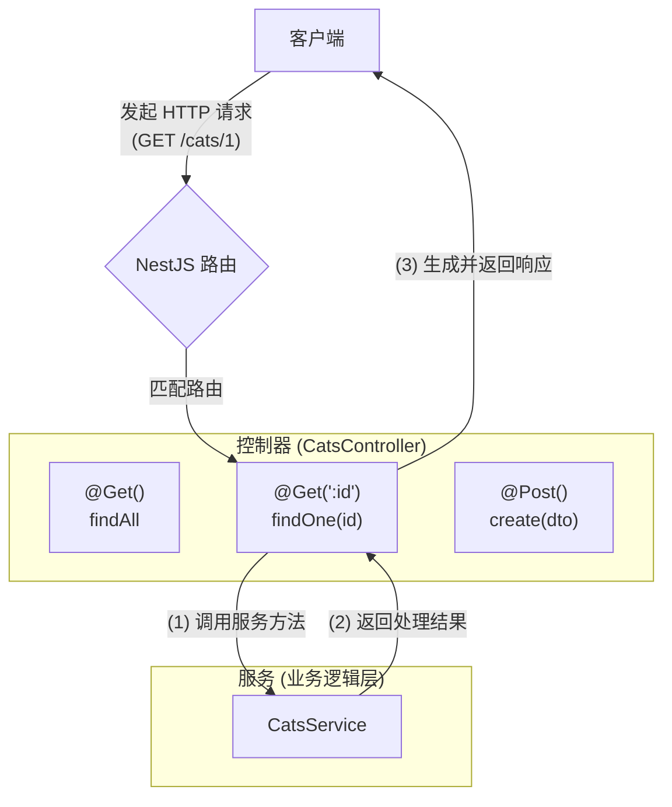

# 控制器

**控制器**（Controller）是 Nest 应用中负责**接收客户端请求并返回响应**的核心组件，是处理请求流程的关键环节。

控制器的主要职责，是基于**路由机制**（Routing）响应特定路径和请求方法的调用。Nest 会根据已配置的路由规则，将请求路由到相应的控制器方法。通常，一个控制器中会包含多个方法，分别对应不同的业务逻辑。

在 Nest 中创建控制器，需要结合**类**和**装饰器**（Decorator）使用。装饰器用于为类及其方法添加元数据，使框架能够建立请求路径与控制器方法之间的映射关系。

<CalloutInfo>
如果你希望快速创建带有内置[校验（Validation）](/techniques/validation)功能的 CRUD 控制器，可以使用 CLI 提供的[资源生成器](/recipes/crud-generator)命令：`nest g resource [name]`

该命令会自动生成包含控制器、服务、DTO 和模块等文件的完整结构，帮助你快速搭建标准的 REST 接口。

</CalloutInfo>



## 路由

在以下示例中，我们使用了 `@Controller()` 装饰器来定义一个控制器，该装饰器是创建控制器类的必要组成部分。通过在 `@Controller()` 中传入一个可选的路径前缀（如 `'cats'`），可以将所有相关路由归类到同一基础路径下，从而避免在每个处理方法中重复书写公共路径。

例如，若希望将所有与「猫咪（cat）」相关的路由统一归在 `/cats` 下，只需在装饰器中传入 `'cats'` 作为前缀，便可简化后续的路径声明：

```ts filename='cats.controller.ts'
import { Controller, Get } from '@nestjs/common'

@Controller('cats')
export class CatsController {
  @Get()
  findAll(): string {
    return '该操作将返回所有猫咪'
  }
}
```

<CalloutInfo>
  你可以通过 CLI 命令 `nest g controller [name]` 快速生成一个控制器文件。
</CalloutInfo>

`@Get()` 是一个 HTTP 请求方法装饰器，作用是将被装饰的方法映射为 GET 请求的处理器。在上面的例子中，`findAll()` 方法没有额外路径定义，而控制器的路径前缀为 `'cats'`，因此该方法会响应 `GET /cats` 路由。

这个路由的完整路径由两部分组成：控制器的路径前缀（如果有）以及方法装饰器中定义的路径字符串。如果我们将方法装饰器改为 `@Get('breed')`，那么该处理器将匹配 `GET /cats/breed` 请求。

需要注意的是，方法名 `findAll` 只是一个示例，Nest 并不对方法名称施加任何约束。开发者可以自由命名，只需确保每个处理器都通过适当的装饰器暴露给路由系统。

当收到符合路由规则的请求时，Nest 会调用该方法并返回响应。在本例中，返回的是一个字符串，因此响应将包含状态码 200 以及字符串内容。

那么，为什么会返回一个字符串？这与 Nest 的响应处理机制有关。Nest 提供了两种响应处理方式：

| 方式                                                          | 说明                                                                                                                                                                                                                                                                                                                                  |
| :------------------------------------------------------------ | :------------------------------------------------------------------------------------------------------------------------------------------------------------------------------------------------------------------------------------------------------------------------------------------------------------------------------------ |
| <div className='whitespace-nowrap'>**标准方式（推荐）**</div> | 当处理器返回一个值（如对象、数组或原始类型），Nest 会自动根据内容生成响应。例如，返回对象或数组时会自动序列化为 JSON；返回字符串、数字或布尔值时则原样发送。默认状态码为 200，POST 请求则默认为 201。若需修改，可使用 `@HttpCode(...)` 装饰器（详见[自定义状态码](#自定义状态码)）。                                                  |
| <div className='whitespace-nowrap'>**库特定方式**</div>       | 通过在方法参数中注入底层 HTTP 框架（如 Express）提供的[响应对象](https://expressjs.com/en/api.html#res)（使用 `@Res()` 装饰器），可以手动控制状态码、响应头和返回内容。例如：`response.status(200).send()`。该方式适用于需要精细控制响应行为的场景。但需注意，一旦使用原生响应对象，Nest 将不再自动处理响应，需完全由开发者负责管理。 |

<CalloutInfo type="warning">
一旦在处理器中使用了 `@Res()` 或 `@Next()`，Nest 会判定你启用了库特定的响应方式，并自动**禁用**标准响应机制。

如果你只希望对响应对象进行部分操作（如设置 Cookie 或响应头），同时仍希望由 Nest 处理响应主体，可以通过 `@Res({ passthrough: true })` 启用「透传模式」，实现标准方式与库特定方式的混合使用。

</CalloutInfo>

## 请求对象

在实际开发中，处理器（Handler）通常需要访问来自客户端的请求信息。Nest 提供了访问底层 HTTP 平台（默认为 Express）原始[请求对象](https://expressjs.com/en/api.html#req)的能力。你只需在方法参数中使用 `@Req()` 装饰器，Nest 就会自动注入对应的请求对象。

```ts filename='cats.controller.ts'
import { Controller, Get, Req } from '@nestjs/common'
import { Request } from 'express'

@Controller('cats')
export class CatsController {
  @Get()
  findAll(@Req() request: Request): string {
    return '该操作将返回所有猫咪'
  }
}
```

<CalloutInfo>
  如果你希望在代码中使用 Express 提供的类型（如 `Request`），请确保已安装
  [`@types/express`](https://www.npmjs.com/package/@types/express) 类型声明包。
</CalloutInfo>

请求对象代表一次完整的 HTTP 请求，包含诸如查询参数、路由参数、请求头、请求体等属性。在大多数场景下，你并不需要直接操作这些底层属性。Nest 提供了更简洁的方式 —— 使用专用的参数装饰器（如 `@Body()`、`@Query()` 等）从请求中提取所需数据。

下表列出了常用的装饰器及其在 Express 中对应的原始对象或属性（详见[官方文档](https://expressjs.com/en/api.html#req)）：

| 装饰器                                | 对应 Express 对象/属性              |
| ------------------------------------- | ----------------------------------- |
| `@Request()` / `@Req()`               | `req`                               |
| `@Response()` / `@Res()`<sup>\*</sup> | `res`                               |
| `@Next()`                             | `next`                              |
| `@Session()`                          | `req.session`                       |
| `@Param(key?: string)`                | `req.params` / `req.params[key]`    |
| `@Body(key?: string)`                 | `req.body` / `req.body[key]`        |
| `@Query(key?: string)`                | `req.query` / `req.query[key]`      |
| `@Headers(name?: string)`             | `req.headers` / `req.headers[name]` |
| `@Ip()`                               | `req.ip`                            |
| `@HostParam()`                        | `req.hosts`                         |

<sup>*</sup> `@Res()` 是 `@Response()`
的别名，二者均用于获取底层平台提供的原生响应对象。Nest
提供这两个装饰器，以支持多种 HTTP 平台（如 Express、Fastify）。
使用时建议同时安装对应平台的类型声明包（如
`@types/express`），以获得更完整的类型提示。

请注意，一旦在处理器方法中注入了 `@Res()` 或 `@Response()`，Nest 将切换为**库特定模式**（library-specific mode）。此模式下，框架不再自动处理响应，而需要你手动调用方法（如 `res.send()` 或 `res.json()`）来结束请求，否则可能导致客户端请求长时间无响应。

<CalloutInfo>
  如需了解如何创建自定义参数装饰器，请参考[自定义装饰器](/custom-decorators)一节。
</CalloutInfo>

## 资源

在前文的示例中，我们定义了一个用于获取猫咪资源的 GET 接口。现实场景中，除了读取数据，还常常需要提供用于**创建新记录**的功能。下面是一个使用 POST 方法处理器的示例：

```ts filename='cats.controller.ts'
import { Controller, Get, Post } from '@nestjs/common'

@Controller('cats')
export class CatsController {
  @Post()
  create(): string {
    return '该操作将添加一只新猫咪'
  }

  @Get()
  findAll(): string {
    return '该操作将返回所有猫咪'
  }
}
```

Nest 提供了专门用于声明标准 HTTP 方法的装饰器，包括：`@Get()`、`@Post()`、`@Put()`、`@Delete()`、`@Patch()`、`@Options()` 和 `@Head()`。如果希望一个处理器能够响应所有类型的 HTTP 请求，还可以使用通用的 `@All()` 装饰器。

## 路由通配符

Nest 支持基于模式的路由匹配，你可以使用星号（`*`）作为通配符，用于匹配路径中任意的尾部内容。例如，下面的 `findAll()` 方法将匹配所有以 `abcd/` 开头的请求路径，无论其后跟随什么字符：

```ts
@Get('abcd/*')
findAll() {
  return '该路由使用了通配符';
}
```

上述路径模式 `'abcd/*'` 可以匹配 `abcd/`、`abcd/123`、`abcd/xyz` 等多种情况。需要注意的是，连字符（`-`）和点（`.`）在字符串路径中是按字面意义进行匹配的，并不会作为特殊字符处理。

这种通配符写法兼容 Express 和 Fastify。不过需要留意，Express 从 v5 开始对路由的解析更加严格。如果你直接使用原生 Express，就必须使用命名通配符才能使匹配生效，例如：

```ts
@Get('abcd/*splat')
```

其中 `splat` 是一个自定义的参数名，用于捕获通配符部分。幸运的是，得益于 Nest 对 Express 的封装，在 Nest 中仍然可以使用简单的 `*` 通配符，而无需显式命名参数。

如果你希望在路径中间使用通配符，在 Express 中需要采用命名通配符的形式（例如 `ab{*splat}cd`），而 Fastify 则不支持这种中间通配符的写法。

## 自定义状态码

正如前文所述，处理器方法的默认响应状态码为 `200（OK）`，但针对 POST 请求，默认状态码则是 `201（Created）`。若需更改这一默认行为，可以在方法上使用 `@HttpCode(...)` 装饰器进行显式指定：

```ts
import { HttpCode, Post } from '@nestjs/common'

@Post()
@HttpCode(204)
create() {
  return '该操作将添加一只新猫咪';
}
```

在某些场景中，状态码并非固定值，而是依据运行时逻辑动态决定。此时，可以通过注入底层平台的**原生响应对象**（使用 `@Res()` 装饰器）手动设置状态码；也可以通过抛出异常的方式，由框架自动转换为对应的错误响应。

## 设置响应头

你可以通过两种方式为响应添加自定义 Header：
一是使用 `@Header()` 装饰器；二是直接操作底层平台提供的原生响应对象（如使用 `res.header()` 方法）。

以下示例展示了使用装饰器方式为响应设置 `Cache-Control` 头：

```ts
import { Header, Post } from '@nestjs/common'

@Post()
@Header('Cache-Control', 'no-store')
create() {
  return '该操作将添加一只新猫咪';
}
```

## 实现重定向

Nest 提供了多种方式用于实现响应重定向。你可以使用 `@Redirect()` 装饰器，或直接调用底层平台的响应对象（如 `res.redirect()`）手动处理。

`@Redirect()` 装饰器支持两个可选参数：`url` 和 `statusCode`，其中 `statusCode` 默认为 `302（Found）`。

```ts
@Get()
@Redirect('https://nestjs.com', 301)
```

<CalloutInfo>
  如果需要根据业务逻辑动态确定重定向的地址或状态码，可以通过返回一个符合
  `HttpRedirectResponse` 接口（定义于 `@nestjs/common`）的对象来实现。
</CalloutInfo>

需要特别注意的是，如果方法返回一个对象，那么将会**覆盖装饰器中指定的默认值**。例如：

```ts
@Get('docs')
@Redirect('https://docs.nestjs.com', 302)
getDocs(@Query('version') version) {
  if (version && version === '5') {
    return { url: 'https://docs.nestjs.com/v5/' };
  }
}
```

## 获取路由参数

在实际开发中，我们常常需要根据 URL 中的动态参数来处理请求。静态路径（如 `GET /cats`）无法满足这类需求，例如：`GET /cats/1` 表示获取 ID 为 1 的猫咪信息。

为此，NestJS 允许在路由路径中通过**参数占位符**（如 `:id`）来声明动态部分，被匹配到的参数可通过 `@Param()` 装饰器注入到控制器的方法中。

<CalloutInfo type="warning">
  参数化路由应始终声明在所有静态路径之后，以避免动态路径错误地匹配本应属于静态路径的请求。
</CalloutInfo>

```ts
import { Param, Get } from '@nestjs/common'

@Get(':id')
findOne(@Param() params: any): string {
  console.log(params.id);
  return `该猫咪的 ID 为 #${params.id}`;
}
```

在上述代码中，`@Param()` 装饰器将所有路由参数作为一个对象注入方法参数 `params`，你可以通过 `params.id` 获取具体值。

若只需使用某一个参数，也可以直接在装饰器中指定参数名，从而简化代码结构：

```ts
@Get(':id')
findOne(@Param('id') id: string): string {
  return `该猫咪的 ID 为 #${id}`;
}
```

这种方式更加直观，推荐在只需获取单个参数时使用。

## 子域名路由

通过在 `@Controller` 装饰器中配置 `host` 选项，可以让控制器仅响应特定主机名（HTTP Host）匹配的请求。

```ts
@Controller({ host: 'admin.example.com' })
export class AdminController {
  @Get()
  index(): string {
    return 'Admin page'
  }
}
```

<CalloutInfo type="warning">
  由于 Fastify 不支持嵌套路由，如果你需要使用子域名路由，建议使用默认的 Express
  适配器。
</CalloutInfo>

类似 `path` 属性，`host` 也支持使用参数占位符（例如 `:subdomain`）来匹配主机名中的动态部分。你可以使用 `@HostParam()` 装饰器获取这些动态值，如下示例所示：

```ts
@Controller({ host: ':account.example.com' })
export class AccountController {
  @Get()
  getInfo(@HostParam('account') account: string) {
    return account
  }
}
```

## 控制器中的状态共享

对于习惯于其他编程语言的开发者来说，Nest 的状态管理方式可能略显不同：在大多数情况下，应用中的状态在多个请求之间是**共享**的。这包括数据库连接池、具有全局状态的单例服务等组件。

这一特性源于 Node.js 的执行模型。与传统的「多线程、无状态」架构不同，Node.js 并不会为每个请求创建一个独立的线程。这意味着在 Nest 中使用单例对象是**安全且高效**的。

当然，在某些特定场景下，你可能仍需要按请求粒度管理控制器或服务的生命周期。例如，在 GraphQL 应用中，常见的需求包括每请求缓存、请求级追踪或多租户支持。此时，可以通过配置注入作用域来实现按需实例化。详见[作用域控制说明](/fundamentals/injection-scopes)。

## 支持异步处理

Nest 天生契合现代 JavaScript，尤其在**异步编程模型**方面提供了卓越的支持。框架原生支持 `async/await`，你只需在处理器方法中返回一个 `Promise`，Nest 会自动解析其结果并作为响应返回：

```ts filename='cats.controller.ts'
@Get()
async findAll(): Promise<any[]> {
  return [];
}
```

除了 `Promise`，Nest 也原生支持使用 RxJS 的 [Observable 流](https://rxjs-dev.firebaseapp.com/guide/observable)。当处理器方法返回一个 `Observable` 时，Nest 会自动订阅该流，并在其完成后提取最终值作为响应发送：

```ts filename='cats.controller.ts'
@Get()
findAll(): Observable<any[]> {
  return of([]);
}
```

无论是返回 `Promise` 还是 `Observable`，Nest 都能自动处理其异步结果。你可以根据具体业务需求，自由选择最适合的异步处理方式。

## 处理请求体数据

在之前的示例中，我们的 POST 路由处理器尚未接收任何来自客户端的参数。为了获取请求体中的数据，你可以使用 `@Body()` 装饰器。

在继续之前（如果你使用 TypeScript），需要先定义一个**数据传输对象**（Data Transfer Object，简称 DTO）来明确客户端提交的数据结构。

你可以使用类或接口来定义 DTO，但**更推荐使用类**。这是因为类属于 ES6 标准的一部分，经过 TypeScript 编译后仍会保留在运行时代码中；而接口则仅存在于编译时，编译后会被完全移除，Nest 在运行时将无法获取任何接口的类型信息。

例如，Nest 中的**管道**（Pipe）功能就依赖于运行时的类型数据，用于实现自动验证与数据转换，而这些能力只有通过类才能实现。

我们可以创建一个 `CreateCatDto` 类作为示例：

```ts filename='create-cat.dto.ts'
export class CreateCatDto {
  name: string
  age: number
  breed: string
}
```

这个 DTO 定义了三项基本属性，随后我们可以在控制器中通过 `@Body()` 装饰器来接收它：

```ts filename='cats.controller.ts'
@Post()
async create(@Body() createCatDto: CreateCatDto) {
  return '该操作将添加一只新猫咪';
}
```

<CalloutInfo>
  使用 `ValidationPipe` 时，Nest 能够自动移除所有不在白名单中的字段。以
  `CreateCatDto` 为例，只有 `name`、`age` 和 `breed`
  三个字段是被允许的，任何额外字段都会被自动剥离。详细用法请参考[属性剥离说明](/techniques/validation#属性剥离whitelist)。
</CalloutInfo>

## 提取查询参数

在处理路由中的查询参数时，Nest 提供了 `@Query()` 装饰器，用于从请求的查询字符串中提取所需参数。我们来看一个示例来了解它的用法。

假设你希望根据查询参数 `age` 和 `breed` 对猫咪列表进行筛选，可以在 `CatsController` 中这样编写：

```ts filename='cats.controller.ts'
@Get()
async findAll(@Query('age') age: number, @Query('breed') breed: string) {
  return `该操作返回符合条件的所有猫咪（年龄：${age}，品种：${breed}）`;
}
```

在上面的示例中，`@Query()` 装饰器分别提取了请求地址中的 `age` 与 `breed` 两个查询参数。例如，当请求为：

```
GET /cats?age=2&breed=Persian
```

框架将自动解析查询字符串，提取出 `age = 2` 和 `breed = Persian` 并注入到控制器方法中。

### 支持复杂查询结构

如果你的应用需要支持更复杂的查询参数格式，例如嵌套对象或数组：

```
?filter[where][name]=John&filter[where][age]=30
?item[]=1&item[]=2
```

那么需要配置底层的 HTTP 适配器，以启用支持嵌套解析的查询字符串解析器。

#### 在 Express 中

Express 默认使用内置的 `querystring` 模块来解析查询字符串，但它对嵌套对象等复杂结构的支持较为有限。你可以通过将解析模式设置为 `extended`，改用功能更强大的 `qs` 模块，从而增强查询参数的解析能力：

```ts
const app = await NestFactory.create<NestExpressApplication>(AppModule)
app.set('query parser', 'extended')
```

#### 在 Fastify 中

Fastify 允许你通过 `querystringParser` 选项自定义查询字符串的解析方式。例如，可以结合 `qs` 库，实现对嵌套对象等复杂结构的支持，配置方式如下：

```ts
const app = await NestFactory.create<NestFastifyApplication>(
  AppModule,
  new FastifyAdapter({
    querystringParser: (str) => qs.parse(str),
  })
)
```

<CalloutInfo>
  `qs`
  是一个功能强大的查询字符串解析器，支持嵌套对象、数组等复杂结构，你可以通过运行
  `npm install qs` 安装它。
</CalloutInfo>

## 错误处理机制

如需深入了解 NestJS 中的错误（异常）处理机制，请查阅[异常过滤器](/exception-filters)一章。

## 控制器示例：构建基础的 REST 接口

下面的示例展示了如何使用多个装饰器快速构建一个基础控制器。该控制器包含常见的 RESTful 端点，用于实现猫咪数据的读取与更新操作：

```ts filename='cats.controller.ts'
import {
  Controller,
  Get,
  Query,
  Post,
  Body,
  Put,
  Param,
  Delete,
} from '@nestjs/common'
import { CreateCatDto, UpdateCatDto, ListAllEntities } from './dto'

@Controller('cats')
export class CatsController {
  @Post()
  create(@Body() createCatDto: CreateCatDto) {
    return '添加一只新猫咪'
  }

  @Get()
  findAll(@Query() query: ListAllEntities) {
    return `返回所有猫咪（限制：${query.limit} 只）`
  }

  @Get(':id')
  findOne(@Param('id') id: string) {
    return `返回 ID 为 #${id} 的猫咪`
  }

  @Put(':id')
  update(@Param('id') id: string, @Body() updateCatDto: UpdateCatDto) {
    return `更新 ID 为 #${id} 的猫咪`
  }

  @Delete(':id')
  remove(@Param('id') id: string) {
    return `删除 ID 为 #${id} 的猫咪`
  }
}
```

<CalloutInfo>
  Nest CLI 提供了基于 **Schematics** 的代码生成器，支持快速生成控制器、服务、DTO
  等结构化模块，省去了繁琐的手工创建过程，显著提升开发效率。详细内容可参考：[CRUD
  代码生成器指南](/recipes/crud-generator)。
</CalloutInfo>

## 控制器注册与模块集成

即便我们已经定义好了 `CatsController`，Nest 并不会自动发现或实例化它。每个控制器都必须显式地隶属于某个模块，并在该模块的 `controllers` 数组中进行注册。

由于当前项目中仅包含一个根模块 `AppModule`，我们可以直接在该模块中引入并注册控制器：

```ts filename='app.module.ts'
import { Module } from '@nestjs/common'
import { CatsController } from './cats/cats.controller'

@Module({
  controllers: [CatsController],
})
export class AppModule {}
```

通过 `@Module()` 装饰器为模块类添加元数据后，Nest 就能够识别并加载对应的控制器。

## 使用底层框架的响应对象

默认情况下，Nest 会自动处理响应的生成与发送流程。但在某些场景下，如果你需要直接操作底层 HTTP 框架（如 Express）的响应对象，可以通过 `@Res()` 装饰器将其注入控制器方法中。

下面是重写后的 `CatsController`，展示了如何手动控制响应输出：

```ts
import { Controller, Get, Post, Res, HttpStatus } from '@nestjs/common'
import { Response } from 'express'

@Controller('cats')
export class CatsController {
  @Post()
  create(@Res() res: Response) {
    res.status(HttpStatus.CREATED).send() // [!code hl]
  }

  @Get()
  findAll(@Res() res: Response) {
    res.status(HttpStatus.OK).json([]) // [!code hl]
  }
}
```

这种方式虽然在设置响应头、状态码或使用底层框架特有功能时更具灵活性，但也存在一些明显的缺点：

- 平台耦合性强：不同底层库的响应对象接口差异较大，影响可移植性。
- 测试难度提高：你需要手动模拟响应对象，增加了测试的复杂度。
- 失去 Nest 提供的内建功能：如拦截器、`@HttpCode()`、`@Header()` 等装饰器将不再生效。

如果希望在保留框架默认行为的基础上，获得对流程的更多控制，可以启用 `passthrough` 模式：

```ts
@Get()
findAll(@Res({ passthrough: true }) res: Response) {
  res.status(HttpStatus.OK);
  return [];
}
```

当 `passthrough` 设置为 `true` 时，Nest 仍会负责响应的最终处理流程，但同时允许你在必要时对原生响应对象进行部分操作（例如按需设置 Cookie 或响应头），从而在保持框架抽象能力的基础上，实现更高的灵活性。
