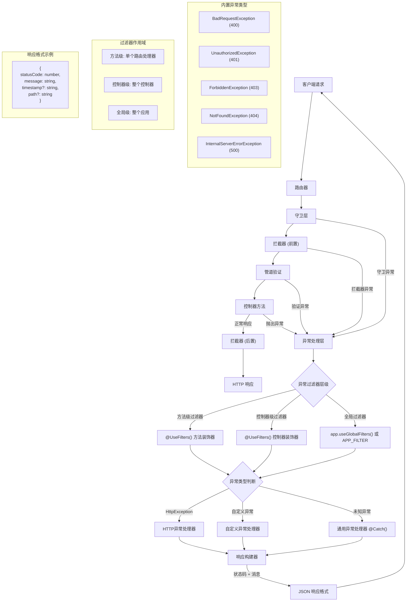

# 异常过滤器

Nest 提供了完善的**异常处理机制**（Exceptions Layer），用于统一捕获和处理应用中未被显式处理的异常。当某个异常未在业务逻辑中被捕获时，Nest 会自动拦截该异常，并生成一份格式化的响应，返回给客户端。



这一机制的默认实现是由框架内置的**全局异常过滤器**（Global Exception Filter）完成的。该过滤器专门处理 `HttpException` 及其所有子类。如果抛出的异常不是 `HttpException` 类型，框架将退回至默认处理策略，返回如下的标准 JSON 响应：

```json
{
  "statusCode": 500,
  "message": "Internal server error"
}
```

<CalloutInfo>
  Nest 对第三方库 `http-errors` 提供了有限的兼容性支持。只要异常对象中包含
  `statusCode` 和 `message`
  属性，框架就能提取这些信息并构造响应。否则，将回退至默认的
  `InternalServerErrorException`。
</CalloutInfo>

## 抛出标准异常

Nest 提供了内置的 `HttpException` 类（由 `@nestjs/common` 模块导出），用于在处理 HTTP 请求时统一返回结构化的错误响应。
在开发常见的 RESTful 或 GraphQL API 时，推荐使用该机制来抛出符合 HTTP 规范的异常信息。

以下是一个基于 `CatsController` 中 `findAll()` 方法的示例。假设该方法由于某种原因需要返回“禁止访问”错误，可以这样处理：

```ts filename='cats.controller.ts'
@Get()
async findAll() {
  throw new HttpException('Forbidden', HttpStatus.FORBIDDEN);
}
```

<CalloutInfo>
  `HttpStatus` 是由 `@nestjs/common` 提供的枚举类型，用于语义化地表示常见的 HTTP
  状态码，例如 `HttpStatus.OK`（200）、`HttpStatus.FORBIDDEN`（403）等。
</CalloutInfo>

当客户端调用上述接口时，返回的响应体如下所示：

```json
{
  "statusCode": 403,
  "message": "Forbidden"
}
```

### HttpException 的构造函数参数

该异常类的构造函数接受两个必填参数：

- `response`：用于定义返回给客户端的响应体内容，可以是字符串或对象；
- `status`：HTTP 状态码，建议使用 HttpStatus 枚举值来增强代码的可读性与可维护性。

默认情况下，Nest 会根据这两个参数生成如下结构的响应：

- `statusCode`：即 `status` 参数指定的 HTTP 状态码；
- `message`：如果 `response` 为字符串，则作为该字段的值；否则根据状态码自动生成简要信息。

你可以仅传入字符串来自定义错误消息，例如 `'Forbidden'`；也可以传入一个对象以完全控制响应体的结构。

### 自定义响应体与错误根因（cause）

`HttpException` 还支持一个第三个参数 `options`，其中可包含 `cause` 字段，用于记录导致该异常的原始错误。该字段不会出现在响应体中，但非常适合用于日志记录与错误追踪。

示例如下：

```ts filename='cats.controller.ts'
@Get()
async findAll() {
  try {
    await this.service.findAll();
  } catch (error) {
    throw new HttpException(
      {
        status: HttpStatus.FORBIDDEN,
        error: 'This is a custom message',
      },
      HttpStatus.FORBIDDEN,
      { cause: error },
    );
  }
}
```

上述代码中，我们自定义了响应体的结构，并通过 `cause` 保留了原始错误，方便后续排查问题。其返回结果为：

```json
{
  "status": 403,
  "error": "This is a custom message"
}
```

## 异常日志记录

在**默认配置**下，Nest 提供的全局异常过滤器**不会将框架内置的异常**（如 `HttpException` 及其子类）输出到控制台。这些异常通常属于**可预期**的业务错误，因此不会被视为系统级错误进行记录。同样地，WsException 和 RpcException 等协议层的异常也不会被自动记录。

这类异常最终都继承自 `@nestjs/common` 包中导出的抽象基类 `IntrinsicException`。Nest 正是借助这一继承结构，区分**可预期异常**与**非预期异常**，从而决定是否需要记录日志。

如果你希望连同这些预期异常一并记录日志，可以通过编写并绑定**自定义异常过滤器**来实现。具体实现方式将在下一节中介绍。

## 自定义异常

在绝大多数场景中，Nest 提供的内置 HTTP 异常类已能满足常规需求。只有在需要表达更细致的业务语义，或附加额外元数据时，才建议实现自定义异常类。

<CalloutInfo type="success">
  为保持异常结构的一致性，推荐定义一套符合业务逻辑的异常类体系，并统一继承自
  `HttpException`。这样，Nest
  的内建异常处理机制便可自动识别这些异常，格式化响应内容，无需额外配置。
</CalloutInfo>

例如，定义一个代表“禁止访问”的异常类：

```ts filename='forbidden.exception.ts'
export class ForbiddenException extends HttpException {
  constructor() {
    super('Forbidden', HttpStatus.FORBIDDEN)
  }
}
```

由于 `ForbiddenException` 继承自 `HttpException`，它能够被框架的内置异常处理器正确识别和格式化，因此我们可以直接在控制器方法中抛出该异常：

```ts filename='cats.controller.ts'
@Get()
async findAll() {
  throw new ForbiddenException();
}
```

当异常被抛出后，Nest 会自动返回相应的 HTTP 响应（如状态码和错误信息），同时根据你的日志策略记录相关信息，无需额外手动处理。

## 内置 HTTP 异常类

Nest 提供了一套内置的标准 HTTP 异常类，这些类均继承自基础类 `HttpException`，并通过 `@nestjs/common` 包导出。他们对应常见的 HTTP 状态码，方便在应用中快速抛出语义明确的异常。包括但不限于以下类型：

- `BadRequestException`
- `UnauthorizedException`
- `NotFoundException`
- `ForbiddenException`
- `NotAcceptableException`
- `RequestTimeoutException`
- `ConflictException`
- `GoneException`
- `HttpVersionNotSupportedException`
- `PayloadTooLargeException`
- `UnsupportedMediaTypeException`
- `UnprocessableEntityException`
- `InternalServerErrorException`
- `NotImplementedException`
- `ImATeapotException`
- `MethodNotAllowedException`
- `BadGatewayException`
- `ServiceUnavailableException`
- `GatewayTimeoutException`
- `PreconditionFailedException`

这些异常类在构造函数中支持传入一个 `options` 参数，可用于同时指定异常的 `cause`（错误原因）和 `description`（描述信息）。例如：

```ts
throw new BadRequestException('Something bad happened', {
  cause: new Error(),
  description: 'Some error description',
})
```

上述代码会返回以下结构的 HTTP 响应体：

```json
{
  "message": "发生了一些错误",
  "error": "错误描述信息",
  "statusCode": 400
}
```

通过使用内置异常类，你可以更规范地表达服务中的错误状态，提升代码的可维护性与可读性。

## 异常过滤器

Nest 内置的异常过滤器已能覆盖绝大多数常见异常处理场景。然而，在某些特定情况下，你可能需要更**精细化**的控制——比如记录日志，或根据当前运行环境返回结构差异较大的 JSON 响应。这时，自定义异常过滤器就派上用场了，它可以让你精准掌控异常处理逻辑及最终返回给客户端的响应格式。

以下示例展示了一个用于捕获 `HttpException` 的自定义异常过滤器，并演示了如何手动定义响应内容。为了实现这一目标，我们需要获取底层平台的原始 `Request` 和 `Response` 对象：

- `Request` 可用于提取请求路径、方法等信息，便于记录日志；
- `Response` 则用于自定义响应结构，通过 `response.json()` 方法返回数据。

```ts filename='http-exception.filter.ts'
import {
  ExceptionFilter,
  Catch,
  ArgumentsHost,
  HttpException,
} from '@nestjs/common'
import { Request, Response } from 'express'

@Catch(HttpException)
export class HttpExceptionFilter implements ExceptionFilter {
  catch(exception: HttpException, host: ArgumentsHost) {
    const ctx = host.switchToHttp()
    const response = ctx.getResponse<Response>()
    const request = ctx.getRequest<Request>()
    const status = exception.getStatus()

    response.status(status).json({
      statusCode: status,
      timestamp: new Date().toISOString(),
      path: request.url,
    })
  }
}
```

<CalloutInfo>  
所有异常过滤器都需实现通用接口 `ExceptionFilter<T>`，并定义 `catch(exception: T, host: ArgumentsHost)` 方法。其中泛型参数 `T` 表示要捕获的异常类型。
</CalloutInfo>

<CalloutInfo type="warning">
  如果你使用的是 `@nestjs/platform-fastify`，应将 `response.json()` 替换为
  `response.send()`，并确保引入自 `fastify` 的正确类型定义。
</CalloutInfo>

装饰器 `@Catch(HttpException)` 用于标注当前过滤器专门处理 `HttpException` 类型的异常。你也可以传入多个异常类（以逗号分隔），让过滤器支持处理多种异常类型。

## ArgumentsHost 参数

在 `catch()` 方法中，我们通常会接收两个参数：

- `exception`：表示当前捕获到的异常对象；
- `host`：一个 `ArgumentsHost` 实例，用于封装请求上下文信息。

`ArgumentsHost` 是由 Nest 提供的通用上下文适配器，可统一处理多种运行环境（如 HTTP、微服务、WebSocket 等）下的参数访问逻辑。关于其原理与应用，我们会在执行上下文章节中展开讲解。

在本示例中，我们通过 `host` 对象，获取到原始控制器方法中传入的 `Request` 和 `Response` 对象。得益于 `ArgumentsHost` 提供的便捷辅助方法，这一操作简单直观。
如需深入了解 `ArgumentsHost` 的使用方式，可参考[官方文档](/fundamentals/execution-context)。

<CalloutInfo title="为什么需要 ArgumentsHost？">
  `ArgumentsHost`
  提供了统一的参数访问接口，适用于所有类型的请求上下文（HTTP、微服务、WebSocket
  等）。你将在后文的执行上下文章节中看到，如何通过它访问不同环境下的底层请求参数，从而构建可跨多场景复用的异常过滤器。
</CalloutInfo>

## 绑定异常过滤器

我们可以通过 `@UseFilters()` 装饰器，将自定义的 `HttpExceptionFilter` 绑定到 `CatsController` 的 `create()` 方法上：

要将自定义的异常过滤器应用到特定路由处理方法中，可使用 `@UseFilters()` 装饰器。例如，将自定义的 `HttpExceptionFilter` 绑定到 `CatsController` 的 `create()` 方法：

```ts filename='cats.controller.ts'
import { UseFilters } from '@nestjs/common'

@Post()
@UseFilters(new HttpExceptionFilter())
async create(@Body() createCatDto: CreateCatDto) {
  throw new ForbiddenException()
}
```

`@UseFilters()` 接受一个或多个异常过滤器的**实例**，多个实例可通过逗号分隔传入。上述示例中，我们直接传入了 `HttpExceptionFilter` 的实例。

实际上，也可以传入过滤器类本身，而非其实例。此时，Nest 会自动完成实例化，并支持依赖注入：

```ts filename='cats.controller.ts'
@Post()
@UseFilters(HttpExceptionFilter)
async create(@Body() createCatDto: CreateCatDto) {
  throw new ForbiddenException()
}
```

<CalloutInfo type="success">
  推荐使用“传入过滤器类”的方式进行绑定。这样不仅可以启用依赖注入，还能在模块内复用同一个实例，降低内存开销。
</CalloutInfo>

上面的例子展示了将过滤器绑定在方法层级，即该过滤器仅作用于 `create()` 方法。事实上，异常过滤器可以根据需求绑定在以下三个作用域：

- **方法级**：仅对单个处理方法生效
- **控制器级**：作用于整个控制器的所有处理方法
- **全局级**：应用于整个应用程序的所有请求处理流程

### 控制器级绑定

要将过滤器应用于整个控制器，只需将其绑定在控制器装饰器上：

```ts filename='cats.controller.ts'
@Controller()
@UseFilters(new HttpExceptionFilter())
export class CatsController {}
```

此方式会让 `HttpExceptionFilter` 作用于 `CatsController` 中的所有路由处理方法。

### 全局级绑定

若希望让过滤器作用于整个应用，可以在 `main.ts` 中注册为全局过滤器：

```ts filename='main.ts'
async function bootstrap() {
  const app = await NestFactory.create(AppModule)
  app.useGlobalFilters(new HttpExceptionFilter()) // [!code hl]
  await app.listen(process.env.PORT ?? 3000)
}
```

<CalloutInfo type="warning">
  通过 `useGlobalFilters()` 注册的过滤器不会应用于 WebSocket
  网关或混合应用中的相关逻辑。
</CalloutInfo>

需要注意的是，**使用 `useGlobalFilters()` 注册的过滤器无法注入依赖**，因为他们并不处于 Nest 的模块上下文中。如果你需要注入服务或其他依赖，建议通过模块提供者的方式注册全局过滤器：

```ts filename='app.module.ts'
import { Module } from '@nestjs/common'
import { APP_FILTER } from '@nestjs/core'

@Module({
  providers: [
    {
      provide: APP_FILTER,
      useClass: HttpExceptionFilter,
    },
  ],
})
export class AppModule {}
```

<CalloutInfo>
  通过 `APP_FILTER`
  注册的异常过滤器将作为全局过滤器生效，无论它在哪个模块中注册。通常建议在定义该过滤器的模块中完成注册。此外，`useClass`
  只是注册策略之一，更多高级用法详见[自定义提供者](/fundamentals/custom-providers)。
</CalloutInfo>

如需同时注册多个全局过滤器，只需将他们一并添加到 `providers` 数组中即可。

## 捕获所有异常

若希望统一处理所有未被显式捕获的异常（无论类型为何），只需在 `@Catch()` 装饰器中**省略参数**，即直接使用 `@Catch()`。这表示该异常过滤器将接管**所有类型的异常**。

以下示例展示了一个**平台无关**的异常过滤器实现。它借助 Nest 提供的 [HTTP 适配器](/faq/http-adapter)来构造响应，而不依赖于特定平台的请求和响应对象：

```ts
import {
  ExceptionFilter,
  Catch,
  ArgumentsHost,
  HttpException,
  HttpStatus,
} from '@nestjs/common'
import { HttpAdapterHost } from '@nestjs/core'

@Catch()
export class CatchEverythingFilter implements ExceptionFilter {
  constructor(private readonly httpAdapterHost: HttpAdapterHost) {}

  catch(exception: unknown, host: ArgumentsHost): void {
    // 注意：某些场景下 httpAdapter 可能尚未初始化，建议在方法内部获取。
    const { httpAdapter } = this.httpAdapterHost

    const ctx = host.switchToHttp()

    const httpStatus =
      exception instanceof HttpException
        ? exception.getStatus()
        : HttpStatus.INTERNAL_SERVER_ERROR

    const responseBody = {
      statusCode: httpStatus,
      timestamp: new Date().toISOString(),
      path: httpAdapter.getRequestUrl(ctx.getRequest()),
    }

    httpAdapter.reply(ctx.getResponse(), responseBody, httpStatus)
  }
}
```

<CalloutInfo>
  若同时注册了“全局异常过滤器”（用于捕获所有异常）和**特定异常类型的过滤器**，请确保将“全局过滤器”注册在优先位置。否则，特定异常可能会被前者截获，从而导致专用过滤器失效。
</CalloutInfo>

## 继承内置异常过滤器

在实际开发中，我们通常会根据业务需求编写自定义的异常过滤器。但在某些场景下，你可能只希望在框架提供的**默认异常处理逻辑**基础上，做少量调整。

此时，可以通过继承 `BaseExceptionFilter`，在子类中调用其 `catch()` 方法，从而复用默认逻辑，并按需扩展：

```ts filename='all-exceptions.filter.ts'
import { Catch, ArgumentsHost } from '@nestjs/common'
import { BaseExceptionFilter } from '@nestjs/core'

@Catch()
export class AllExceptionsFilter extends BaseExceptionFilter {
  catch(exception: unknown, host: ArgumentsHost) {
    super.catch(exception, host)
  }
}
```

<CalloutInfo type="warning">
  如果你打算在方法级或控制器级使用继承自 `BaseExceptionFilter`
  的过滤器，**请勿使用 `new` 手动创建实例**，应交由 Nest
  的依赖注入机制自动完成实例化。
</CalloutInfo>

### 注册为全局异常过滤器

将继承自 `BaseExceptionFilter` 的过滤器设置为全局过滤器，有两种推荐方式：

#### 方式一：手动注入 `HttpAdapter` 实例

```ts
async function bootstrap() {
  const app = await NestFactory.create(AppModule)

  const { httpAdapter } = app.get(HttpAdapterHost)
  app.useGlobalFilters(new AllExceptionsFilter(httpAdapter))

  await app.listen(process.env.PORT ?? 3000)
}
bootstrap()
```

#### 方式二：使用 `APP_FILTER` 令牌注册为全局过滤器

此方式更契合 Nest 的依赖注入设计。具体用法详见：[绑定过滤器](/exception-filters#绑定过滤器) 小节。
