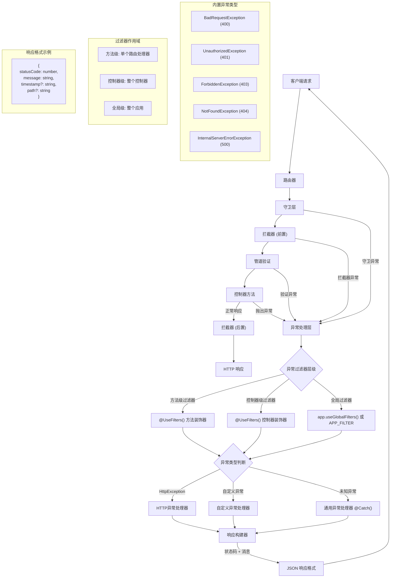

# 异常过滤器

Nest 内置了一套**异常处理机制**（Exceptions Layer），用于统一处理应用中所有未被捕获的异常。当你的业务代码未能捕获某个异常时，这一机制会拦截该异常，并自动生成一份用户可读的响应结果。



默认情况下，这项功能由框架提供的**全局异常过滤器**（Global Exception Filter）实现。该过滤器会处理所有 `HttpException` 及其子类。当遇到无法识别的异常（即既非 `HttpException`，也非其子类）时，内置异常过滤器将返回如下默认的 JSON 响应：

```json
{
  "statusCode": 500,
  "message": "Internal server error"
}
```

<CalloutInfo>
  全局异常过滤器对 `http-errors` 库提供了部分兼容支持。只要抛出的异常对象中包含 `statusCode` 和
  `message` 属性，这些信息就会被正确提取并用于响应；否则，系统将退回至默认的
  `InternalServerErrorException`。
</CalloutInfo>

## 抛出标准异常

Nest 提供了内置的 `HttpException` 类（从 `@nestjs/common` 包导出）。对于典型的 HTTP REST 或 GraphQL API 应用，推荐在出现错误时返回标准化的 HTTP 响应对象。

以 `CatsController` 中的 `findAll()` 方法为例（GET 路由处理器）。假设该方法由于某些原因抛出异常，可参考如下写法：

```ts filename='cats.controller.ts'
@Get()
async findAll() {
  throw new HttpException('Forbidden', HttpStatus.FORBIDDEN);
}
```

<CalloutInfo>
  `HttpStatus` 是一个辅助枚举，同样从 `@nestjs/common` 包中导入，用于提供语义化的 HTTP 状态码。
</CalloutInfo>

当客户端调用该接口时，返回的响应如下所示：

```json
{
  "statusCode": 403,
  "message": "Forbidden"
}
```

`HttpException` 构造函数接收两个必选参数：

- `response`：定义返回的 JSON 响应体，可以是字符串或对象（详见下文）；
- `status`：定义 HTTP 状态码，推荐使用 `HttpStatus` 枚举值。

默认情况下，响应体包含以下两个字段：

- `statusCode`：值为 `status` 参数指定的 HTTP 状态码；
- `message`：根据 `status` 自动生成的简短错误描述。

如果只想自定义 `message`，可以传入字符串作为 `response`；若需完全自定义响应体结构，则可传入一个对象，Nest 会将其序列化为 JSON 返回给客户端。

`status` 参数应为合法的 HTTP 状态码，最佳实践是使用 `@nestjs/common` 中的 `HttpStatus` 枚举，以确保语义明确且便于维护。

此外，`HttpException` 还支持第三个可选参数 `options`，用于传递异常的 [cause](https://nodejs.org/en/blog/release/v16.9.0/#error-cause)。该 cause 不会出现在响应体中，但可用于日志记录，有助于定位错误的根本原因。

如下所示，通过传入自定义响应体及错误根因：

```ts filename='cats.controller.ts'
@Get()
async findAll() {
  try {
    await this.service.findAll()
  } catch (error) {
    throw new HttpException({
      status: HttpStatus.FORBIDDEN,
      error: 'This is a custom message',
    }, HttpStatus.FORBIDDEN, {
      cause: error
    });
  }
}
```

上述代码的响应为：

```json
{
  "status": 403,
  "error": "This is a custom message"
}
```

## 异常日志记录

在**默认配置**下，Nest 提供的全局异常过滤器**不会**把框架内置异常（如 `HttpException` 及其派生类）打印到控制台。这类异常被视为可预期的业务流程，因此不会记录为系统错误。`WsException`、`RpcException` 等协议层异常同样如此。

所有这类异常最终都继承自 `@nestjs/common` 导出的抽象基类 `IntrinsicException`。
借助这一层级结构，Nest 能区分**预期异常**与**非预期异常**，从而决定是否写入日志。

如果你希望同时记录这些预期异常，可以编写并绑定自定义异常过滤器。下一节将演示具体做法。

## 自定义异常

在大多数情况下，直接使用官方提供的 HTTP 异常已足够，只有当业务需要更细粒度的语义或附加元数据时，才建议实现自定义异常。

<CalloutInfo title="最佳实践" type="success">
  为保持一致性，建议为业务定义一个异常层级结构，并让所有自定义异常继承自基类
  `HttpException`。这样，Nest 内置的异常处理链即可自动识别并格式化这些异常，无需额外配置。
</CalloutInfo>

示例：

```ts filename='forbidden.exception.ts'
export class ForbiddenException extends HttpException {
  constructor() {
    super('Forbidden', HttpStatus.FORBIDDEN)
  }
}
```

由于 `ForbiddenException` 继承自基础 `HttpException`，它能与内置异常处理器无缝协作，因此可直接在 `findAll()` 方法中使用：

由于 `ForbiddenException` 继承自基础类 `HttpException`，它能够被框架内置的异常处理机制正确识别并处理，因此可直接在 `findAll()` 方法中抛出使用：

```ts filename='cats.controller.ts'
@Get()
async findAll() {
  throw new ForbiddenException();
}
```

这样，框架会自动返回合适的响应，并按你的日志策略处理该异常。

## 内置 HTTP 异常

Nest 提供了一组内置的标准 HTTP 异常类，这些类均继承自基础类 `HttpException`，并由 `@nestjs/common` 包导出，涵盖了常见的 HTTP 状态码对应的异常类型，包括：

- `BadRequestException`
- `UnauthorizedException`
- `NotFoundException`
- `ForbiddenException`
- `NotAcceptableException`
- `RequestTimeoutException`
- `ConflictException`
- `GoneException`
- `HttpVersionNotSupportedException`
- `PayloadTooLargeException`
- `UnsupportedMediaTypeException`
- `UnprocessableEntityException`
- `InternalServerErrorException`
- `NotImplementedException`
- `ImATeapotException`
- `MethodNotAllowedException`
- `BadGatewayException`
- `ServiceUnavailableException`
- `GatewayTimeoutException`
- `PreconditionFailedException`

这些异常类在构造函数中均支持传入 `options` 参数，用于同时提供错误的 cause（原因）和 description（描述）信息。例如：

```ts
throw new BadRequestException('Something bad happened', {
  cause: new Error(),
  description: 'Some error description',
})
```

上述代码将返回如下结构的 HTTP 响应：

```json
{
  "message": "发生了一些错误",
  "error": "错误描述信息",
  "statusCode": 400
}
```

## 异常过滤器

Nest 提供的内置异常过滤器已能自动处理大多数常见情况，但在某些场景下，你可能希望对异常处理过程拥有更**精细**的控制。例如，你可能需要添加日志记录，或根据运行时上下文返回不同结构的 JSON 响应。此时，可以使用自定义异常过滤器来精确掌控异常的处理逻辑和返回给客户端的响应内容。

下面是一个用于捕获 `HttpException` 异常的自定义过滤器示例，并展示如何自定义响应格式。为了实现这一点，我们需要访问底层平台提供的 `Request` 和 `Response` 对象：其中，`Request` 可用于获取原始请求路径以进行日志记录，而 `Response` 可用于手动构造响应内容，通过 `response.json()` 方法发送数据。

```ts filename='http-exception.filter.ts'
import { ExceptionFilter, Catch, ArgumentsHost, HttpException } from '@nestjs/common'
import { Request, Response } from 'express'

@Catch(HttpException)
export class HttpExceptionFilter implements ExceptionFilter {
  catch(exception: HttpException, host: ArgumentsHost) {
    const ctx = host.switchToHttp()
    const response = ctx.getResponse<Response>()
    const request = ctx.getRequest<Request>()
    const status = exception.getStatus()

    response.status(status).json({
      statusCode: status,
      timestamp: new Date().toISOString(),
      path: request.url,
    })
  }
}
```

<CalloutInfo>
  所有异常过滤器都应实现通用接口 `ExceptionFilter<T>`，你需要实现其中的 `catch(exception: T, host: ArgumentsHost)` 方法。其中 `T` 表示需要捕获的异常类型。
</CalloutInfo>

<CalloutInfo type="warning">
  如果你使用的是 `@nestjs/platform-fastify`，请使用 `response.send()` 替代
  `response.json()`，并确保从 `fastify` 导入正确的类型。
</CalloutInfo>

`@Catch(HttpException)` 装饰器用于为过滤器绑定异常类型元数据，告知 Nest 此过滤器仅处理 `HttpException` 类型的异常。你也可以传入多个参数（以逗号分隔），从而让过滤器同时处理多种异常类型。

## ArgumentsHost 参数

下面来看看 `catch()` 方法的两个参数：`exception` 表示当前捕获到的异常，而 `host` 是一个 `ArgumentsHost` 实例。`ArgumentsHost` 是 Nest 提供的通用上下文封装器，我们会在[执行上下文](/fundamentals/execution-context)一章中做更详细的介绍。

在本示例中，我们借助 `host` 取回原始请求处理器（即抛出异常的控制器方法）收到的 `Request` 和 `Response` 对象。得益于 `ArgumentsHost` 内置的辅助方法，这一步骤十分直观。想了解更多细节，可查阅 [ArgumentsHost 文档](/fundamentals/execution-context)。

<CalloutInfo title="为什么需要 ArgumentsHost？">
  这一抽象层可在所有类型的上下文中工作（HTTP、微服务、WebSocket
  等）。在后文的执行上下文章节中，你将看到怎样利用这些辅助方法访问**任意上下文**下的底层参数，从而编写能够跨多种场景复用的异常过滤器。
</CalloutInfo>

## 绑定过滤器

我们可以通过 `@UseFilters()` 装饰器，将自定义的 `HttpExceptionFilter` 绑定到 `CatsController` 的 `create()` 方法上：

```ts filename='cats.controller.ts'
import { UseFilters } from '@nestjs/common'

@Post()
@UseFilters(new HttpExceptionFilter())
async create(@Body() createCatDto: CreateCatDto) {
  throw new ForbiddenException();
}
```

如上所示，`@UseFilters()` 装饰器可接收一个或多个异常过滤器实例，多个实例以逗号分隔传入。在该示例中，我们直接传入了 `HttpExceptionFilter` 的实例。实际上，也可以传入过滤器类本身（而非其实例），由框架负责实例化，并自动支持**依赖注入**：

```ts filename='cats.controller.ts'
@Post()
@UseFilters(HttpExceptionFilter)
async create(@Body() createCatDto: CreateCatDto) {
  throw new ForbiddenException();
}
```

<CalloutInfo type="success">
  推荐使用类方式（即传入过滤器类）进行绑定。这样可减少内存开销，Nest
  会在模块范围内复用同一个过滤器实例。
</CalloutInfo>

如上例，`HttpExceptionFilter` 只应用于单个 `create()` 路由处理器，即方法级作用域。异常过滤器可按不同层级作用域绑定：方法级、控制器级或全局级。

上述示例中，`HttpExceptionFilter` 仅应用于 `create()` 路由处理方法，即属于方法级作用域。实际上，异常过滤器可以绑定在三个不同的作用域：方法级、控制器级或全局级。

例如，将过滤器绑定到整个控制器：

```ts filename='cats.controller.ts'
@Controller()
@UseFilters(new HttpExceptionFilter())
export class CatsController {}
```

这种写法会使 `HttpExceptionFilter` 应用于 `CatsController` 内的所有路由处理器。

如需注册为全局过滤器，可在 `main.ts` 中使用如下方式：

```ts filename='main.ts'
async function bootstrap() {
  const app = await NestFactory.create(AppModule)
  app.useGlobalFilters(new HttpExceptionFilter()) // [!code hl]
  await app.listen(process.env.PORT ?? 3000)
}
```

<CalloutInfo type="warning">
  `useGlobalFilters()` 注册的过滤器不会作用于网关（Gateway）或混合应用中的过滤器逻辑。
</CalloutInfo>

通过 `useGlobalFilters()` 注册的全局过滤器将作用于应用中所有控制器与其方法。但请注意：此方式注册的过滤器**无法注入依赖**，因为它们不在 Nest 的模块上下文中。若需要依赖注入支持，可通过模块内提供者注册的方式实现：

```ts filename='app.module.ts'
import { Module } from '@nestjs/common'
import { APP_FILTER } from '@nestjs/core'

@Module({
  providers: [
    {
      provide: APP_FILTER,
      useClass: HttpExceptionFilter,
    },
  ],
})
export class AppModule {}
```

<CalloutInfo>
  通过 `APP_FILTER`
  提供者注册的过滤器，**无论在哪个模块注册，都会作为全局过滤器生效**。建议在定义该过滤器的模块中进行注册。此外，`useClass`
  并非唯一的注册方式，更多注册策略详见[自定义提供者](/fundamentals/custom-providers)。
</CalloutInfo>

如需同时注册多个全局过滤器，只需将它们一并添加到 `providers` 数组中即可。

## 捕获所有异常

如需捕获所有未处理的异常（无论其具体类型），只需在 `@Catch()` 装饰器中不传入任何参数，即 `@Catch()`。这表示该过滤器将处理所有抛出的异常。

下方示例展示了一个平台无关的异常过滤器实现。该实现通过使用 Nest 提供的 [HTTP 适配器](/faq/http-adapter)来返回响应，而非直接依赖具体平台提供的对象（如 `Request` 和 `Response`）：

```ts
import { ExceptionFilter, Catch, ArgumentsHost, HttpException, HttpStatus } from '@nestjs/common'
import { HttpAdapterHost } from '@nestjs/core'

@Catch()
export class CatchEverythingFilter implements ExceptionFilter {
  constructor(private readonly httpAdapterHost: HttpAdapterHost) {}

  catch(exception: unknown, host: ArgumentsHost): void {
    // 注意：在某些情况下，`httpAdapter` 可能尚未初始化，因此推荐在方法中获取。
    const { httpAdapter } = this.httpAdapterHost

    const ctx = host.switchToHttp()

    const httpStatus =
      exception instanceof HttpException ? exception.getStatus() : HttpStatus.INTERNAL_SERVER_ERROR

    const responseBody = {
      statusCode: httpStatus,
      timestamp: new Date().toISOString(),
      path: httpAdapter.getRequestUrl(ctx.getRequest()),
    }

    httpAdapter.reply(ctx.getResponse(), responseBody, httpStatus)
  }
}
```

<CalloutInfo>
  如果同时注册了“捕获所有异常”的过滤器和**针对特定异常类型**的过滤器，应优先注册“捕获所有异常”的过滤器。否则，特定异常过滤器可能无法正确处理其目标异常类型。
</CalloutInfo>

## 继承

在实际开发中，你通常会根据应用的需求自定义异常过滤器。但有时，你可能只需要在内置的**全局异常过滤器**上，按需重写部分行为。

此时，你可以继承 `BaseExceptionFilter` 并在子类中调用其 `catch()` 方法，将默认的异常处理逻辑委托给基类：

```ts filename='all-exceptions.filter.ts'
import { Catch, ArgumentsHost } from '@nestjs/common'
import { BaseExceptionFilter } from '@nestjs/core'

@Catch()
export class AllExceptionsFilter extends BaseExceptionFilter {
  catch(exception: unknown, host: ArgumentsHost) {
    super.catch(exception, host)
  }
}
```

<CalloutInfo type="warning">
  如果在方法级或控制器级使用继承自 `BaseExceptionFilter` 的过滤器，**不要使用 `new`
  手动实例化**，应交由框架自动创建实例。
</CalloutInfo>

全局异常过滤器可以继承 `BaseExceptionFilter`。有两种推荐的实现方式：

- **方式一**：构造时手动注入 `HttpAdapter` 实例

```ts
async function bootstrap() {
  const app = await NestFactory.create(AppModule)

  const { httpAdapter } = app.get(HttpAdapterHost)
  app.useGlobalFilters(new AllExceptionsFilter(httpAdapter))

  await app.listen(process.env.PORT ?? 3000)
}
bootstrap()
```

- **方式二**：使用 `APP_FILTER` 令牌注册为全局过滤器

详见[绑定过滤器](/exception-filters#绑定过滤器)部分。
