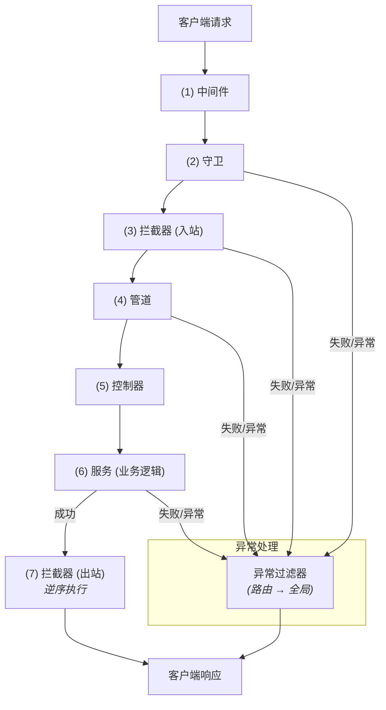

# 请求生命周期

在 Nest 应用中，一个请求从接收到响应的整个过程遵循一个特定的顺序，这个过程被称为**请求生命周期（Request Lifecycle）**。由于这个过程涉及中间件、管道、守卫、拦截器等多种机制，尤其当全局、控制器级和路由级的组件共同作用时，追踪某段代码在生命周期中的执行位置可能会变得复杂。一个典型的请求流程是：请求首先依次穿过中间件、守卫、拦截器和管道，抵达控制器处理后，在响应阶段再次经过拦截器。

## 中间件

中间件的执行遵循一个明确的顺序。首先，Nest 会运行全局中间件（例如通过 `app.use()` 绑定的中间件），然后运行按路由路径绑定的[模块中间件](/middleware)。中间件会按照它们的绑定顺序依次执行，这一点与 Express 非常相似。如果中间件分布在不同模块中，根模块中的中间件会最先执行，其余模块的中间件则会按照模块在 `imports` 数组中的排列顺序依次执行。

## 守卫

守卫的执行顺序同样是固定的：首先是全局守卫，其次是控制器守卫，最后是路由守卫。与中间件类似，同级别的守卫也会按照绑定顺序依次执行。例如：

```ts
@UseGuards(Guard1, Guard2)
@Controller('cats')
export class CatsController {
  constructor(private catsService: CatsService) {}

  @UseGuards(Guard3)
  @Get()
  getCats(): Cats[] {
    return this.catsService.getCats()
  }
}
```

在上面的例子中，`Guard1` 会先于 `Guard2` 执行，而它们两者都会在 `Guard3` 之前执行。

<CalloutInfo>
  所谓"全局"、"控制器级"或"路由级"，其区别在于组件的绑定**作用域**。例如，通过
  `app.useGlobalGuards()`
  或模块提供者绑定的守卫是**全局**的；在控制器类上应用的装饰器是**控制器级**的；在路由处理方法上应用的装饰器则是**路由级**的。
</CalloutInfo>

## 拦截器

拦截器的执行顺序与守卫大体相同，但其独特之处在于它利用了 [RxJS Observable](https://github.com/ReactiveX/rxjs)。这意味着拦截器的执行流呈现"先进后出"（LIFO）的特点。具体来说，入站请求会按照**全局 → 控制器 → 路由**的顺序通过拦截器，而响应流则会以**路由 → 控制器 → 全局**的逆序返回。此外，由管道、控制器或服务抛出的任何异常，都可以在拦截器的 `catchError` 操作符中被捕获。

## 管道

管道的执行顺序为：**全局管道 → 控制器管道 → 路由管道 → 路由参数管道**。

与其他组件类似，`@UsePipes()` 中列出的管道也是"先进先出"（FIFO）的。然而，管道在处理**路由参数**时有一个特别之处：它们会从最后一个参数开始，向前依次处理。

例如，在下面的控制器中：

```ts
@UsePipes(GeneralValidationPipe)
@Controller('cats')
export class CatsController {
  constructor(private catsService: CatsService) {}

  @UsePipes(RouteSpecificPipe)
  @Patch(':id')
  updateCat(
    @Body() body: UpdateCatDTO,
    @Param() params: UpdateCatParams,
    @Query() query: UpdateCatQuery
  ) {
    return this.catsService.updateCat(body, params, query)
  }
}
```

`GeneralValidationPipe` 和 `RouteSpecificPipe` 会按照以下顺序处理路由参数：首先是 `query`，然后是 `params`，最后是 `body`。如果 `@Query()`、`@Param()` 或 `@Body()` 上直接绑定了参数级管道，它们会在 `GeneralValidationPipe` 和 `RouteSpecificPipe` 执行完毕后，同样以 `query` → `params` → `body` 的顺序执行。

## 异常过滤器

异常过滤器是唯一**不遵循**"全局优先"原则的组件。它的执行顺序恰好相反：从最低层级开始，即**路由级 → 控制器级 → 全局级**。

值得注意的是，同一个异常**不会**被多个异常过滤器处理。一旦路由级过滤器捕获了某个异常，控制器级和全局级的过滤器将不会再处理该异常。如果希望在不同级别的过滤器之间共享处理逻辑，你可以通过[继承](/exception-filters#inheritance)的方式将它们联系起来。

<CalloutInfo>
  异常过滤器只处理**未被捕获**的异常。也就是说，被 `try/catch`
  块捕获的异常不会触发异常过滤器。一旦请求生命周期中出现未捕获的异常，常规的执行流程会立即中止，并将控制权移交给异常过滤器。
</CalloutInfo>

## 总结

为了更直观地理解上述流程，下图展示了一个典型的请求生命周期：


