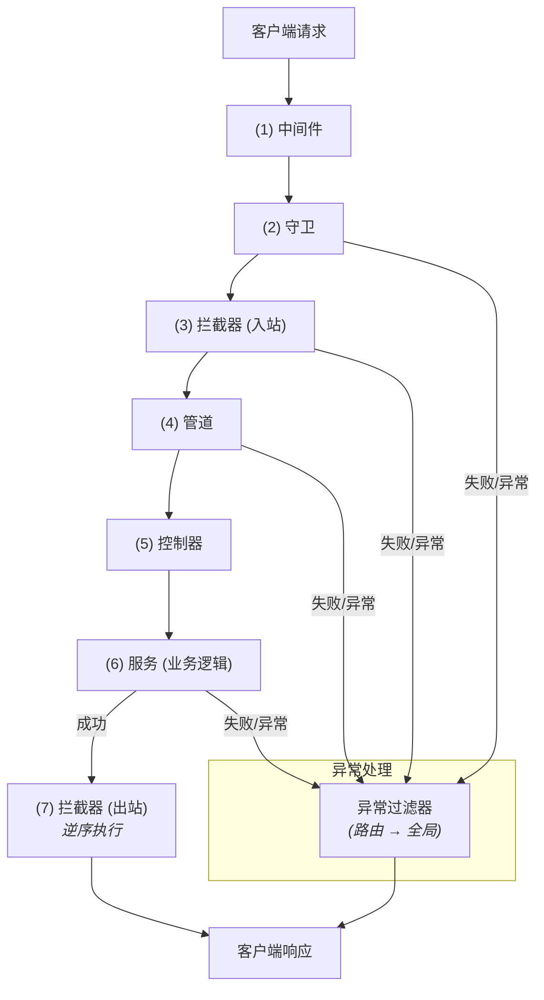

# 请求生命周期

在 Nest 应用中，每个传入请求都会经历一系列有序的处理阶段，这个完整的处理流程被称为**请求生命周期**（Request Lifecycle）。
由于生命周期中涉及中间件、管道、守卫、拦截器等多个机制，且这些机制可能在全局、控制器级或路由级同时生效，因此追踪某段逻辑在整个流程中的执行位置，常常并非易事。

一个典型的请求处理过程大致如下：

1. 请求首先按顺序穿过所有中间件。
2. 接着经过守卫进行权限校验。
3. 然后交由拦截器处理逻辑包裹。
4. 再由管道进行数据转换与验证。
5. 最终抵达控制器处理业务逻辑。
6. 控制器响应后，响应数据再次穿过拦截器处理，最后返回给客户端。

## 中间件

中间件的执行顺序是确定的：

1. 全局中间件：最先执行，通过 `app.use()` 注册；
2. 模块中间件：随后执行，根据其所绑定的模块与路由路径决定是否触发。

中间件的执行顺序与其注册顺序保持一致，与 Express 的行为基本相同。

当多个模块中定义了中间件时，它们的执行顺序遵循以下规则：

1. 根模块中的中间件最先执行。
2. 其余模块中的中间件按照模块在根模块 `imports` 数组中的排列顺序依次执行。

## 守卫

守卫用于在请求进入控制器之前进行权限判断，执行顺序如下：

1. 全局守卫：通过 `app.useGlobalGuards()` 注册；
2. 控制器级守卫：通过控制器上的 `@UseGuards()` 装饰器绑定；
3. 路由级守卫：绑定在控制器方法上，优先级最低，但离实际请求最近。

同一作用域内的多个守卫，也会按照其声明顺序依次执行。

例如：

```ts filename='cats.controller.ts'
@UseGuards(Guard1, Guard2)
@Controller('cats')
export class CatsController {
  constructor(private catsService: CatsService) {}

  @UseGuards(Guard3)
  @Get()
  getCats(): Cats[] {
    return this.catsService.getCats()
  }
}
```

上述代码中的执行顺序为：`Guard1` → `Guard2` → `Guard3`。

<CalloutInfo>
所谓的“全局”、“控制器级”和“路由级”是指守卫的**绑定作用域**不同：

- 使用 `app.useGlobalGuards()` 注册的为全局守卫。
- 使用装饰器绑定在控制器类上的为控制器级守卫。
- 使用装饰器绑定在控制器方法上的为路由级守卫。

</CalloutInfo>

## 拦截器

拦截器的执行顺序与守卫类似，但其核心特性在于：拦截器基于 [RxJS](https://github.com/ReactiveX/rxjs) 的 Observable 构建，因此其执行逻辑遵循“**先进后出（LIFO）**”的模式。

当处理请求时，拦截器的执行顺序为：**全局 → 控制器 → 路由**。
当处理响应时，则按相反顺序流转：**路由 → 控制器 → 全局**。

此外，任何在**管道、控制器或服务中抛出的异常**，都可以在拦截器中通过 `catchError` 操作符进行统一捕获和处理。这使得拦截器非常适合用来实现跨层异常处理、日志记录或响应数据格式化等逻辑。

## 管道

管道的执行顺序为：**全局管道 → 控制器级管道 → 路由级管道 → 参数级管道**。

在通过 `@UsePipes()` 装饰器显式声明多个管道时，它们会按照定义顺序依次执行，即遵循“**先进先出**”原则。

不过在处理**路由参数**时，NestJS 采用了一种特殊的处理顺序：
默认情况下，参数会从**最后一个到第一个**依次经过管道处理。举个例子：

```ts
@UsePipes(GeneralValidationPipe)
@Controller('cats')
export class CatsController {
  constructor(private catsService: CatsService) {}

  @UsePipes(RouteSpecificPipe)
  @Patch(':id')
  updateCat(
    @Body() body: UpdateCatDTO,
    @Param() params: UpdateCatParams,
    @Query() query: UpdateCatQuery
  ) {
    return this.catsService.updateCat(body, params, query)
  }
}
```

在上述示例中，`GeneralValidationPipe` 和 `RouteSpecificPipe` 会依次处理请求参数，处理顺序为：`query` → `params` → `body`。

此外，如果 `@Query()`、`@Param()` 或 `@Body()` 装饰器上绑定了参数级管道（如 `@Query(new CustomPipe())`），这些管道会在上面提到的通用管道（如 `GeneralValidationPipe`）执行完毕后，同样按 `query` → `params` → `body` 的顺序依次执行。

## 异常过滤器

异常过滤器是 NestJS 中**唯一不遵循**“全局优先”执行顺序的组件。相反，它采用的是“由内而外”的处理流程，具体顺序为：**路由级 → 控制器级 → 全局级**

这一执行机制意味着：一旦某个异常被路由级过滤器处理，后续更高层级（控制器级、全局级）的过滤器将不再介入。每个异常最多只会被一个过滤器处理。

如果你希望在不同层级间复用处理逻辑，例如记录日志、统一封装响应结构等，可以通过[继承机制](/exception-filters#继承内置异常过滤器)将多个过滤器组织成一个继承链。

<CalloutInfo>
异常过滤器仅处理**未被捕获**的异常。

换言之，在代码中使用 `try/catch` 明确捕获的异常将不会触发异常过滤器。
一旦请求生命周期中抛出了未捕获的异常，常规的处理流程会被中断，并立即由异常过滤器接管。

</CalloutInfo>

## 总结

为了帮助你更清晰地理解上述各类组件（拦截器、管道、异常过滤器）的执行顺序与作用时机，下面的图示展示了一个典型的 NestJS 请求生命周期流程：


