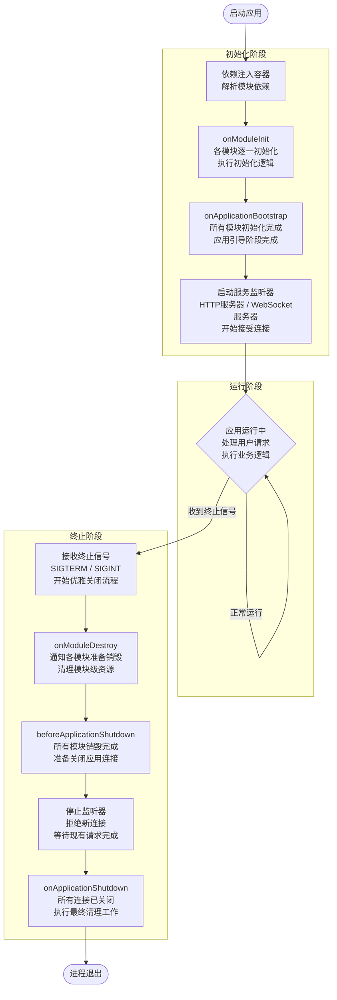

# 生命周期事件

Nest 应用程序及其各个组成部分都受 Nest 生命周期管理。Nest 提供了**生命周期钩子（Lifecycle Hook）**，允许你在关键生命周期节点感知并执行相应操作（如在模块、提供者或控制器中运行注册代码）。

## 生命周期流程

下图展示了应用程序从启动到 Node 进程退出期间，关键生命周期事件的顺序。整个生命周期分为三个阶段：**初始化（initializing）**、**运行中（running）**和**终止中（terminating）**。理解生命周期有助于合理安排模块和服务的初始化、活跃连接管理，以及在收到终止信号时优雅关闭应用。



## 生命周期事件

生命周期事件在应用程序启动和关闭过程中触发。Nest 会在每个生命周期节点调用已注册的生命周期钩子方法（Lifecycle Hook Method），这些方法可定义在模块、提供者或控制器中（关闭钩子（shutdown hook）需先启用，详见[下文](/fundamentals/lifecycle-events#application-shutdown)）。如上图所示，Nest 还会调用底层方法来开始或停止监听连接。

下表说明，只有在显式调用 `app.init()` 或 `app.listen()` 时，`onModuleInit` 和 `onApplicationBootstrap` 才会被触发。

同理，`onModuleDestroy`、`beforeApplicationShutdown` 和 `onApplicationShutdown` 仅在显式调用 `app.close()`，或进程收到特殊系统信号（如 SIGTERM）且应用已正确启用 `enableShutdownHooks` 时才会触发（详见下文[应用关闭](/fundamentals/lifecycle-events#application-shutdown)部分）。

| 生命周期钩子方法                | 触发钩子方法调用的生命周期事件                                                                                                              |
| ------------------------------- | ------------------------------------------------------------------------------------------------------------------------------------------- |
| `onModuleInit()`                | 宿主模块依赖关系解析完成后调用。                                                                                                            |
| `onApplicationBootstrap()`      | 所有模块初始化完成但尚未开始监听连接时调用。                                                                                                |
| `onModuleDestroy()`\*           | 收到终止信号（如 `SIGTERM`）后调用。                                                                                                        |
| `beforeApplicationShutdown()`\* | 所有 `onModuleDestroy()` 处理器完成（Promise 已 resolve 或 reject）后调用；<br />一旦完成，所有现有连接将被关闭（即调用了 `app.close()`）。 |
| `onApplicationShutdown()`\*     | 连接关闭后（`app.close()` resolve 后）调用。                                                                                                |

\* 对于这些事件，如果未显式调用 `app.close()`，则必须主动启用相关钩子，才能响应如 `SIGTERM` 等系统信号。详见[应用关闭](/fundamentals/lifecycle-events#application-shutdown)。

<CalloutInfo type="warning">
  上述生命周期钩子不会在请求作用域类中触发。请求作用域类不受应用生命周期管理，其生命周期不可预测，仅在每个请求中单独创建，并在响应发送后自动被垃圾回收。
</CalloutInfo>

<CalloutInfo>
  `onModuleInit()` 和 `onApplicationBootstrap()`
  的执行顺序取决于模块导入顺序，并会等待前一个钩子完成后再执行。
</CalloutInfo>

## 用法

每个生命周期钩子都对应一个接口（Interface）。接口在 TypeScript 编译后不会保留，因此实现接口并非强制，但推荐这样做，以获得类型检查和编辑器智能提示。要注册生命周期钩子，只需在类（如控制器、提供者或模块）中实现相应接口并提供对应方法。例如，若需在模块初始化阶段注册方法，只需实现 `OnModuleInit` 接口并定义 `onModuleInit()` 方法，如下所示：

```ts
import { Injectable, OnModuleInit } from '@nestjs/common'

@Injectable()
export class UsersService implements OnModuleInit {
  onModuleInit() {
    console.log(`The module has been initialized.`)
  }
}
```

## 异步初始化

`OnModuleInit` 和 `OnApplicationBootstrap` 钩子支持异步操作（即方法可返回 `Promise`，或将方法声明为 `async` 并在方法体内 `await` 异步任务完成），从而延迟应用初始化流程。

```ts
async onModuleInit(): Promise<void> {
  await this.fetch();
}
```

## 应用关闭

`onModuleDestroy()`、`beforeApplicationShutdown()` 和 `onApplicationShutdown()` 钩子会在应用终止阶段被调用（如显式调用 `app.close()`，或收到 SIGTERM 等系统信号，前提是已主动开启关闭钩子）。此特性常用于 [Kubernetes](https://kubernetes.io/) 管理容器生命周期，或 [Heroku](https://www.heroku.com/) 等平台管理 dyno 或类似服务。

关闭钩子监听器会占用系统资源，因此默认关闭。要启用关闭钩子，必须调用 `enableShutdownHooks()`：

```ts
import { NestFactory } from '@nestjs/core'
import { AppModule } from './app.module'

async function bootstrap() {
  const app = await NestFactory.create(AppModule)

  // 启用关闭钩子监听
  app.enableShutdownHooks()

  await app.listen(process.env.PORT ?? 3000)
}

bootstrap()
```

<CalloutInfo type="warning">
  由于平台本身的限制，NestJS 在 Windows 上对应用关闭钩子的支持有限。你可以预期 `SIGINT`、`SIGBREAK`
  以及部分 `SIGHUP`
  能正常工作——[详细说明](https://nodejs.org/api/process.html#process_signal_events)。但 `SIGTERM` 在
  Windows 上始终无效，因为任务管理器强制结束进程时，应用无法检测或阻止该操作。更多信息可参考 [libuv
  官方文档](https://docs.libuv.org/en/v1.x/signal.html) 及 Node.js
  的[进程信号事件文档](https://nodejs.org/api/process.html#process_signal_events)。
</CalloutInfo>

<CalloutInfo>
  `enableShutdownHooks` 会因启动监听器而占用内存。如果你在单个 Node 进程中运行多个 Nest 应用（如使用
  Jest 并行测试时），Node 可能会因监听器过多而发出警告。因此，`enableShutdownHooks`
  默认未启用。运行多个实例时请注意。
</CalloutInfo>

当应用收到终止信号时，会依次调用已注册的 `onModuleDestroy()`、`beforeApplicationShutdown()` 和 `onApplicationShutdown()` 方法（顺序如上），并将信号名称作为第一个参数传递。如果注册的方法为异步（返回 Promise），Nest 会等待 Promise resolve 或 reject 后再继续后续流程。

```ts
@Injectable()
class UsersService implements OnApplicationShutdown {
  onApplicationShutdown(signal: string) {
    console.log(signal) // 例如 "SIGINT"
  }
}
```

<CalloutInfo>
  调用 `app.close()` 并不会终止 Node 进程，只会触发 `onModuleDestroy()` 和 `onApplicationShutdown()`
  钩子。因此，如果存在定时器、长时间运行的后台任务等，进程不会自动退出。
</CalloutInfo>
