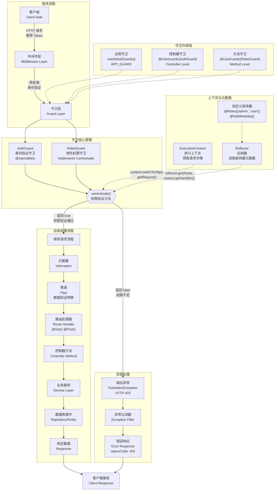

# 守卫

**守卫**（Guard）是通过 `@Injectable()` 装饰器修饰的类，并且实现了 `CanActivate` 接口，主要用于在请求到达路由处理器（Route Handler）之前执行**权限验证**（Authorization）。

守卫的核心职责，是在运行时基于权限、角色或访问控制列表（ACL）等条件，判断当前请求是否有权继续执行。在传统的 Express 应用中，此类授权判断通常由中间件完成，例如验证令牌、在 `Request` 对象上附加用户信息等操作。之所以采用中间件，是因为这些逻辑通常与具体的路由处理器无关，属于通用的请求预处理流程。

不过，中间件本质上是**无状态**的：它无法得知在调用 `next()` 之后，请求将进入哪个具体的路由处理器。而守卫则不同，它可以访问 `ExecutionContext`，从而精确识别当前请求对应的控制器方法及其元数据。这使得守卫能够基于更丰富的上下文信息执行细粒度的权限验证。

与异常过滤器、管道、拦截器一样，守卫是 Nest 提供的“声明式扩展机制”之一。这些机制允许我们在请求/响应流程的不同阶段插入自定义逻辑，从而实现更清晰的职责分离，编写出符合 DRY 原则、易于维护的代码。



<CalloutInfo>
  守卫的执行顺序：**所有中间件之后，任何管道和拦截器之前**。
</CalloutInfo>

## 授权守卫

如前所述，守卫常用于实现授权逻辑。某些特定路由可能仅对具备特定权限的调用者开放，通常指已通过身份验证的用户。在本节中，我们将构建一个基础的 `AuthGuard`，其前提是假设用户已经完成身份验证（例如，请求头中包含有效的访问令牌）。该守卫的主要职责是：从请求中提取并验证令牌，再基于解析出的用户信息判断是否允许该请求继续执行。

```ts filename='auth.guard.ts'
import { Injectable, CanActivate, ExecutionContext } from '@nestjs/common'
import { Observable } from 'rxjs'

@Injectable()
export class AuthGuard implements CanActivate {
  canActivate(
    context: ExecutionContext
  ): boolean | Promise<boolean> | Observable<boolean> {
    const request = context.switchToHttp().getRequest()
    return validateRequest(request)
  }
}
```

<CalloutInfo>
  如果你希望了解更完整的身份验证实现，请参考[身份验证](/security/authentication)章节；如果你关心更复杂的权限控制策略，也可继续阅读[授权](/security/authorization)章节。
</CalloutInfo>

`validateRequest()` 函数的具体实现方式取决于项目需求，既可以是简单的令牌校验逻辑，也可以是集成用户信息查询、权限判断等在内的完整验证流程。这里的重点在于演示守卫如何介入请求-响应周期，并对请求进行拦截与处理。

每个守卫都必须实现 `canActivate()` 方法。此方法的返回值用于判断当前请求是否被允许继续处理，它支持返回三种类型：

- `boolean`：同步返回 `true` 或 `false`。
- `Promise<boolean>`：用于处理异步校验逻辑。
- `Observable<boolean>`：支持响应式流式判断。

Nest 会根据返回值决定是否继续执行后续的处理流程：

- 返回 `true`：请求将被正常处理。
- 返回 `false`：请求将被拒绝，响应相应的异常。

## 理解 ExecutionContext（执行上下文）

在守卫中，`canActivate()` 方法接收一个参数，即 `ExecutionContext` 实例。它继承自我们在“异常过滤器”章节中提到的 `ArgumentsHost`，并在其基础上做了扩展。

在前面的示例中，我们主要通过它获取 HTTP 请求对象。若你尚不熟悉 `ArgumentsHost` 的用法，可以回顾[相关章节](/exception-filters#argumentshost-参数)以加深理解。

与 `ArgumentsHost` 相比，`ExecutionContext` 提供了更多辅助方法，用于访问当前执行流程中的上下文信息。这些信息对于编写灵活、通用的守卫至关重要 —— 它使守卫能够适配不同的控制器、处理器方法，甚至是运行环境（如 HTTP、RPC、WebSocket 等）。

如果你想进一步深入了解 `ExecutionContext` 的结构和功能，可以参考[文档](/fundamentals/execution-context)中的相关说明。

## 基于角色的访问控制

在实际应用中，我们经常需要根据用户的角色来限制对某些资源的访问。接下来，我们将实现一个更贴近真实场景的守卫，用于控制只有具备特定角色的用户才能访问特定的接口或服务。

下面是一个守卫的基础模板。在以下实现中，我们尚未添加任何校验逻辑，所有请求都会被默认放行。你可以在此基础上，根据业务需求逐步补充角色校验的相关逻辑：

```ts filename='roles.guard.ts'
import { Injectable, CanActivate, ExecutionContext } from '@nestjs/common'
import { Observable } from 'rxjs'

@Injectable()
export class RolesGuard implements CanActivate {
  canActivate(
    context: ExecutionContext
  ): boolean | Promise<boolean> | Observable<boolean> {
    return true
  }
}
```

## 守卫的绑定方式

与管道和异常过滤器类似，守卫也可以按照**控制器作用域**、**方法作用域**以及**全局作用域**进行绑定。下面示例展示了如何使用 `@UseGuards()` 装饰器在控制器层级应用守卫：

```ts
import { UseGuards } from '@nestjs/common'

@Controller('cats')
@UseGuards(RolesGuard)
export class CatsController {}
```

在上述示例中，我们将 `RolesGuard` 类作为参数传入。Nest 会自动对其进行实例化，并处理依赖注入。除了传入类引用，也可以显式传入守卫的实例：

```ts
@Controller('cats')
@UseGuards(new RolesGuard())
export class CatsController {}
```

无论是传入类还是实例，这两种写法都会将守卫应用到该控制器下的所有处理器方法上。若只想为某个特定方法设置守卫，可以在方法上直接使用 `@UseGuards()` 装饰器：

```ts
@Get()
@UseGuards(RolesGuard)
findAll() {
  // ...
}
```

### 全局守卫的注册

如果希望守卫作用于整个应用，可以通过 `app.useGlobalGuards()` 方法注册全局守卫：

```ts
const app = await NestFactory.create(AppModule)
app.useGlobalGuards(new RolesGuard())
```

<CalloutInfo type="warning">
  在混合应用中，使用 `useGlobalGuards()` **默认不会**将守卫应用到 WebSocket
  网关或微服务中（详见[混合应用](/faq/hybrid-application)章节）。但在**纯微服务应用**中，该方法注册的守卫会在全局生效。
</CalloutInfo>

需要注意的是，通过 `useGlobalGuards()` 注册的守卫是在**模块上下文之外**执行的，因此**无法注入依赖**。如果守卫中包含需要依赖注入的逻辑，建议在模块内以**提供者**的方式注册：

```ts filename='app.module.ts'
import { Module } from '@nestjs/common'
import { APP_GUARD } from '@nestjs/core'

@Module({
  providers: [
    {
      provide: APP_GUARD,
      useClass: RolesGuard,
    },
  ],
})
export class AppModule {}
```

<CalloutInfo>
  通过上述方式注册的守卫，无论它声明在哪个模块中，都会作为**全局守卫**生效。通常建议在守卫所属的模块中进行注册（如本例中的
  `RolesGuard`）。此外，`useClass`
  只是注册自定义提供者的一种方式，更多高级用法可参考[自定义提供者](/fundamentals/custom-providers)章节。
</CalloutInfo>

## 为处理器设置角色

目前的 `RolesGuard` 还未充分发挥守卫机制的核心优势 —— 利用[执行上下文](/fundamentals/execution-context) 精准识别每个处理器的访问需求。也就是说，它还无法判断某个具体路由是否允许某些角色访问。

举例来说，在 `CatsController` 中，不同路由往往对应不同的权限策略：某些操作只对管理员开放，而其他则对所有用户开放。那么，我们如何为每个处理器灵活地指定所需角色，并保持良好的可复用性呢？

答案是 —— 借助**自定义元数据**（Metadata）机制（详见[反射与元数据](/fundamentals/execution-context#反射与元数据)）。Nest 提供了两种常见方式用于为路由处理器附加元数据：

1. 使用 `Reflector.createDecorator()` 创建专属装饰器；
2. 使用内置的 `@SetMetadata()` 装饰器。

### 创建自定义装饰器：`@Roles()`

推荐方式是使用 `Reflector.createDecorator()` 创建一个语义清晰的装饰器，例如 `@Roles()`，用于将角色信息绑定到特定的处理器方法上。`Reflector` 是 Nest 提供的反射工具，定义在 `@nestjs/core` 包中：

```ts filename='roles.decorator.ts'
import { Reflector } from '@nestjs/core'

export const Roles = Reflector.createDecorator<string[]>()
```

`Roles` 是一个支持传入字符串数组的装饰器，用于标记当前处理器允许访问的角色列表。

### 应用装饰器到控制器方法

定义好装饰器后，我们就可以在控制器中直接使用它：

```ts filename='cats.controller.ts'
@Post()
@Roles(['admin'])
async create(@Body() createCatDto: CreateCatDto) {
  this.catsService.create(createCatDto);
}
```

如上所示，`@Roles(['admin'])` 表示该路由仅允许 `'admin'` 角色访问。

### 其他方式

除了自定义装饰器外，你也可以使用更底层的 `@SetMetadata()` 装饰器手动附加元数据，具体用法可参考[反射与元数据](/fundamentals/execution-context#low-level-approach)。

## 角色守卫完整示例

现在让我们回到 `RolesGuard` 的实现。当前实现的守卫逻辑始终返回 `true`，意味着所有请求都会被允许通过。为了实现基于角色的访问控制，我们需要根据当前用户的角色与路由所要求的角色进行匹配，从而动态判断是否授权访问。

这里，我们再次使用 `Reflector` 来读取定义在路由处理器上的自定义元数据：

```ts filename='roles.guard.ts'
import { Injectable, CanActivate, ExecutionContext } from '@nestjs/common'
import { Reflector } from '@nestjs/core'
import { Roles } from './roles.decorator'

@Injectable()
export class RolesGuard implements CanActivate {
  constructor(private reflector: Reflector) {}

  canActivate(context: ExecutionContext): boolean {
    const roles = this.reflector.get(Roles, context.getHandler())

    if (!roles) {
      return true
    }

    const request = context.switchToHttp().getRequest()
    const user = request.user

    return matchRoles(roles, user.roles)
  }
}
```

在典型的 Node.js
应用中，用户认证成功后，用户对象通常会挂载到请求对象上。因此在本示例中，`request.user`
被视为包含当前用户信息及其角色数据。在实际项目中，这一过程通常由自定义的身份验证守卫或中间件负责完成。详细说明请参阅[身份验证](/security/authentication)章节。

<CalloutInfo>
  `matchRoles()`
  函数的具体实现可根据业务需求灵活设计。本示例的核心在于演示守卫如何介入 Nest
  的请求处理流程，实现访问权限控制。
</CalloutInfo>

如果你希望进一步了解如何在上下文感知的场景中使用 `Reflector`，建议阅读执行上下文章节中的[反射与元数据](/fundamentals/execution-context#reflection-and-metadata)部分。

当用户权限不足时，Nest 会自动返回以下响应：

```ts
{
  "statusCode": 403,
  "message": "Forbidden resource",
  "error": "Forbidden"
}
```

这是因为当守卫返回 `false` 时，Nest 默认会抛出 `ForbiddenException`。如果你希望返回其他类型的响应信息，也可以显式抛出自定义异常，例如：

```ts
throw new UnauthorizedException()
```

守卫中抛出的所有异常，最终都会交由[异常过滤器](/exception-filters)进行处理，包括全局或特定上下文下注册的过滤器。

<CalloutInfo>
  想深入了解权限控制在实际项目中的应用？请参考[授权](/security/authorization)章节。
</CalloutInfo>
