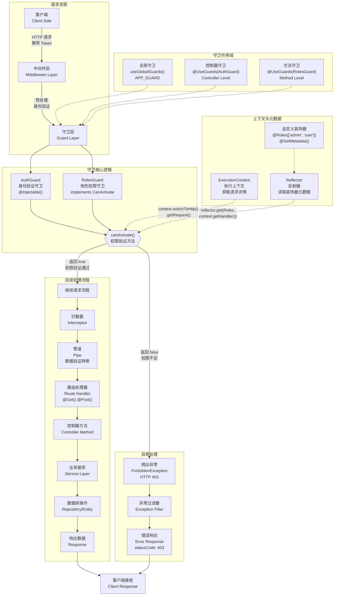

# 守卫

**守卫**（Guard）是带有 `@Injectable()` 装饰器并实现 `CanActivate` 接口的类，用于在请求真正抵达路由处理器（Route Handler）之前进行**授权**（Authorization）判定。

其核心职责是依据运行时条件 —— 如权限、角色或访问控制列表（ACL）—— 决定当前请求是否被允许继续执行。在传统 Express 应用中，授权逻辑（以及常见的身份验证）通常放在[中间件](/middleware)里实现：例如校验令牌、在 `Request` 对象上挂载属性等，因为这些操作与具体路由上下文无关。

然而，中间件本身是“无状态”的：它并不知道 `next()` 之后究竟会调用哪个处理器。而守卫可以访问 `ExecutionContext`，从而精确获知即将执行的处理器及其元数据。与异常过滤器、管道、拦截器一样，守卫的设计让我们能够在请求/响应生命周期的恰当阶段，以**声明式**方式插入逻辑，使代码更加 DRY 且易于维护。



<CalloutInfo>守卫的执行顺序：**所有中间件之后，任何管道和拦截器之前**。</CalloutInfo>

## 授权守卫

如前所述，授权是守卫的典型应用场景之一。某些特定路由仅允许具备相应权限的调用者（通常是已认证用户）访问。接下来，我们将实现一个 `AuthGuard`，其前提是假设用户已通过身份验证（即请求头中包含有效令牌）。该守卫的职责是提取并验证令牌，并根据提取出的用户信息判断是否允许该请求继续执行。

```ts filename='auth.guard.ts'
import { Injectable, CanActivate, ExecutionContext } from '@nestjs/common'
import { Observable } from 'rxjs'

@Injectable()
export class AuthGuard implements CanActivate {
  canActivate(context: ExecutionContext): boolean | Promise<boolean> | Observable<boolean> {
    const request = context.switchToHttp().getRequest()
    return validateRequest(request)
  }
}
```

<CalloutInfo>
  如果你想了解如何在实际项目中实现完整的身份验证机制，请参阅[身份验证章节](/security/authentication)。如需更复杂的授权方案，请参考[授权章节](/security/authorization)。
</CalloutInfo>

`validateRequest()` 函数的实现方式可以因项目需求而异，既可以简化处理，也可以包含更完整的验证逻辑。这里的重点在于展示守卫如何嵌入到请求/响应生命周期中。

每个守卫都必须实现 `canActivate()` 方法。该方法的返回值用于指示是否允许处理当前请求。它既可以返回布尔值，也可以返回 `Promise<boolean>` 或 `Observable<boolean>` 以支持异步流程。Nest 会根据返回结果决定后续行为：

- 返回 `true` 时，请求将继续被处理。
- 返回 `false` 时，Nest 会拒绝该请求。

## 理解 ExecutionContext 执行上下文

`canActivate()` 方法接收一个参数，即 `ExecutionContext`（执行上下文）实例。`ExecutionContext` 继承自 `ArgumentsHost`，我们在异常过滤器章节中已经介绍过 `ArgumentsHost` 的相关内容。

在前面的示例中，我们只是利用它来获取请求对象。你可以回顾上述章节，进一步了解 `ArgumentsHost` 的作用与用法。

相比 `ArgumentsHost`，`ExecutionContext` 通过扩展提供了更多实用的辅助方法，使我们能够获取当前执行流程中的更多上下文信息。这些信息在编写更通用、更具适应性的守卫时尤为重要，有助于让守卫在不同控制器、处理方法以及执行环境中均能灵活适用。你可以在这里阅读更多关于 `ExecutionContext` 的详细说明。

## 基于角色的访问控制

接下来，我们来实现一个更具实际意义的守卫，用于限制仅具有特定角色的用户才能访问特定资源。

下面是一个守卫的基本模板，当前实现默认允许所有请求通过，后续可以根据实际需求逐步完善逻辑：

```ts filename='roles.guard.ts'
import { Injectable, CanActivate, ExecutionContext } from '@nestjs/common'
import { Observable } from 'rxjs'

@Injectable()
export class RolesGuard implements CanActivate {
  canActivate(context: ExecutionContext): boolean | Promise<boolean> | Observable<boolean> {
    return true
  }
}
```

## 守卫的绑定方式

与管道和异常过滤器一样，守卫也可以按照**控制器作用域**、**方法作用域**和**全局作用域**进行绑定。下面演示如何使用 `@UseGuards()` 装饰器在控制器级别应用守卫。该装饰器可以接收一个或多个守卫类（用逗号分隔），便于一次性声明多个守卫：

```ts
import { UseGuards } from '@nestjs/common'

@Controller('cats')
@UseGuards(RolesGuard)
export class CatsController {}
```

如上示例传入的是 `RolesGuard` 类（而非其实例），Nest 会自动为其实例化并处理依赖注入。当然，也可以显式传入守卫实例：

```ts
@Controller('cats')
@UseGuards(new RolesGuard())
export class CatsController {}
```

这两种写法都会将守卫应用于该控制器下的所有处理器方法。如果仅需作用于某个方法，可直接在**方法级别**使用 `@UseGuards()` 装饰器。

若需注册全局守卫，可通过应用实例的 `useGlobalGuards()` 方法：

```ts
const app = await NestFactory.create(AppModule)
// [!code word:useGlobalGuards:1]
app.useGlobalGuards(new RolesGuard())
```

<CalloutInfo type="warning">
  在混合应用中，`useGlobalGuards()`
  **默认不会**为网关和微服务挂载守卫（详见[混合应用](/faq/hybrid-application)一节）。对于**纯微服务**应用，该方法则会将守卫全局生效。
</CalloutInfo>

全局守卫会作用于整个应用的所有控制器和路由处理器。需要注意的是，若通过 `useGlobalGuards()` 在 模块外 注册守卫，便无法注入依赖，因为注册发生在任何模块上下文之外。若守卫需要依赖注入，请在模块内按以下方式注册：

```ts filename='app.module.ts'
import { Module } from '@nestjs/common'
import { APP_GUARD } from '@nestjs/core'

@Module({
  providers: [
    {
      provide: APP_GUARD,
      useClass: RolesGuard,
    },
  ],
})
export class AppModule {}
```

<CalloutInfo>
  通过上述方式注册的守卫，无论声明于哪个模块，实际上都会成为全局守卫。建议在守卫（如本例中的
  `RolesGuard`）所属模块中进行注册。此外，`useClass`
  并非自定义提供者的唯一写法，更多用法请参见[自定义提供者](/fundamentals/custom-providers)。
</CalloutInfo>

## 为处理器设置角色

当前的 `RolesGuard` 并未充分发挥守卫最核心的能力 —— [执行上下文](/fundamentals/execution-context)。因此，它无法区分每个处理器允许哪些角色。例如，在 `CatsController` 中，不同路由可能有不同的权限要求：有的仅限管理员访问，有的则对所有用户开放。那么，如何以灵活且可复用的方式为每个路由指定所需角色呢？

这时，我们可以借助**自定义元数据**（Metadata）（详见[反射与元数据](/fundamentals/execution-context#reflection-and-metadata)）机制。Nest 提供了两种方式为路由处理器附加元数据：

1. 使用 `Reflector.createDecorator()` 创建自定义装饰器；
2. 使用内置的 `@SetMetadata()` 装饰器。

以第一种方式为例，我们可以通过 `Reflector.createDecorator()` 创建一个名为 `@Roles()` 的装饰器，将角色信息附加到处理器方法上。`Reflector` 是 Nest 提供的辅助工具，定义于 `@nestjs/core` 包中：

```ts filename='roles.decorator.ts'
import { Reflector } from '@nestjs/core'

export const Roles = Reflector.createDecorator<string[]>()
```

`Roles` 是一个接受 `string[]` 参数的装饰器，用于标注路由处理器允许的角色。

接下来，在控制器中即可直接使用该装饰器：

```ts filename='cats.controller.ts'
@Post()
@Roles(['admin'])
async create(@Body() createCatDto: CreateCatDto) {
  this.catsService.create(createCatDto);
}
```

如上所示，我们为 `create()` 方法添加了 `@Roles(['admin'])` 装饰器，表示该路由仅允许 `'admin'` 角色访问。

当然，你也可以选择使用更底层的 `@SetMetadata()` 装饰器，详见[反射与元数据](/fundamentals/execution-context#low-level-approach)。

## 角色守卫完整示例

现在我们回到 `RolesGuard` 的实现。当前守卫始终返回 `true`，即允许所有请求通过。但我们希望根据当前用户的角色与路由所需角色进行比对，从而动态控制访问权限。此处，我们再次使用 `Reflector` 来读取自定义元数据：

```ts filename='roles.guard.ts'
import { Injectable, CanActivate, ExecutionContext } from '@nestjs/common'
import { Reflector } from '@nestjs/core'
import { Roles } from './roles.decorator'

@Injectable()
export class RolesGuard implements CanActivate {
  constructor(private reflector: Reflector) {}

  canActivate(context: ExecutionContext): boolean {
    const roles = this.reflector.get(Roles, context.getHandler())
    if (!roles) {
      return true
    }
    const request = context.switchToHttp().getRequest()
    const user = request.user
    return matchRoles(roles, user.roles)
  }
}
```

<CalloutInfo>
  在典型的 Node.js 应用中，认证成功后的用户对象通常会挂载到请求对象上。因此在上述示例中，我们假设
  `request.user`
  包含用户实例及其角色信息。实际项目中，通常会在自定义的身份验证守卫或中间件中完成这一过程。更多内容请参阅[身份验证章节](/security/authentication)。
</CalloutInfo>

<CalloutInfo type="warning">
  `matchRoles()` 函数的具体实现方式可以根据业务场景灵活调整。此处的重点在于展示守卫如何介入 Nest
  的请求处理流程，实现权限控制。
</CalloutInfo>

如需进一步了解如何在上下文敏感的场景中使用 `Reflector`，建议阅读执行上下文中的[反射与元数据](/fundamentals/execution-context#reflection-and-metadata)部分。

当用户权限不足时，Nest 会自动返回如下响应：

```ts
{
  "statusCode": 403,
  "message": "Forbidden resource",
  "error": "Forbidden"
}
```

需要注意的是，当守卫返回 `false` 时，Nest 会自动抛出 `ForbiddenException`。如果你希望返回不同的响应信息，也可以主动抛出其他异常，例如：

```ts
throw new UnauthorizedException()
```

守卫中抛出的所有异常，最终都会由[异常过滤器](/exception-filters)（包括全局或特定上下文的过滤器）处理。

<CalloutInfo>
  想了解在真实项目中如何实现权限控制？请参考[授权章节](/security/authorization)。
</CalloutInfo>
