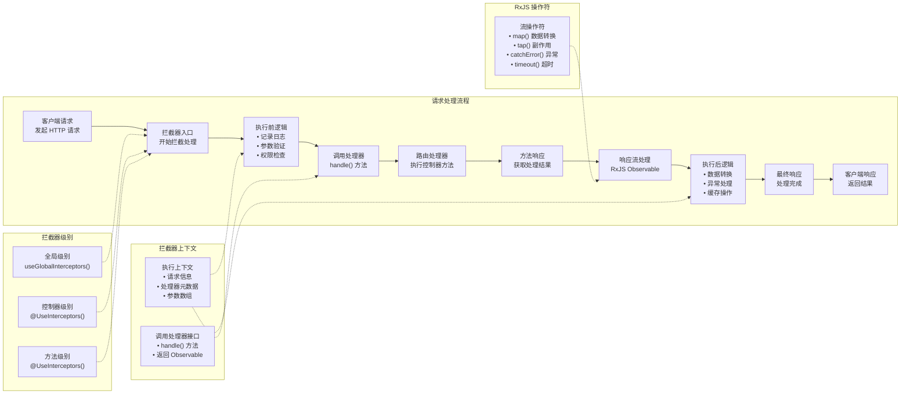

# 拦截器

拦截器（Interceptor）是一个通过 `@Injectable()` 装饰器注解，并实现了 `NestInterceptor` 接口的类。



拦截器受[面向切面编程（Aspect Oriented Programming, AOP）](https://en.wikipedia.org/wiki/Aspect-oriented_programming) 的启发，具备以下能力：

- 在方法执行前后插入自定义逻辑
- 转换函数的返回结果
- 处理或转换函数抛出的异常
- 扩展原有方法的行为
- 根据特定条件（如缓存）重写方法执行流程

## 基础用法

每个拦截器都需要实现 `intercept()` 方法。该方法接收两个参数：第一个是 `ExecutionContext` 实例（与守卫中相同），它继承自 `ArgumentsHost`。在异常过滤器章节我们已介绍过 `ArgumentsHost`，它封装了传递给处理器的参数，并根据应用类型提供不同的参数数组。你可以参考[异常过滤器](/exception-filters#arguments-host)章节了解更多。

## 执行上下文

`ExecutionContext` 在 `ArgumentsHost` 的基础上，增加了多种辅助方法，能够提供当前执行流程的更多细节。这些信息有助于构建通用的拦截器，使其适用于不同的控制器、方法和上下文。详细内容可参考[执行上下文](/fundamentals/execution-context)。

## CallHandler 处理器调用机制

第二个参数是 `CallHandler`。`CallHandler` 接口实现了 `handle()` 方法，你可以在拦截器中调用它来执行路由处理器。如果未调用 `handle()`，路由处理器方法将不会被执行。

这种设计意味着 `intercept()` 方法实际上包裹了整个请求/响应流程。你可以在调用 `handle()` 前后分别实现自定义逻辑。由于 `handle()` 返回的是一个 `Observable`，我们可以利用强大的 [RxJS](https://github.com/ReactiveX/rxjs) 操作符对响应进行进一步处理。在面向切面编程中，调用路由处理器（即调用 `handle()`）被称为[切入点（Pointcut）](https://en.wikipedia.org/wiki/Pointcut)，表示插入额外逻辑的时机。

举例来说，假设有一个 `POST /cats` 的请求，由 `CatsController` 的 `create()` 方法处理。如果某个拦截器在调用链中被触发但未调用 `handle()`，则 `create()` 方法不会被执行。一旦调用 `handle()` 并返回 `Observable`，`create()` 处理器才会被触发。随后我们可以通过 `Observable` 对响应流进行处理，并将最终结果返回给调用方。

## 切面拦截

第一个用例展示如何使用拦截器记录用户操作，例如存储调用日志、异步分发事件或统计耗时。以下是一个简单的 `LoggingInterceptor（日志拦截器）` 示例：

```ts filename='logging.interceptor.ts'
import { Injectable, NestInterceptor, ExecutionContext, CallHandler } from '@nestjs/common'
import { Observable } from 'rxjs'
import { tap } from 'rxjs/operators'

@Injectable()
export class LoggingInterceptor implements NestInterceptor {
  intercept(context: ExecutionContext, next: CallHandler): Observable<any> {
    console.log('Before...')

    const now = Date.now()
    return next.handle().pipe(tap(() => console.log(`After... ${Date.now() - now}ms`)))
  }
}
```

<CalloutInfo>
  `NestInterceptor<T, R>` 是一个泛型接口，其中 `T` 表示 `Observable<T>` 的类型（支持响应流），`R` 表示被 `Observable<R>` 包裹的值的类型。
</CalloutInfo>

<CalloutInfo type="warning">
  拦截器（与控制器、提供者、守卫类似）可以通过构造函数注入依赖。
</CalloutInfo>

由于 `handle()` 返回的是 RxJS 的 `Observable`，我们可以使用多种操作符处理数据流。在上述示例中，`tap()` 操作符会在 observable 流正常或异常终止时执行日志函数，但不会影响响应流程。

## 绑定拦截器

要设置拦截器，可使用 `@nestjs/common` 包中的 `@UseInterceptors()` 装饰器。与[管道](/pipes)和[守卫](/guards)类似，拦截器既可应用于控制器，也可应用于方法或全局。

```ts filename='cats.controller.ts'
import { UseInterceptors } from '@nestjs/common'

@UseInterceptors(LoggingInterceptor)
export class CatsController {}
```

如上所示，`CatsController` 中定义的每个路由处理器都会使用 `LoggingInterceptor`。当调用 `GET /cats` 接口时，标准输出将显示：

```ts
Before...
After... 1ms
```

注意，这里传递的是 `LoggingInterceptor` 类（而非其实例），实例化过程由框架自动完成，从而支持依赖注入。与管道、守卫、异常过滤器类似，也可以直接传递实例：

```ts filename='cats.controller.ts'
@UseInterceptors(new LoggingInterceptor())
export class CatsController {}
```

如前所述，这种写法会将拦截器绑定到该控制器声明的所有处理器。如果只需拦截某个方法，只需在**方法级别**应用装饰器。

如需设置全局拦截器，可通过 Nest 应用实例的 `useGlobalInterceptors()` 方法实现：

```ts
const app = await NestFactory.create(AppModule)
app.useGlobalInterceptors(new LoggingInterceptor())
```

全局拦截器会作用于应用内所有控制器和路由处理器。需要注意，通过 `useGlobalInterceptors()` 在模块外注册的全局拦截器无法注入依赖，因为此时已脱离模块上下文。为解决该问题，可在模块中注册拦截器，示例如下：

```ts filename='app.module.ts'
import { Module } from '@nestjs/common'
import { APP_INTERCEPTOR } from '@nestjs/core'

@Module({
  providers: [
    {
      provide: APP_INTERCEPTOR,
      useClass: LoggingInterceptor,
    },
  ],
})
export class AppModule {}
```

<CalloutInfo>
  采用此方式注册的拦截器，无论在哪个模块中声明，实际上都是全局生效。建议在定义拦截器（如上例中的
  `LoggingInterceptor`）的模块中注册。此外，`useClass`
  并非自定义提供者的唯一注册方式，详情可参考[自定义提供者](/fundamentals/custom-providers)。
</CalloutInfo>

## 响应数据映射

我们已经知道 `handle()` 方法返回的是一个 `Observable`。该流包含了路由处理器的返回值，因此我们可以直接使用 RxJS 的 `map()` 操作符对其进行转换。

<CalloutInfo type="warning">
  响应映射功能不适用于特定库的响应策略（即禁止直接操作 `@Res()` 对象）。
</CalloutInfo>

下面我们来实现一个 `TransformInterceptor`（转换拦截器）。它会通过 RxJS 的 `map()` 操作符，将每个响应包裹到一个新对象的 `data` 属性中，并将该对象返回给客户端。

```ts filename='transform.interceptor.ts'
import { Injectable, NestInterceptor, ExecutionContext, CallHandler } from '@nestjs/common'
import { Observable } from 'rxjs'
import { map } from 'rxjs/operators'

export interface Response<T> {
  data: T
}

@Injectable()
export class TransformInterceptor<T> implements NestInterceptor<T, Response<T>> {
  intercept(context: ExecutionContext, next: CallHandler): Observable<Response<T>> {
    return next.handle().pipe(map((data) => ({ data })))
  }
}
```

<CalloutInfo>
  Nest 拦截器既支持同步的 `intercept()` 方法，也支持异步方法。必要时可以将其声明为 `async`。
</CalloutInfo>

采用上述写法，当调用 `GET /cats` 接口且路由处理器返回空数组 `[]` 时，响应结果如下：

```json
{
  "data": []
}
```

拦截器在实现全局需求时非常有用。例如，如果我们希望将所有 `null` 值转换为空字符串 `''`，可以用一行代码实现，并将拦截器全局绑定，这样每个处理器都会自动应用。

```ts
import { Injectable, NestInterceptor, ExecutionContext, CallHandler } from '@nestjs/common'
import { Observable } from 'rxjs'
import { map } from 'rxjs/operators'

@Injectable()
export class ExcludeNullInterceptor implements NestInterceptor {
  intercept(context: ExecutionContext, next: CallHandler): Observable<any> {
    return next.handle().pipe(map((value) => (value === null ? '' : value)))
  }
}
```

## 异常处理与映射

另一个常见场景是利用 RxJS 的 `catchError()` 操作符对抛出的异常进行重写：

```ts filename='errors.interceptor.ts'
import {
  Injectable,
  NestInterceptor,
  ExecutionContext,
  BadGatewayException,
  CallHandler,
} from '@nestjs/common'
import { Observable, throwError } from 'rxjs'
import { catchError } from 'rxjs/operators'

@Injectable()
export class ErrorsInterceptor implements NestInterceptor {
  intercept(context: ExecutionContext, next: CallHandler): Observable<any> {
    return next.handle().pipe(catchError(() => throwError(() => new BadGatewayException())))
  }
}
```

## 响应流重写

有时我们希望完全跳过处理器的执行，直接返回其他结果。典型场景如实现缓存机制以提升响应速度。下面是一个基础的 **缓存拦截器（CacheInterceptor）** 示例，它直接从缓存返回响应。实际应用中还需考虑 TTL、缓存失效、缓存容量等，这里仅作基本演示。

```ts filename='cache.interceptor.ts'
import { Injectable, NestInterceptor, ExecutionContext, CallHandler } from '@nestjs/common'
import { Observable, of } from 'rxjs'

@Injectable()
export class CacheInterceptor implements NestInterceptor {
  intercept(context: ExecutionContext, next: CallHandler): Observable<any> {
    const isCached = true
    if (isCached) {
      return of([])
    }
    return next.handle()
  }
}
```

在 `CacheInterceptor` 中，`isCached` 和响应内容均为硬编码。这里的关键在于，我们通过 RxJS 的 `of()` 操作符返回了一个新的流，因此路由处理器不会被执行。当某个端点应用了 `CacheInterceptor` 后，会立即返回硬编码的空数组。若需实现更通用的缓存方案，可结合 `Reflector` 与自定义装饰器，`Reflector` 的用法详见[守卫](/guards)章节。

## 常用 RxJS 操作符实践

利用 RxJS 操作符处理流，可以实现丰富的功能。以下是另一个常见场景：为路由请求设置超时时间。当某个端点在指定时间内未返回结果时，自动终止请求并返回错误响应。示例代码如下：

```ts filename='timeout.interceptor.ts'
import {
  Injectable,
  NestInterceptor,
  ExecutionContext,
  CallHandler,
  RequestTimeoutException,
} from '@nestjs/common'
import { Observable, throwError, TimeoutError } from 'rxjs'
import { catchError, timeout } from 'rxjs/operators'

@Injectable()
export class TimeoutInterceptor implements NestInterceptor {
  intercept(context: ExecutionContext, next: CallHandler): Observable<any> {
    return next.handle().pipe(
      timeout(5000),
      catchError((err) => {
        if (err instanceof TimeoutError) {
          return throwError(() => new RequestTimeoutException())
        }
        return throwError(() => err)
      })
    )
  }
}
```

如上所示，若处理时间超过 5 秒，请求会被自动取消。你也可以在抛出 `RequestTimeoutException` 前，添加自定义逻辑（如释放资源等）。
