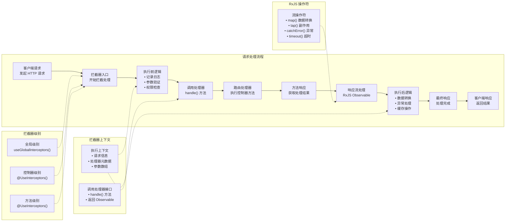

# 拦截器

**拦截器**（Interceptor）是一个使用 `@Injectable()` 装饰器标记，并实现了 `NestInterceptor` 接口的类。

它受到[面向切面编程](https://en.wikipedia.org/wiki/Aspect-oriented_programming)（Aspect Oriented Programming, AOP）理念的启发，主要用于在方法执行流程中插入横切关注点逻辑，具备如下能力：

- 在方法调用前后执行自定义逻辑
- 转换方法的返回值
- 捕获并处理方法抛出的异常
- 扩展方法的默认行为
- 根据特定条件（如缓存）改变方法的执行流程



## 基础用法

每个拦截器都需要实现 `intercept()` 方法。该方法接收两个参数：第一个是 `ExecutionContext` 实例（与守卫中相同），它继承自 `ArgumentsHost`。在异常过滤器章节我们已介绍过 `ArgumentsHost`，它封装了传递给处理器的参数，并根据应用类型提供不同的参数数组。你可以参考[异常过滤器](/exception-filters#arguments-host)章节了解更多。

每个拦截器类都必须实现 `intercept()` 方法。该方法接收两个参数：第一个是 `ExecutionContext` 实例（与守卫中的相同），它继承自 `ArgumentsHost`。我们在[异常过滤器](/exception-filters#argumentshost-参数)一章中已介绍过 `ArgumentsHost` —— 它用于封装传递给处理器的参数，并根据应用类型（如 HTTP、RPC、WebSocket）提供相应的参数访问方式。你可以查阅该章节以了解更多详情。

## 执行上下文

`ExecutionContext` 是 `ArgumentsHost` 的扩展，提供了更多用于获取当前执行流程上下文信息的辅助方法。这些方法使我们能够访问控制器类、处理器方法、请求类型等，从而支持构建可适用于多种场景的通用拦截器。更多内容请参阅[执行上下文](/fundamentals/execution-context)章节。

## CallHandler 处理器调用机制

`intercept()` 方法的第二个参数是 `CallHandler`，它是一个接口，内部定义了 `handle()` 方法。在拦截器中调用该方法，即可继续执行后续的路由处理器逻辑；如果不调用 `handle()`，对应的路由处理器方法将不会被执行。

这种设计使得 `intercept()` 实际上成为了整个请求-响应流程的一个包装器。你可以在调用 `handle()` 之前或之后插入自定义逻辑。由于 `handle()` 返回的是一个 `Observable`，我们可以借助强大的 [RxJS](https://github.com/ReactiveX/rxjs) 操作符对响应数据进行进一步处理和转换。

在面向切面编程中，调用路由处理器（即调用 `handle()`）被称为[切入点（Pointcut）](https://en.wikipedia.org/wiki/Pointcut)，代表的是执行核心业务逻辑前后插入额外操作的时机。

举个例子，假设有一个 `POST /cats` 请求，对应控制器 `CatsController` 中的 `create()` 方法。如果一个拦截器被触发但未调用 `handle()`，那么 `create()` 方法将不会执行。只有当拦截器中调用了 `handle()` 并返回 `Observable` 后，`create()` 方法才会被触发，随后我们可以在响应流上使用 RxJS 操作符进行加工处理，最终将结果返回给客户端。

## 切面拦截

第一个用例展示了如何使用拦截器记录用户操作，例如用于存储调用日志、异步分发事件，或统计接口耗时。以下是一个简单的 `LoggingInterceptor`（日志拦截器）示例：

```ts filename='logging.interceptor.ts'
import { Injectable, NestInterceptor, ExecutionContext, CallHandler } from '@nestjs/common'
import { Observable } from 'rxjs'
import { tap } from 'rxjs/operators'

@Injectable()
export class LoggingInterceptor implements NestInterceptor {
  intercept(context: ExecutionContext, next: CallHandler): Observable<any> {
    console.log('Before...')

    const now = Date.now()
    return next.handle().pipe(tap(() => console.log(`After... ${Date.now() - now}ms`)))
  }
}
```

<CalloutInfo>
  `NestInterceptor<T, R>` 是一个泛型接口，其中 `T` 表示进入拦截器前的值类型（对应 `Observable<T>`），`R` 表示拦截处理后的最终值类型（对应 `Observable<R>`）。
</CalloutInfo>

<CalloutInfo type="warning">
  拦截器与控制器、提供者、守卫类似，同样支持通过构造函数注入依赖。
</CalloutInfo>

由于 `handle()` 方法返回的是一个 RxJS 的 `Observable`，我们可以灵活地使用各种操作符对数据流进行处理。在上述示例中，`tap()` 操作符用于在响应流结束（无论正常或异常）时记录日志，但不会改变或中断原有的响应流程。

## 绑定拦截器

要绑定拦截器，可以使用 `@nestjs/common` 包中的 `@UseInterceptors()` 装饰器。与[管道](/pipes)和[守卫](/guards)类似，拦截器既可应用于控制器，也可应用于单个方法，或配置为全局拦截器。

```ts filename='cats.controller.ts'
import { UseInterceptors } from '@nestjs/common'

@UseInterceptors(LoggingInterceptor)
export class CatsController {}
```

如上所示，`LoggingInterceptor` 会应用于 `CatsController` 中定义的所有路由处理器。当调用 `GET /cats` 接口时，标准输出将打印：

```ts
Before...
After... 1ms
```

注意，这里传入的是 `LoggingInterceptor` 类本身（而非其实例），实例化过程由框架自动完成，以支持依赖注入机制。与管道、守卫、异常过滤器类似，拦截器也可以通过传入实例的方式使用：

```ts filename='cats.controller.ts'
@UseInterceptors(new LoggingInterceptor())
export class CatsController {}
```

如前所述，这种写法会将拦截器绑定到该控制器中声明的所有处理器方法。如果只需作用于特定方法，可以在**方法级别**使用装饰器进行绑定。

若需配置全局拦截器，可通过 Nest 应用实例的 `useGlobalInterceptors()` 方法实现：

```ts
const app = await NestFactory.create(AppModule)
app.useGlobalInterceptors(new LoggingInterceptor())
```

全局拦截器会应用于应用中的所有控制器与路由处理器。需要注意的是，使用 `useGlobalInterceptors()` 在模块上下文之外注册的拦截器**无法注入依赖**，因为此时拦截器的实例化不受 Nest 容器管理。为解决此限制，可在模块中使用内置的 `APP_INTERCEPTOR` 提供者令牌进行注册：

```ts filename='app.module.ts'
import { Module } from '@nestjs/common'
import { APP_INTERCEPTOR } from '@nestjs/core'

@Module({
  providers: [
    {
      provide: APP_INTERCEPTOR,
      useClass: LoggingInterceptor,
    },
  ],
})
export class AppModule {}
```

<CalloutInfo>
  通过上述方式注册的拦截器，无论在哪个模块中声明，都会在全局范围内生效。建议在定义拦截器（如上例中的
  `LoggingInterceptor`）的模块中进行注册。此外，`useClass`
  并不是唯一的注册方式，更多内容请参见[自定义提供者](/fundamentals/custom-providers)。
</CalloutInfo>

## 响应数据映射

在 NestJS 中，`handle()` 方法返回的是一个 `Observable`，其中包含了路由处理器的返回值。因此，我们可以直接使用 RxJS 的 `map()` 操作符对其进行转换和包装。

<CalloutInfo type="warning">
  响应映射功能不适用于某些特定库的响应处理方式，尤其是显式注入了 `@Res()`
  对象的场景。在这种情况下，请避免手动操作响应对象。
</CalloutInfo>

下面我们实现一个名为 `TransformInterceptor` 的转换拦截器。它会使用 `map()` 操作符将每个响应数据包装到一个包含 `data` 属性的对象中，并将该对象返回给客户端。

```ts filename='transform.interceptor.ts'
import { Injectable, NestInterceptor, ExecutionContext, CallHandler } from '@nestjs/common'
import { Observable } from 'rxjs'
import { map } from 'rxjs/operators'

export interface Response<T> {
  data: T
}

@Injectable()
export class TransformInterceptor<T> implements NestInterceptor<T, Response<T>> {
  intercept(context: ExecutionContext, next: CallHandler): Observable<Response<T>> {
    return next.handle().pipe(map((data) => ({ data })))
  }
}
```

<CalloutInfo>
  拦截器中的 `intercept()` 方法既支持同步实现，也支持异步实现。如有需要，可将其声明为 `async`。
</CalloutInfo>

使用该拦截器后，假设某路由处理器返回一个空数组 `[]`，如调用 `GET /cats` 接口，则响应结果如下所示：

```json
{
  "data": []
}
```

拦截器非常适合处理全局性需求。例如，如果我们希望统一将所有响应中的 `null` 值转换为空字符串 `''`，可以通过如下拦截器实现，并将其注册为全局拦截器，使所有路由自动应用此逻辑：

```ts
import { Injectable, NestInterceptor, ExecutionContext, CallHandler } from '@nestjs/common'
import { Observable } from 'rxjs'
import { map } from 'rxjs/operators'

@Injectable()
export class ExcludeNullInterceptor implements NestInterceptor {
  intercept(context: ExecutionContext, next: CallHandler): Observable<any> {
    return next.handle().pipe(map((value) => (value === null ? '' : value)))
  }
}
```

## 异常处理与映射

借助 RxJS 的 `catchError()` 操作符可以优雅地“改写”抛出的异常。例如，以下拦截器会把管道中出现的任何错误统一转换为 `BadGatewayException`：

```ts filename='errors.interceptor.ts'
import {
  Injectable,
  NestInterceptor,
  ExecutionContext,
  BadGatewayException,
  CallHandler,
} from '@nestjs/common'
import { Observable, throwError } from 'rxjs'
import { catchError } from 'rxjs/operators'

@Injectable()
export class ErrorsInterceptor implements NestInterceptor {
  intercept(context: ExecutionContext, next: CallHandler): Observable<any> {
    return next.handle().pipe(catchError(() => throwError(() => new BadGatewayException())))
  }
}
```

这样做可以在不修改业务代码的前提下，统一错误格式，提升异常处理的一致性。

## 响应流重写

有时我们希望完全绕过处理器逻辑，直接返回结果。常见场景是**缓存**：命中缓存时立即返回缓存数据，避免重复计算。下面的 `CacheInterceptor` 演示了这一思路；真实项目中还需结合 TTL、失效策略、容量控制等机制。

```ts filename='cache.interceptor.ts'
import { Injectable, NestInterceptor, ExecutionContext, CallHandler } from '@nestjs/common'
import { Observable, of } from 'rxjs'

@Injectable()
export class CacheInterceptor implements NestInterceptor {
  intercept(context: ExecutionContext, next: CallHandler): Observable<any> {
    const isCached = true
    if (isCached) {
      return of([])
    }
    return next.handle()
  }
}
```

在示例中，`isCached` 与返回值均为硬编码，旨在突出“短路”流程：使用 `of()` 创建新的响应流后，后续路由处理器将**不会**执行。若要扩展为通用缓存解决方案，可结合 `Reflector` 和自定义装饰器；有关 `Reflector` 的详细用法，请参阅[守卫](/guards)章节。

## 常用 RxJS 操作符实践

RxJS 操作符在处理数据流时非常强大，能够实现多种常见的应用场景。以下示例展示了如何为路由请求设置超时时间：当某个端点在指定时间内未响应时，自动中止处理流程并返回错误响应。

```ts filename='timeout.interceptor.ts'
import {
  Injectable,
  NestInterceptor,
  ExecutionContext,
  CallHandler,
  RequestTimeoutException,
} from '@nestjs/common'
import { Observable, throwError, TimeoutError } from 'rxjs'
import { catchError, timeout } from 'rxjs/operators'

@Injectable()
export class TimeoutInterceptor implements NestInterceptor {
  intercept(context: ExecutionContext, next: CallHandler): Observable<any> {
    return next.handle().pipe(
      timeout(5000),
      catchError((err) => {
        if (err instanceof TimeoutError) {
          return throwError(() => new RequestTimeoutException())
        }
        return throwError(() => err)
      })
    )
  }
}
```

如上所示，当请求处理时间超过 5 秒时，将自动抛出 `RequestTimeoutException` 异常，终止响应流程。你也可以根据实际需求，在抛出异常前加入自定义逻辑，例如资源清理、日志记录等操作。
