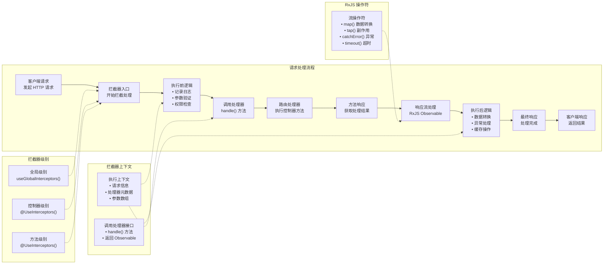

# 拦截器

**拦截器**（Interceptor）是通过 `@Injectable()` 装饰器修饰的类，并且实现了 `NestInterceptor` 接口。它借鉴了[面向切面编程](https://en.wikipedia.org/wiki/Aspect-oriented_programming)（AOP）的设计理念，用于在方法的调用流程中插入“横切关注点”的逻辑。

通过拦截器，你可以在不干扰核心业务代码的前提下，对方法执行过程进行增强或改造。其主要作用包括：

- 在方法调用之前或之后插入自定义逻辑。
- 修改方法的返回结果。
- 捕获并处理方法内部抛出的异常。
- 扩展方法默认行为，实现更灵活的功能控制。
- 基于特定条件（如缓存命中）改变方法的执行路径。



## 基础用法

拦截器类必须实现 `intercept()` 方法，该方法是其核心逻辑的入口。它接收两个参数：

- 第一个参数是 `ExecutionContext` 实例，与守卫中使用的是同一个对象。它继承自 `ArgumentsHost`，用于封装传递给处理器的请求上下文信息。
- 第二个参数稍后会在其他小节中讲解。

关于 `ArgumentsHost` 的具体作用和不同上下文（如 HTTP、RPC、WebSocket）下的参数访问方式，建议参考[异常过滤器](/exception-filters#argumentshost-参数)章节获取更详细的介绍。

## 执行上下文

`ExecutionContext` 是 `ArgumentsHost` 的扩展，提供了更多用于获取当前执行流程上下文信息的便捷方法。通过这些方法，我们可以访问控制器类、处理器方法、请求类型等关键信息，从而更轻松地编写兼容多种执行环境（如 HTTP、WebSocket、RPC）的通用拦截器。详细内容可参考[执行上下文](/fundamentals/execution-context)章节。

## `CallHandler`：处理器调用机制

`intercept()` 方法的第二个参数是 `CallHandler` 接口，定义了一个 `handle()` 方法。调用 `handle()` 即表示继续执行后续的路由处理器逻辑；如果未调用该方法，对应的处理器将不会被触发。

这一机制使得 `intercept()` 方法本质上成为整个请求-响应链路的“包装器”：我们可以在执行核心业务逻辑前后，插入自定义逻辑。由于 `handle()` 返回的是一个 `Observable`，我们可以借助强大的 [RxJS](https://github.com/ReactiveX/rxjs) 操作符对响应数据进行进一步加工和转换。

在面向切面编程中，调用路由处理器（即 `handle()`）的动作被称为[切入点](https://en.wikipedia.org/wiki/Pointcut)（Pointcut），代表可以在方法执行前后插入额外逻辑的关键位置。

例如，假设我们有一个 `POST /cats` 请求，其对应的控制器方法是 `CatsController` 中的 `create()`。如果一个拦截器被触发但未调用 `handle()`，那么 `create()` 方法将不会执行。只有在拦截器中调用了 `handle()` 并返回 `Observable`，`create()` 方法才会被执行，随后我们可以通过 RxJS 操作符对响应流进行处理，最终将结果返回给客户端。

## 拦截器示例：记录日志

拦截器常用于在请求处理流程中插入额外的逻辑，例如记录操作日志、统计接口耗时、异步触发某些事件。下面是一个基本的日志拦截器示例，用于演示如何实现这一功能：

```ts filename='logging.interceptor.ts'
import {
  Injectable,
  NestInterceptor,
  ExecutionContext,
  CallHandler,
} from '@nestjs/common'
import { Observable } from 'rxjs'
import { tap } from 'rxjs/operators'

@Injectable()
export class LoggingInterceptor implements NestInterceptor {
  intercept(context: ExecutionContext, next: CallHandler): Observable<any> {
    console.log('Before...')

    const now = Date.now()

    return next
      .handle()
      .pipe(tap(() => console.log(`After... ${Date.now() - now}ms`)))
  }
}
```

<CalloutInfo title="接口类型说明">
  `NestInterceptor<T, R>` 是一个泛型接口，其中 `T` 表示传入拦截器的数据类型（即 `Observable<T>` 中的类型），`R` 表示拦截器处理完成后返回的数据类型（即 `Observable<R>` 中的类型）。
</CalloutInfo>

<CalloutInfo>
  拦截器同样支持依赖注入，可通过构造函数注入服务，与控制器、提供者或守卫的用法一致。
</CalloutInfo>

由于 `handle()` 方法返回的是一个 RxJS 的 `Observable`，我们可以利用各种操作符对数据流进行扩展或观察。在上面的示例中，使用了 `tap()` 操作符来在响应流程结束时记录耗时日志 —— 这一操作不会修改或中断原有的数据流，仅用于副作用处理。

## 绑定拦截器

拦截器的绑定方式与管道和守卫类似，可通过 `@nestjs/common` 包中的 `@UseInterceptors()` 装饰器实现。你可以将拦截器绑定到整个控制器、某个具体方法，或配置为全局拦截器。

```ts filename='cats.controller.ts'
import { UseInterceptors } from '@nestjs/common'

@UseInterceptors(LoggingInterceptor)
export class CatsController {}
```

如上例所示，`LoggingInterceptor` 会作用于 `CatsController` 中定义的所有处理器方法。当客户端请求 `GET /cats` 接口时，控制台将输出：

```ts
Before...
After... 1ms
```

需要注意，传入的应该是 `LoggingInterceptor` 类本身，而不是其实例。Nest 会自动实例化该类，以便在创建时注入其所需的依赖。与管道、守卫和异常过滤器一样，拦截器同样支持传入类实例的方式：

```ts filename='cats.controller.ts'
@UseInterceptors(new LoggingInterceptor())
export class CatsController {}
```

使用这种写法时，`LoggingInterceptor` 将同样作用于控制器中所有的处理器方法。若只需拦截某个特定方法，可以直接在方法级别使用 `@UseInterceptors()` 装饰器进行绑定。

### 全局拦截器

若希望拦截器在整个应用范围内生效，可通过 Nest 应用实例调用 `useGlobalInterceptors()` 方法进行配置：

```ts
const app = await NestFactory.create(AppModule)
app.useGlobalInterceptors(new LoggingInterceptor())
```

这种方式注册的拦截器会自动应用于所有控制器与路由处理器。但需要特别留意：使用 `useGlobalInterceptors()` 注册的拦截器实例**不受 Nest 容器管理**，因此**无法进行依赖注入**。

为解决此限制，建议使用框架内置的 `APP_INTERCEPTOR` 提供者令牌，在模块中以提供者的形式注册拦截器：

```ts filename='app.module.ts'
import { Module } from '@nestjs/common'
import { APP_INTERCEPTOR } from '@nestjs/core'

@Module({
  providers: [
    {
      provide: APP_INTERCEPTOR,
      useClass: LoggingInterceptor,
    },
  ],
})
export class AppModule {}
```

<CalloutInfo>
  无论在哪个模块中通过 `APP_INTERCEPTOR`
  注册拦截器，其都会在全局范围内生效。建议在定义拦截器（如本例中的
  `LoggingInterceptor`）的模块中完成注册。此外，`useClass`
  并非唯一的注册方式，更多高级用法请参考[自定义提供者](/fundamentals/custom-providers)。
</CalloutInfo>

## 响应数据映射

在 NestJS 中，拦截器的 `handle()` 方法返回一个 `Observable`，其中封装了路由处理器的返回结果。因此，我们可以使用 RxJS 的 `map()` 操作符对响应数据进行转换和封装。

<CalloutInfo type="warning">
  响应映射功能不适用于某些特定场景，尤其是手动注入了 `@Res()`
  的情况。此时应避免通过拦截器操作响应对象。
</CalloutInfo>

下面是一个名为 `TransformInterceptor` 的拦截器示例，它会将每个响应结果包装成一个包含 `data` 属性的对象，并将其发送给客户端。

```ts filename='transform.interceptor.ts'
import {
  Injectable,
  NestInterceptor,
  ExecutionContext,
  CallHandler,
} from '@nestjs/common'
import { Observable } from 'rxjs'
import { map } from 'rxjs/operators'

export interface Response<T> {
  data: T
}

@Injectable()
export class TransformInterceptor<T>
  implements NestInterceptor<T, Response<T>>
{
  intercept(
    context: ExecutionContext,
    next: CallHandler
  ): Observable<Response<T>> {
    return next.handle().pipe(map((data) => ({ data })))
  }
}
```

<CalloutInfo>
  `intercept()`
  方法支持同步和异步两种实现方式。若需在内部执行异步逻辑，可将其声明为 `async`。
</CalloutInfo>

使用上述拦截器后，假设某路由处理器返回一个空数组 `[]`，如请求 `GET /cats` 接口，则客户端收到的响应将为：

```json
{
  "data": []
}
```

### 拦截器的扩展用途

拦截器非常适合处理通用性逻辑。例如，如果你希望统一将响应中的所有 `null` 值替换为空字符串 `''`，可以实现如下拦截器并将其注册为全局拦截器，从而自动作用于所有路由处理器：

```ts
import {
  Injectable,
  NestInterceptor,
  ExecutionContext,
  CallHandler,
} from '@nestjs/common'
import { Observable } from 'rxjs'
import { map } from 'rxjs/operators'

@Injectable()
export class ExcludeNullInterceptor implements NestInterceptor {
  intercept(context: ExecutionContext, next: CallHandler): Observable<any> {
    return next.handle().pipe(map((value) => (value === null ? '' : value)))
  }
}
```

通过这种方式，NestJS 的响应拦截器机制可以为应用提供强大的响应数据统一处理能力，无需在每个处理器中重复编写类似逻辑。

## 异常处理与映射

利用 RxJS 提供的 `catchError()` 操作符，我们可以优雅地拦截并“映射”原始异常，实现统一的错误处理逻辑。例如，下面的拦截器会将处理流程中抛出的任意异常，统一转换为 `BadGatewayException`：

```ts filename='errors.interceptor.ts'
import {
  Injectable,
  NestInterceptor,
  ExecutionContext,
  CallHandler,
  BadGatewayException,
} from '@nestjs/common'
import { Observable, throwError } from 'rxjs'
import { catchError } from 'rxjs/operators'

@Injectable()
export class ErrorsInterceptor implements NestInterceptor {
  intercept(context: ExecutionContext, next: CallHandler): Observable<any> {
    return next
      .handle()
      .pipe(catchError(() => throwError(() => new BadGatewayException())))
  }
}
```

通过这种方式，我们无需修改任何业务逻辑代码，即可实现统一的错误格式输出，从而提升系统的异常处理一致性和可维护性。

## 响应流重写

在某些场景下，你可能希望**绕过路由处理器的执行逻辑，直接返回响应结果**。这种做法在缓存处理中尤为常见：当请求命中缓存时，无需重复计算，直接返回缓存内容即可。

下面的 `CacheInterceptor` 拦截器演示了这一机制。在实际应用中，你通常还需要结合 TTL（过期时间）、失效策略、缓存容量控制等功能实现一个健壮的缓存方案。

```ts filename='cache.interceptor.ts'
import {
  Injectable,
  NestInterceptor,
  ExecutionContext,
  CallHandler,
} from '@nestjs/common'
import { Observable, of } from 'rxjs'

@Injectable()
export class CacheInterceptor implements NestInterceptor {
  intercept(context: ExecutionContext, next: CallHandler): Observable<any> {
    const isCached = true

    if (isCached) {
      return of([]) // 直接返回缓存响应，跳过处理器
    }

    return next.handle()
  }
}
```

上述示例中，`isCached` 和返回值均为硬编码，目的是演示所谓“**短路响应**”的核心逻辑：通过 `of()` 创建一个新的响应流，Nest 会直接将其直接返回，而不会继续执行后续的处理器逻辑。

如果你希望构建一个可复用、可配置的缓存拦截器，建议结合 `Reflector` 与自定义装饰器，为特定的处理器或控制器添加缓存元数据。关于 `Reflector` 的使用方法，请参阅[守卫](/guards#为处理器设置角色)章节。

## 常用的 RxJS 操作符实践

RxJS 提供了丰富的操作符，用于灵活地处理异步数据流。在 Nest 中，操作符常用于对路由处理流程进行扩展，例如设置请求超时时间。以下示例展示了如何使用 RxJS 操作符为路由添加超时控制：当处理逻辑在指定时间内未完成时，自动中止流程并返回超时错误。

```ts filename='timeout.interceptor.ts'
import {
  Injectable,
  NestInterceptor,
  ExecutionContext,
  CallHandler,
  RequestTimeoutException,
} from '@nestjs/common'
import { Observable, throwError, TimeoutError } from 'rxjs'
import { timeout, catchError } from 'rxjs/operators'

@Injectable()
export class TimeoutInterceptor implements NestInterceptor {
  intercept(context: ExecutionContext, next: CallHandler): Observable<any> {
    return next.handle().pipe(
      timeout(5000),
      catchError((err) => {
        if (err instanceof TimeoutError) {
          return throwError(() => new RequestTimeoutException())
        }
        return throwError(() => err)
      })
    )
  }
}
```

如上所示，`timeout(5000)` 操作符会在请求处理超过 5 秒后触发 `TimeoutError`，随后被 `catchError` 捕获并转换为 Nest 提供的 `RequestTimeoutException`，从而终止响应流程并返回 408 超时错误。

你也可以根据实际需求，在抛出异常前加入其他逻辑处理，例如记录日志、清理资源、上报监控数据等。
