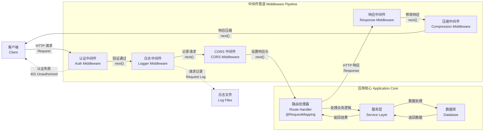

# 中间件

**中间件**（Middleware）是一个在路由处理器**执行之前**调用的函数，它可以访问[请求对象](https://expressjs.com/en/4x/api.html#req)（Request）、[响应对象](https://expressjs.com/en/4x/api.html#res)（Response），以及控制请求流程的 `next()` 回调函数。通常情况下，**下一个中间件函数**通过名为 `next` 的参数显式调用。



在 Nest 中，中间件默认遵循 Express 的中间件机制。以下是 [Express 官方文档](https://expressjs.com/en/guide/using-middleware.html)对中间件功能的定义：

> 中间件函数可以执行以下操作：
>
> - 运行任意代码
> - 修改请求（req）和响应（res）对象
> - 结束请求-响应周期
> - 调用栈中的下一个中间件函数
> - 如果当前中间件没有终止请求流程，必须显式调用 `next()`，否则请求将被挂起

Nest 支持两种方式定义中间件：函数形式与类形式。

- **函数式中间件**是普通的函数，没有强制的结构或接口要求；
- **类中间件**需要使用 `@Injectable()` 装饰器，并实现 `NestMiddleware` 接口。

以下是一个使用类实现的中间件示例：

```ts filename='logger.middleware.ts'
import { Injectable, NestMiddleware } from '@nestjs/common'
import { Request, Response, NextFunction } from 'express'

@Injectable()
export class LoggerMiddleware implements NestMiddleware {
  use(req: Request, res: Response, next: NextFunction) {
    console.log('Request...')
    next()
  }
}
```

## 中间件的依赖注入

Nest 中间件原生支持依赖注入，与控制器和服务（提供者）一样，你可以通过构造函数将模块中已注册的依赖注入到中间件中使用。这意味着中间件同样可以享受 Nest 的依赖注入机制带来的便利和一致性。

## 中间件的注册与应用

在 Nest 中，中间件**无需**像提供者那样在 `@Module()` 装饰器中显式声明。相反，他们通过模块类的 `configure()` 方法进行注册。为了使用该方法，模块需要实现 `NestModule` 接口。

下面的示例展示了如何在 `AppModule` 中将 `LoggerMiddleware` 应用于指定路由：

```ts filename='app.module.ts'
import { Module, NestModule, MiddlewareConsumer } from '@nestjs/common'
import { LoggerMiddleware } from './common/middleware/logger.middleware'
import { CatsModule } from './cats/cats.module'

@Module({
  imports: [CatsModule],
})
export class AppModule implements NestModule {
  configure(consumer: MiddlewareConsumer) {
    consumer.apply(LoggerMiddleware).forRoutes('cats')
  }
}
```

在上述代码中，`LoggerMiddleware` 被绑定到 `/cats` 路由，该路由由 `CatsController` 处理。你还可以通过 `forRoutes()` 方法传入一个包含 `path` 和 `method` 属性的对象，进一步限定中间件的匹配范围。

例如，以下示例仅将中间件应用于对 `/cats` 路由发起的 GET 请求：

```ts filename='app.module.ts'
iimport { Module, NestModule, RequestMethod, MiddlewareConsumer } from '@nestjs/common'
import { LoggerMiddleware } from './common/middleware/logger.middleware'
import { CatsModule } from './cats/cats.module'

@Module({
  imports: [CatsModule],
})
export class AppModule implements NestModule {
  configure(consumer: MiddlewareConsumer) {
    consumer.apply(LoggerMiddleware).forRoutes({
      path: 'cats',
      method: RequestMethod.GET,
    })
  }
}
```

<CalloutInfo>
  `configure()`
  方法支持异步操作。如果你需要在中间件注册前执行异步逻辑（例如加载配置或远程数据），可以在该方法内部使用
  `await`。
</CalloutInfo>

<CalloutInfo type="warning">
当使用 Express 作为底层 HTTP 适配器时，Nest 默认会注册 `body-parser` 提供的 `json` 与 `urlencoded` 中间件。

如果你希望完全自定义这些中间件的行为，并通过 `MiddlewareConsumer` 手动注册他们，需要在调用 `NestFactory.create()` 时将 `bodyParser` 选项设置为 `false`，以禁用默认中间件的自动注入。

</CalloutInfo>

## 路由通配符用法

Nest 支持在路由路径中使用通配符，以便一次性匹配一组具有相同路径前缀的请求，常用于批量注册中间件。

例如，以下示例中的路径模式使用了命名通配符 `*splat`，可以匹配所有以 `abcd/` 开头的路径。此时，该中间件将应用于如 `abcd/1`、`abcd/abc`、`abcd/123` 等所有请求：

```ts
forRoutes({
  path: 'abcd/*splat',
  method: RequestMethod.ALL,
})
```

<CalloutInfo>
  `splat`
  仅作为占位符使用，不具备特殊含义。你可以使用任意合法的标识符进行替换，如
  `*wildcard` 等。
</CalloutInfo>

需要注意，像连字符（`-`）和点（`.`）等字符在路径中会按字面意义进行匹配，**不会被通配符捕获**。此外，`'abcd/*'` 不会匹配纯 `'abcd/'`（即末尾无附加路径段）的请求。

如果你希望同时匹配 'abcd/' 本身以及后续子路径，可以将通配符包裹在大括号中，使其成为可选参数：

```ts
forRoutes({
  path: 'abcd/{*splat}',
  method: RequestMethod.ALL,
})
```

## MiddlewareConsumer 使用指南

`MiddlewareConsumer` 是 Nest 提供的一个辅助类，用于灵活配置和管理中间件。它支持**链式调用**（[Fluent Interface](https://en.wikipedia.org/wiki/Fluent_interface)），使中间件的注册过程更加简洁、可读。

其中，`forRoutes()` 方法的参数类型非常丰富，既可以是：

- 路由路径字符串（单个或多个），
- 控制器类（单个或多个），
- `RouteInfo` 对象，

也可以混合使用。在实际开发中，最常见的做法是直接传入一个或多个控制器类，用于匹配其下所有路由。

以下示例展示了如何为 `CatsController` 绑定一个中间件：

```ts filename='app.module.ts'
import { Module, NestModule, MiddlewareConsumer } from '@nestjs/common'
import { LoggerMiddleware } from './common/middleware/logger.middleware'
import { CatsModule } from './cats/cats.module'
import { CatsController } from './cats/cats.controller'

@Module({
  imports: [CatsModule],
})
export class AppModule implements NestModule {
  configure(consumer: MiddlewareConsumer) {
    consumer.apply(LoggerMiddleware).forRoutes(CatsController)
  }
}
```

<CalloutInfo>
  `apply()`
  方法不仅支持传入一个中间件类，也可以同时传入多个中间件，使用逗号分隔即可。详见：[组合多个中间件](/middleware#组合多个中间件)。
</CalloutInfo>

## 路由排除策略

在使用中间件时，我们有时需要排除某些特定路由，使其不被中间件作用。Nest 提供了 `exclude()` 方法，可用于精确排除这些路由。

该方法支持传入以下类型作为排除条件：

- 单个或多个路径字符串
- 一个或多个 `RouteInfo` 对象（包含路径与请求方法）
- 还可结合通配符，进行灵活的路径匹配

以下是一个常见示例：

```ts
consumer
  .apply(LoggerMiddleware)
  .exclude(
    { path: 'cats', method: RequestMethod.GET },
    { path: 'cats', method: RequestMethod.POST },
    'cats/{*splat}'
  )
  .forRoutes(CatsController)
```

<CalloutInfo>
  `exclude()` 方法内部基于
  [path-to-regexp](https://github.com/pillarjs/path-to-regexp#parameters)
  实现，因此支持通配符语法（如 `*`、`+`、命名参数等），可实现更复杂的匹配规则。
</CalloutInfo>

如上所示，中间件 `LoggerMiddleware` 会应用于 `CatsController` 中声明的所有路由，但会排除上述通过 `exclude()` 指定的路径与请求方法。

这种机制让我们可以更加灵活、精细地控制中间件的作用范围，满足复杂业务场景下的定制化需求。

## 函数式中间件

在前面的示例中，`LoggerMiddleware` 类结构十分简单，不包含任何属性、方法或依赖项。这种情况下，我们可以选择使用函数的形式来实现中间件，这种写法被称为**函数式中间件**（Functional Middleware）。

下面演示如何将 `logger` 中间件由类形式改为函数实现：

```ts filename='logger.middleware.ts'
import { Request, Response, NextFunction } from 'express'

export function logger(req: Request, res: Response, next: NextFunction) {
  console.log(`Request...`)
  next()
}
```

注册方式与类中间件相同，只需在 `AppModule` 中通过 `apply()` 方法引入该函数：

```ts filename='app.module.ts'
consumer.apply(logger).forRoutes(CatsController)
```

当中间件无需依赖注入时，推荐使用函数式中间件，写法更简洁、直观。

## 组合多个中间件

如果需要为某个路由绑定多个中间件，可以通过 `apply()` 方法一次传入多个中间件，Nest 会按照传入的顺序依次执行：

```ts
consumer.apply(cors(), helmet(), logger).forRoutes(CatsController)
```

## 全局中间件

如果希望将某个中间件应用于所有已注册的路由，可以通过 `INestApplication` 实例调用 `use()` 方法进行全局注册：

```ts filename='main.ts'
const app = await NestFactory.create(AppModule)

app.use(logger)

await app.listen(process.env.PORT ?? 3000)
```

<CalloutInfo>
  由于通过 `app.use()`
  注册的全局中间件**无法访问依赖注入容器**，因此推荐优先使用[函数式中间件](/middleware#函数式中间件)。若确实需要使用类中间件，可在
  `AppModule`（或其他模块）中通过 `.forRoutes('*')`
  的方式显式挂载，以覆盖全局范围。
</CalloutInfo>
