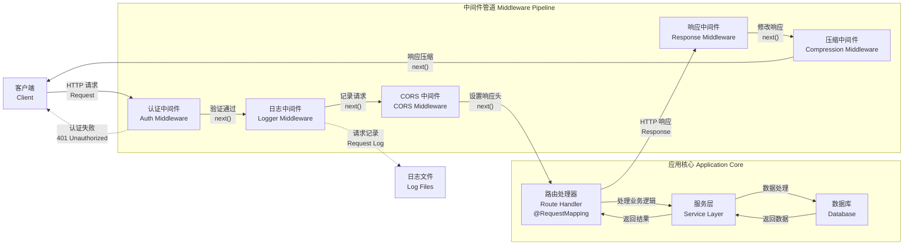

# 中间件

**中间件**（Middleware）是在路由处理器**之前**执行的函数，它能够访问[请求对象（Request）](https://expressjs.com/en/4x/api.html#req)、[响应对象（Response）](https://expressjs.com/en/4x/api.html#res)，以及控制请求-响应流程的 `next()` 函数。**下一个**中间件函数通常以 `next` 作为参数名称。



在 Nest 中，中间件的行为默认遵循 Express 框架的中间件机制。以下是 [Express 官方文档](https://expressjs.com/en/guide/using-middleware.html)对中间件功能的描述：

> 中间件函数可以执行以下任务：
>
> - 执行任意代码
> - 修改请求和响应对象
> - 结束请求-响应周期
> - 调用下一个中间件函数
> - 如果当前中间件未结束请求-响应周期，必须调用 `next()` 将控制权交给下一个中间件函数，否则请求将被挂起

在 Nest 中你可以通过函数或使用 `@Injectable()` 装饰器的类来自定义中间件。类形式的中间件需实现 `NestMiddleware` 接口，而函数形式则无强制接口要求。下面展示了使用类方式实现的一个简单中间件示例：

```ts filename='logger.middleware.ts'
import { Injectable, NestMiddleware } from '@nestjs/common'
import { Request, Response, NextFunction } from 'express'

@Injectable()
export class LoggerMiddleware implements NestMiddleware {
  use(req: Request, res: Response, next: NextFunction) {
    console.log('Request...')
    next()
  }
}
```

## 中间件的依赖注入

Nest 中间件完全支持依赖注入机制。与提供者和控制器类似，中间件同样可以注入当前模块中已注册的依赖，通常通过构造函数（`constructor`）实现。

## 中间件的配置与应用

中间件**不需要**在 `@Module()` 装饰器中显式声明，而是通过模块类中的 `configure()` 方法进行配置。要使用该方法，模块需实现 `NestModule` 接口。以下示例展示了如何在 `AppModule` 中注册 `LoggerMiddleware`：

```ts filename='app.module.ts'
import { Module, NestModule, MiddlewareConsumer } from '@nestjs/common'
import { LoggerMiddleware } from './common/middleware/logger.middleware'
import { CatsModule } from './cats/cats.module'

@Module({
  imports: [CatsModule],
})
export class AppModule implements NestModule {
  configure(consumer: MiddlewareConsumer) {
    consumer.apply(LoggerMiddleware).forRoutes('cats')
  }
}
```

如上所示，我们将 `LoggerMiddleware` 应用于 `/cats` 路由（由 `CatsController` 处理）。此外，你还可以通过向 `forRoutes()` 方法传递包含路由路径 `path` 与请求方法 `method` 的对象，进一步限定中间件的作用范围。下面的示例中使用 `RequestMethod` 枚举来指定仅对 `GET` 请求生效：

```ts filename='app.module.ts'
import { Module, NestModule, RequestMethod, MiddlewareConsumer } from '@nestjs/common'
import { LoggerMiddleware } from './common/middleware/logger.middleware'
import { CatsModule } from './cats/cats.module'

@Module({
  imports: [CatsModule],
})
export class AppModule implements NestModule {
  configure(consumer: MiddlewareConsumer) {
    consumer.apply(LoggerMiddleware).forRoutes({ path: 'cats', method: RequestMethod.GET })
  }
}
```

<CalloutInfo>
  `configure()` 方法可以包含异步逻辑，你可以在方法内部使用 `await` 等待异步任务完成。
</CalloutInfo>

<CalloutInfo type="warning">
  使用 Express 作为适配器时，Nest 默认注册了来自 `body-parser` 包的 `json` 与 `urlencoded`
  中间件。如果你希望通过 `MiddlewareConsumer` 自行配置这些中间件，需在调用 `NestFactory.create()`
  创建应用时，将 `bodyParser` 选项设为 `false`，以禁用默认注册的全局中间件。
</CalloutInfo>

## 路由通配符用法

Nest 支持在路由路径中使用通配符，以便一次性为符合特定模式的所有路由注册中间件。下面示例中的命名通配符（`*splat`）会匹配任意字符序列，因此该中间件将应用于所有以 `abcd/` 开头的请求：

```ts
forRoutes({
  path: 'abcd/*splat',
  method: RequestMethod.ALL,
})
```

<CalloutInfo>
  `splat` 只是占位符名称，并无特殊含义，可替换为任何合法标识符，如 `*wildcard`。
</CalloutInfo>

路径模式 `'abcd/*'` 能匹配 `abcd/1`、`abcd/123`、`abcd/abc` 等，但连字符（-）和点（.）会被按字面解释。需要注意，纯 `abcd/`（末尾无附加段）并不在匹配范围内；如需同时匹配，可将通配符包裹在大括号中，使其成为可选参数：

```ts
forRoutes({
  path: 'abcd/{*splat}',
  method: RequestMethod.ALL,
})
```

## MiddlewareConsumer 详解

`MiddlewareConsumer` 是一个辅助类，提供多种内置方法用于灵活配置和管理中间件。所有方法均支持**链式调用**（[Fluent Interface](https://en.wikipedia.org/wiki/Fluent_interface)）风格。

其中，`forRoutes()` 方法的参数类型非常灵活：它可以接收单个字符串、多个字符串、`RouteInfo` 对象、单个控制器类，甚至多个控制器类。在大多数实际场景中，你可能只需要直接传入一个或多个控制器。以下是一个仅传入单个控制器的示例：

```ts filename='app.module.ts'
import { Module, NestModule, MiddlewareConsumer } from '@nestjs/common'
import { LoggerMiddleware } from './common/middleware/logger.middleware'
import { CatsModule } from './cats/cats.module'
import { CatsController } from './cats/cats.controller'

@Module({
  imports: [CatsModule],
})
export class AppModule implements NestModule {
  configure(consumer: MiddlewareConsumer) {
    consumer.apply(LoggerMiddleware).forRoutes(CatsController)
  }
}
```

<CalloutInfo>
  `appl()`
  方法既支持传入单个中间件，也支持传入多个中间件（使用逗号分隔）。更多信息，请参见[组合多个中间件](/middleware#组合多个中间件)。
</CalloutInfo>

## 路由排除策略

有时我们希望排除某些路由不应用中间件，可以通过 `exclude()` 方法轻松实现。`exclude()` 支持传入单个字符串、多个字符串或 `RouteInfo` 对象来指定要排除的路由。

在某些场景下，我们希望中间件**不应用于特定路由**，这时可以使用 `exclude()` 方法轻松实现。该方法支持传入单个字符串、多个字符串，或 `RouteInfo` 对象，以灵活指定需要排除的路由。

下面是一个典型用法示例：

```ts
consumer
  .apply(LoggerMiddleware)
  .exclude(
    { path: 'cats', method: RequestMethod.GET },
    { path: 'cats', method: RequestMethod.POST },
    'cats/{*splat}'
  )
  .forRoutes(CatsController)
```

<CalloutInfo>
  `exclude()` 方法支持使用 [path-to-regexp](https://github.com/pillarjs/path-to-regexp#parameters)
  提供的通配符语法，便于进行更灵活的路径匹配。
</CalloutInfo>

如上例所示，`LoggerMiddleware` 会应用于 `CatsController` 中定义的所有路由，但会排除传入 `exclude()` 的这三个路径匹配项。

通过这种方式，可以更精确地控制中间件的作用范围，大大增强了其在实际应用中的灵活性和可配置性。

## 函数式中间件

在前面的示例中，`LoggerMiddleware` 类结构简单，不包含任何属性、方法或依赖。因此，我们也可以使用函数来实现中间件，这类中间件称为**函数式中间件**（Functional Middleware）。下面演示如何将 `logger` 中间件由类实现改为函数实现：

```ts filename='logger.middleware.ts'
import { Request, Response, NextFunction } from 'express'

export function logger(req: Request, res: Response, next: NextFunction) {
  console.log(`Request...`)
  next()
}
```

然后在 `AppModule` 中注册该中间件：

```ts filename='app.module.ts'
consumer.apply(logger).forRoutes(CatsController)
```

<CalloutInfo>当中间件不涉及依赖注入时，建议优先采用更简洁的函数式中间件实现方式。</CalloutInfo>

## 组合多个中间件

如果需要按顺序绑定多个中间件，只需在 `apply()` 方法中依次传入各个中间件，用逗号分隔即可：

```ts
consumer.apply(cors(), helmet(), logger).forRoutes(CatsController)
```

## 全局中间件

若希望将中间件应用于所有已注册的路由，可通过 `INestApplication` 实例的 `use()` 方法进行设置：

```ts filename='main.ts'
const app = await NestFactory.create(AppModule)

app.use(logger)

await app.listen(process.env.PORT ?? 3000)
```

<CalloutInfo>
  全局中间件无法访问依赖注入容器，因此推荐优先使用[函数式中间件](/middleware#函数式中间件)。若需使用类中间件，可在
  `AppModule`（或其他模块）中通过 `.forRoutes('*')` 显式注册。
</CalloutInfo>
