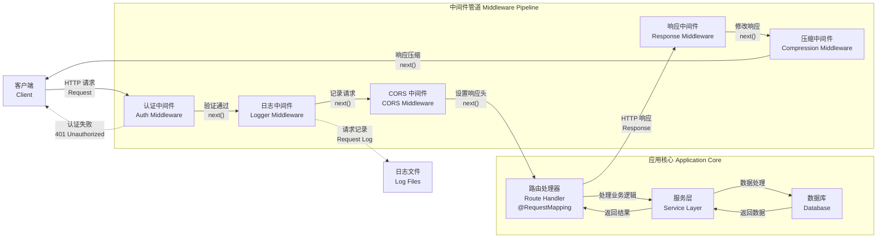

# 中间件

中间件（Middleware）是一个在路由处理器**之前**执行的函数，它可以访问[请求对象（Request）](https://expressjs.com/en/4x/api.html#req)、[响应对象（Response）](https://expressjs.com/en/4x/api.html#res)，以及应用请求-响应周期中的 `next()` 函数。**下一个**中间件函数通常用变量 `next` 表示。



Nest 中的中间件默认与 [Express](https://expressjs.com/en/guide/using-middleware.html) 的中间件行为一致。以下是官方 Express 文档对中间件功能的描述：

> 中间件函数可以执行以下任务：
>
> - 执行任意代码
> - 修改请求对象和响应对象
> - 结束请求-响应周期
> - 调用下一个中间件函数
> - 如果当前中间件没有结束请求-响应周期，必须调用 `next()`，将控制权交给下一个中间件。否则，请求会被挂起

你可以通过函数或带有 `@Injectable()` 装饰器的类来实现自定义 Nest 中间件。类方式需实现 `NestMiddleware` 接口，函数方式则无特殊要求。下面以类的方式实现一个简单的中间件：

```ts filename='logger.middleware.ts'
import { Injectable, NestMiddleware } from '@nestjs/common'
import { Request, Response, NextFunction } from 'express'

@Injectable()
export class LoggerMiddleware implements NestMiddleware {
  use(req: Request, res: Response, next: NextFunction) {
    console.log('Request...')
    next()
  }
}
```

```js hideInDoc filename='logger.middleware.js'
import { Injectable } from '@nestjs/common'

@Injectable()
export class LoggerMiddleware {
  use(req, res, next) {
    console.log('Request...')
    next()
  }
}
```

## 中间件的依赖注入

Nest 中间件完全支持依赖注入。与提供者和控制器类似，中间件也可以注入同一模块内可用的依赖。通常通过 `constructor` 实现。

## 中间件配置与应用

中间件**无需**在 `@Module()` 装饰器中声明，而是通过模块类的 `configure()` 方法进行配置。包含中间件的模块需实现 `NestModule` 接口。以下示例展示如何在 `AppModule` 中设置 `LoggerMiddleware`：

```ts filename='app.module.ts'
import { Module, NestModule, MiddlewareConsumer } from '@nestjs/common'
import { LoggerMiddleware } from './common/middleware/logger.middleware'
import { CatsModule } from './cats/cats.module'

@Module({
  imports: [CatsModule],
})
export class AppModule implements NestModule {
  configure(consumer: MiddlewareConsumer) {
    consumer.apply(LoggerMiddleware).forRoutes('cats')
  }
}
```

```js hideInDoc filename='app.module.js'
import { Module } from '@nestjs/common'
import { LoggerMiddleware } from './common/middleware/logger.middleware'
import { CatsModule } from './cats/cats.module'

@Module({
  imports: [CatsModule],
})
export class AppModule {
  configure(consumer) {
    consumer.apply(LoggerMiddleware).forRoutes('cats')
  }
}
```

如上所示，我们为 `/cats` 路由（由 `CatsController` 处理）应用了 `LoggerMiddleware`。你还可以通过向 `forRoutes()` 方法传递包含路由 `path` 和请求 `method` 的对象，进一步限定中间件仅作用于特定请求方法。如下例所示，使用 `RequestMethod` 枚举指定请求类型：

```ts filename='app.module.ts'
import { Module, NestModule, RequestMethod, MiddlewareConsumer } from '@nestjs/common'
import { LoggerMiddleware } from './common/middleware/logger.middleware'
import { CatsModule } from './cats/cats.module'

@Module({
  imports: [CatsModule],
})
export class AppModule implements NestModule {
  configure(consumer: MiddlewareConsumer) {
    consumer.apply(LoggerMiddleware).forRoutes({ path: 'cats', method: RequestMethod.GET })
  }
}
```

```js hideInDoc filename='app.module.js'
import { Module, RequestMethod } from '@nestjs/common'
import { LoggerMiddleware } from './common/middleware/logger.middleware'
import { CatsModule } from './cats/cats.module'

@Module({
  imports: [CatsModule],
})
export class AppModule {
  configure(consumer) {
    consumer.apply(LoggerMiddleware).forRoutes({ path: 'cats', method: RequestMethod.GET })
  }
}
```

<CalloutInfo>
  `configure()` 方法支持异步操作（例如，你可以在方法体内使用 `await` 等待异步任务完成）。
</CalloutInfo>

<CalloutInfo type="warning">
  当使用 `express` 适配器时，NestJS 默认注册 `body-parser` 包中的 `json` 和 `urlencoded`
  中间件。如果你希望通过 `MiddlewareConsumer` 自定义这些中间件，需要在调用 `NestFactory.create()`
  创建应用时，将 `bodyParser` 选项设置为 `false`，以禁用全局中间件。
</CalloutInfo>

## 路由通配符用法

NestJS 支持通过通配符为符合特定路径规则的路由统一应用中间件。例如，命名通配符（`*splat`）可用于匹配路由中的任意字符组合。如下例所示，该中间件会应用于所有以 `abcd/` 开头的路由，无论后续路径为何：

```ts
forRoutes({
  path: 'abcd/*splat',
  method: RequestMethod.ALL,
})
```

<CalloutInfo>
  `splat` 只是通配符参数的名称，没有特殊含义。你可以使用任意名称，例如 `*wildcard`。
</CalloutInfo>

`'abcd/*'` 路由路径会匹配 `abcd/1`、`abcd/123`、`abcd/abc` 等。但连字符（`-`）和点（`.`）会被字面解释。注意，`abcd/`（无后缀）不会被匹配。若需同时匹配这种情况，可用大括号包裹通配符使其可选：

```ts
forRoutes({
  path: 'abcd/{*splat}',
  method: RequestMethod.ALL,
})
```

## MiddlewareConsumer 详解

`MiddlewareConsumer` 是一个辅助类，提供多种内置方法用于管理中间件。所有方法均支持**链式调用**（[fluent style](https://en.wikipedia.org/wiki/Fluent_interface)）。`forRoutes()` 方法可接收单个字符串、多个字符串、`RouteInfo` 对象、控制器类，甚至多个控制器类。大多数情况下，你会直接传入一个或多个控制器。以下是仅传递一个控制器的示例：

```ts filename='app.module.ts'
import { Module, NestModule, MiddlewareConsumer } from '@nestjs/common'
import { LoggerMiddleware } from './common/middleware/logger.middleware'
import { CatsModule } from './cats/cats.module'
import { CatsController } from './cats/cats.controller'

@Module({
  imports: [CatsModule],
})
export class AppModule implements NestModule {
  configure(consumer: MiddlewareConsumer) {
    consumer.apply(LoggerMiddleware).forRoutes(CatsController)
  }
}
```

```js hideInDoc filename='app.module.js'
import { Module } from '@nestjs/common'
import { LoggerMiddleware } from './common/middleware/logger.middleware'
import { CatsModule } from './cats/cats.module'
import { CatsController } from './cats/cats.controller'

@Module({
  imports: [CatsModule],
})
export class AppModule {
  configure(consumer) {
    consumer.apply(LoggerMiddleware).forRoutes(CatsController)
  }
}
```

<CalloutInfo>
  `apply()`
  方法既可以接收单个中间件，也可以用逗号分隔传递多个中间件，详见[多中间件组合](/middleware#multiple-middleware)。
</CalloutInfo>

## 路由排除策略

有时我们希望排除某些路由不应用中间件，可以通过 `exclude()` 方法轻松实现。`exclude()` 支持传入单个字符串、多个字符串或 `RouteInfo` 对象来指定要排除的路由。

示例用法如下：

```ts
consumer
  .apply(LoggerMiddleware)
  .exclude(
    { path: 'cats', method: RequestMethod.GET },
    { path: 'cats', method: RequestMethod.POST },
    'cats/{*splat}'
  )
  .forRoutes(CatsController)
```

<CalloutInfo>
  `exclude()` 方法支持 [path-to-regexp](https://github.com/pillarjs/path-to-regexp#parameters)
  包的通配符参数。
</CalloutInfo>

如上例，`LoggerMiddleware` 会应用于 `CatsController` 中定义的所有路由，除了传递给 `exclude()` 的这三项。

这种方式极大提升了中间件的灵活性，可按需应用或排除特定路由。

## 函数式中间件

前文示例中的 `LoggerMiddleware` 类结构简单，无成员属性、额外方法或依赖。因此，也可以直接使用函数来实现中间件，这类中间件称为 **函数式中间件（Functional Middleware）**。下面演示如何将 logger 中间件由类实现改为函数实现：

```ts filename='logger.middleware.ts'
import { Request, Response, NextFunction } from 'express'

export function logger(req: Request, res: Response, next: NextFunction) {
  console.log(`Request...`)
  next()
}
```

然后在 `AppModule` 中使用：

```ts filename='app.module.ts'
consumer.apply(logger).forRoutes(CatsController)
```

<CalloutInfo>
  <div>如果中间件无需依赖注入，推荐优先采用更简洁的函数式中间件。</div>
</CalloutInfo>

## 多中间件组合

如需按顺序绑定多个中间件，只需在 `apply()` 方法中以逗号分隔列出：

```ts
consumer.apply(cors(), helmet(), logger).forRoutes(CatsController)
```

## 全局中间件

如需将中间件应用于所有已注册路由，可通过 `INestApplication` 实例的 `use()` 方法实现：

```ts filename='main.ts'
const app = await NestFactory.create(AppModule)

app.use(logger)

await app.listen(process.env.PORT ?? 3000)
```

<CalloutInfo>
  全局中间件无法访问依赖注入容器，因此建议优先使用[函数式中间件](/middleware#functional-middleware)。如需使用类中间件，可在
  `AppModule`（或其他模块）中通过 `.forRoutes('*')` 进行注册。
</CalloutInfo>
