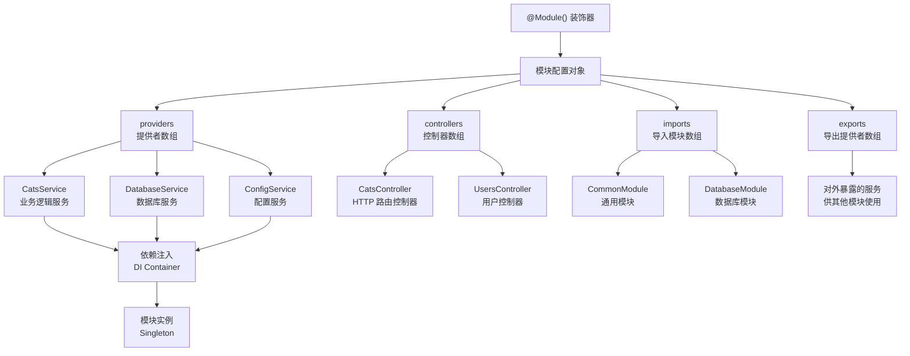
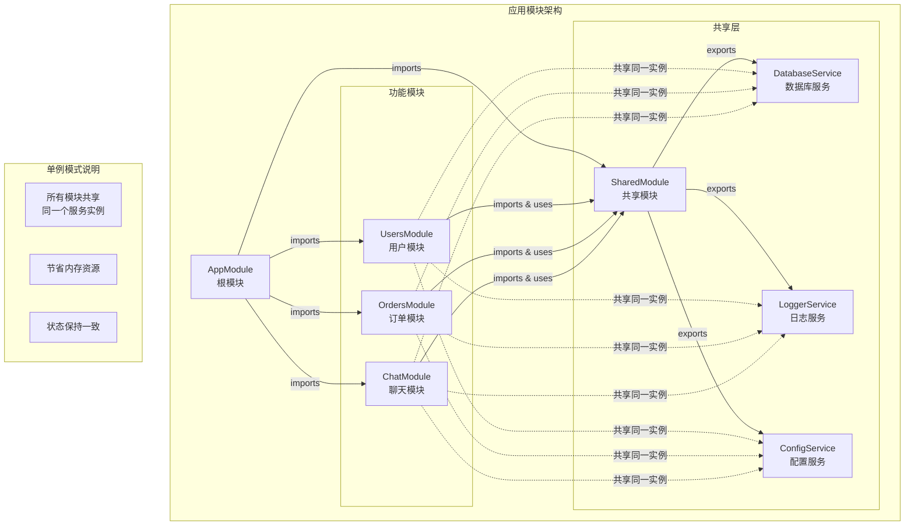

# 模块

**模块**（Module）是由 `@Module()` 装饰器定义的类，其内部的元数据用于帮助 Nest 有效地组织应用结构，并管理各类组件之间的关系。



每个 Nest 应用至少包含一个模块，即**根模块**（Root Module），它是应用图（Application Graph）的起点。应用图描述了模块之间以及模块与提供者之间的依赖关系。

对于小型项目，仅使用一个根模块通常就足够；但在实际开发中，我们更倾向于按功能拆分为多个模块。Nest **强烈推荐**使用模块来组织应用结构，以提升可维护性与可扩展性。通常，每个模块都负责封装一组紧密相关的功能。

`@Module()` 装饰器接受一个配置对象，支持以下几个主要选项：

| 属性          | 描述                                                                                                       |
| ------------- | ---------------------------------------------------------------------------------------------------------- |
| `providers`   | 当前模块中定义的**提供者**数组，将由 Nest 的依赖注入容器实例化，默认仅在本模块中可用。                     |
|               |
| `controllers` | 当前模块中定义的**控制器**数组，由 Nest 自动实例化并处理传入请求。                                         |
|               |
| `imports`     | 当前模块所依赖的**其他模块**数组，用于引入他们导出的提供者。                                               |
|               |
| `exports`     | 当前模块中希望**对外暴露**的提供者，可供导入本模块的其他模块使用，支持提供者本体或其令牌（`provide` 值）。 |

需要特别注意的是，模块默认**封装其提供者**。换句话说，模块内部注册的提供者在外部默认不可访问，除非显式导出。导出的提供者构成了模块的**公共接口**，也是模块之间进行依赖共享的桥梁。

## 功能模块

在本示例中，`CatsController` 与 `CatsService` 同属于“猫”这一业务领域，二者密切配合、职责相关。因此，将他们封装为一个独立的功能模块（Feature Module）是一种合理且官方推荐的架构方式。

功能模块的作用在于**将相关功能的代码组织在一起**，从而实现更清晰的模块边界、更强的内聚性与可维护性。随着应用规模的增长和开发协作的复杂化，模块化的结构优势将愈加突出，同时也更符合 [SOLID 原则](https://en.wikipedia.org/wiki/SOLID)中强调的高内聚、低耦合设计理念。

下面我们将创建一个名为 `CatsModule` 的模块，并将控制器与服务整合在其中：

```ts filename='cats/cats.module.ts'
import { Module } from '@nestjs/common'
import { CatsController } from './cats.controller'
import { CatsService } from './cats.service'

@Module({
  controllers: [CatsController],
  providers: [CatsService],
})
export class CatsModule {
  // 可选：可在此添加模块级的初始化逻辑
}
```

<CalloutInfo>
  你也可以通过命令行快速生成模块结构：`nest g module cats`。
</CalloutInfo>

如上所示，我们在 `cats.module.ts` 文件中声明了 `CatsModule`，并将相关的控制器和服务注册其中。同时，也建议将这些文件统一放置在 `cats` 目录中，以保持结构清晰、易于维护。

接下来，还需要在应用的根模块中导入该功能模块：

```ts filename='app.module.ts'
import { Module } from '@nestjs/common'
import { CatsModule } from './cats/cats.module'

@Module({
  imports: [CatsModule],
})
export class AppModule {}
```

此时，项目的目录结构将大致如下所示：

<FileTree
  data={[
    {
      name: 'src',
      children: [
        {
          name: 'cats',
          children: [
            { name: 'dto', children: [{ name: 'create-cat.dto.ts' }] },
            { name: 'interfaces', children: [{ name: 'cat.interface.ts' }] },
            { name: 'cats.controller.ts' },
            { name: 'cats.module.ts' },
            { name: 'cats.service.ts' },
          ],
        },
        { name: 'app.module.ts' },
        { name: 'main.ts' },
      ],
    },
  ]}
/>

## 共享模块与服务复用

在 NestJS 中，模块默认是**单例**（Singleton）的。这意味着，同一个服务实例可以在多个模块之间共享，无需重复创建。



实际上，Nest 中的每个模块本质上就是一个**共享模块**：只要被其他模块导入，就可以复用其导出的服务。

举个例子，如果我们希望在多个模块中复用同一个 `CatsService` 实例，需要先将它添加到模块的 `exports` 数组中：

```ts filename='cats.module.ts'
import { Module } from '@nestjs/common'
import { CatsController } from './cats.controller'
import { CatsService } from './cats.service'

@Module({
  controllers: [CatsController],
  providers: [CatsService],
  exports: [CatsService], // 导出 CatsService，供其他模块复用
})
export class CatsModule {}
```

这样一来，任何导入了 `CatsModule` 的模块都可以直接注入 `CatsService`，并且他们共享同一个服务实例。

反过来，如果在每个使用场景中都单独注册一次 `CatsService`，虽然功能上仍然可用，但每个模块都会创建一个独立实例。这不仅增加了内存开销，还可能导致服务状态不一致的问题。

通过将服务封装在模块中并显式导出，Nest 提供了一种清晰而可控的服务共享机制。所有依赖该模块的地方都会复用同一个实例，从而实现资源复用、状态一致，也体现了 NestJS 模块化架构和依赖注入机制的强大优势。

## 模块的再导出

如前所述，模块除了可以导出自身定义的提供者外，还可以**再导出**其导入的其他模块。这种机制在构建模块聚合时非常有用。

例如，`CoreModule` 导入了 `CommonModule`，并通过 `exports` 将其重新导出。这样，任何引入 `CoreModule` 的模块，都会自动拥有 `CommonModule` 提供的服务和功能，无需再单独引入：

```ts
@Module({
  imports: [CommonModule],
  exports: [CommonModule],
})
export class CoreModule {}
```

这种方式有助于构建更清晰、可复用的模块边界，尤其适用于基础设施类模块的封装与复用。

## 模块中的依赖注入

除了在模块元数据中注册控制器和提供者外，你还可以在模块类本身通过构造函数注入需要的依赖，例如读取配置或执行初始化逻辑：

```ts filename='cats.module.ts'
import { Module } from '@nestjs/common'
import { CatsController } from './cats.controller'
import { CatsService } from './cats.service'

@Module({
  controllers: [CatsController],
  providers: [CatsService],
})
export class CatsModule {
  constructor(private catsService: CatsService) {}
}
```

需要注意的是：**模块类自身不会作为提供者参与依赖注入体系**，因此不能被注入到其他地方。如果这么做，可能会导致[循环依赖](/fundamentals/circular-dependency)的问题，应该避免。

## 使用全局模块

在 Nest 项目中，如果你需要在多个模块间复用某些依赖，频繁地在 `imports` 中手动引入同一个模块会显得繁琐。与 Angular 不同，Nest 中的 `providers` 默认只在声明他们的模块作用域内可用，并不会自动暴露给全局。这意味着：只有将某个模块显式加入当前模块的 `imports` 数组，才能访问其导出的提供者。

这种按需引入的机制有助于维护模块边界，避免全局作用域被过度污染，也降低了隐式依赖带来的维护成本。

不过，对于一些确实需要在整个应用中广泛使用的服务（如工具类、数据库连接等），Nest 提供了 `@Global()` 装饰器来声明**全局模块**（global module），使其提供者在任意模块中都可以直接注入：

```ts
import { Module, Global } from '@nestjs/common'
import { CatsController } from './cats.controller'
import { CatsService } from './cats.service'

@Global()
@Module({
  controllers: [CatsController],
  providers: [CatsService],
  exports: [CatsService],
})
export class CatsModule {}
```

通过 `@Global()` 装饰器修饰后，`CatsModule` 会被注册到全局作用域，其中导出的 `CatsService` 将自动成为全局提供者。其他模块无需在 `imports` 中引入 `CatsModule`，也能直接注入并使用 `CatsService`。

<CalloutInfo title="谨慎使用全局模块">
  虽然全局模块能减少重复导入的样板代码，但更推荐的做法是按需引入所需模块，并通过
  `exports` 显式暴露其
  API。这样可以保持模块之间的清晰边界，避免产生不必要的耦合，从而提升项目的可维护性。
</CalloutInfo>

## 动态模块配置

Nest 提供了强大的动态模块机制，使我们能够在运行时灵活配置模块内容。它特别适用于需要根据传入参数或配置项动态创建提供者的场景。下面将介绍其基本用法。

```ts
import { Module, DynamicModule } from '@nestjs/common'
import { createDatabaseProviders } from './database.providers'
import { Connection } from './connection.provider'

@Module({
  providers: [Connection],
  exports: [Connection],
})
export class DatabaseModule {
  static forRoot(entities = [], options?): DynamicModule {
    const providers = createDatabaseProviders(options, entities)
    return {
      module: DatabaseModule,
      providers: providers,
      exports: providers,
    }
  }
}
```

<CalloutInfo>
  `forRoot()` 方法既可以返回同步的动态模块对象，也支持返回
  `Promise`，从而满足异步配置的需求。
</CalloutInfo>

在上述示例中，模块通过 `@Module()` 装饰器静态注册了一个名为 `Connection` 的提供者。与此同时，`forRoot()` 方法根据传入的 `entities` 和 `options` 参数动态生成一组提供者（例如用于数据库访问的仓储类）。

需要注意的是，`forRoot()` 返回的配置对象是对原模块元数据的“扩展”，而非“替换”。因此，`Connection` 和动态生成的提供者将共同作为导出成员，供其他模块使用。

如果希望将该动态模块注册为全局模块，只需在返回对象中添加 `global: true`：

```ts
{
  global: true,
  module: DatabaseModule,
  providers: providers,
  exports: providers,
}
```

<CalloutInfo type="warning">
  尽管全局模块可以减少样板代码，但**不建议滥用**。更推荐按需导入的方式，以保持模块边界清晰、依赖关系明确，从而提升代码的可维护性和可测试性。
</CalloutInfo>

模块的导入和配置方式如下：

```ts
import { Module } from '@nestjs/common'
import { DatabaseModule } from './database/database.module'
import { User } from './users/entities/user.entity'

@Module({
  imports: [DatabaseModule.forRoot([User])],
})
export class AppModule {}
```

如果需要在其他模块中重新导出此动态模块，可以直接在 `exports` 中添加模块本身，而无需再次调用 `forRoot()`：

```ts
import { Module } from '@nestjs/common'
import { DatabaseModule } from './database/database.module'
import { User } from './users/entities/user.entity'

@Module({
  imports: [DatabaseModule.forRoot([User])],
  exports: [DatabaseModule],
})
export class AppModule {}
```

更多内容请参阅[动态模块](/fundamentals/dynamic-modules)一章，以及官方提供的[示例项目](https://github.com/nestjs/nest/tree/master/sample/25-dynamic-modules)。

<CalloutInfo>
  想进一步构建更具灵活性与可定制性的模块？请参考[可配置模块构建器](/fundamentals/dynamic-modules#configurable-module-builder)章节，了解如何使用
  `ConfigurableModuleBuilder`。
</CalloutInfo>
