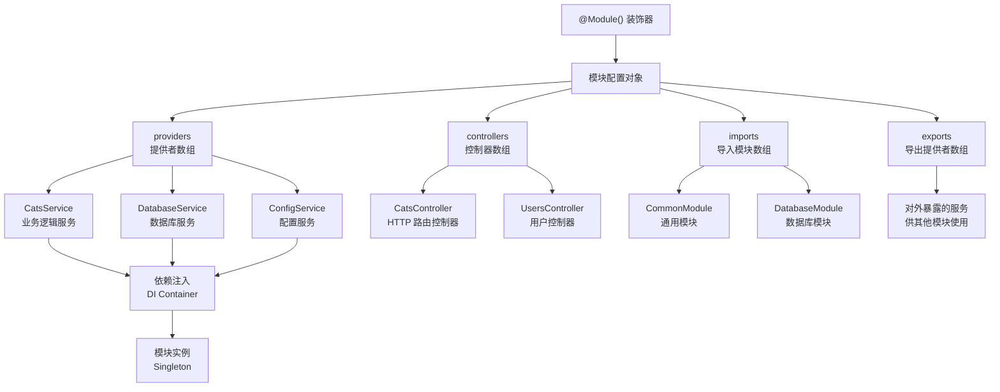
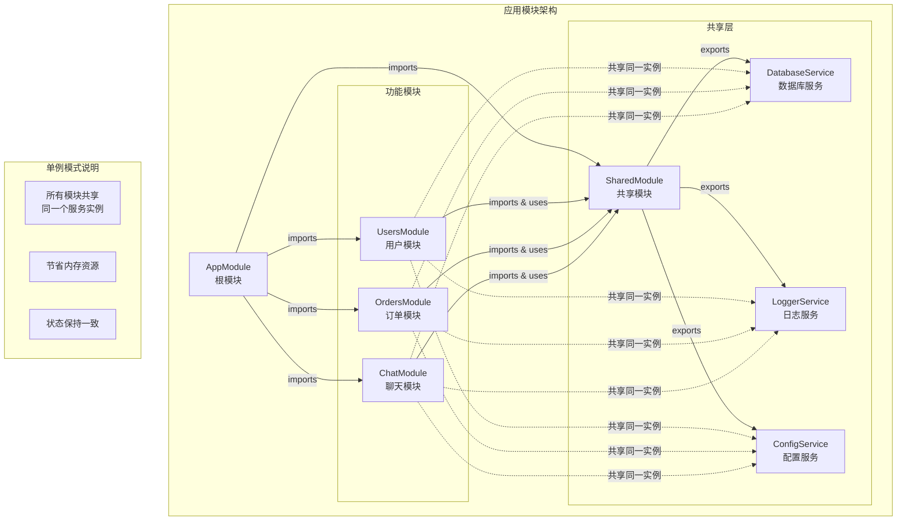

# 模块

**模块**（Module）是通过 `@Module()` 装饰器定义的类，该装饰器提供的元数据有助于 Nest 有效地组织和管理应用结构。



每个 Nest 应用至少包含一个模块，即**根模块**（Root Module），它是 Nest 构建应用图（Application Graph）的起点。应用图用于描述模块之间以及模块与提供者之间的依赖关系。

虽然小型应用可能仅包含根模块，但在实际开发中，通常会划分为多个功能模块。Nest **强烈建议**使用模块来组织各类组件，以提升可维护性与可扩展性。大多数应用中，你往往会有多个模块，每个模块负责封装一组紧密相关的功能。

`@Module()` 装饰器接收一个配置对象，包含以下几个关键属性：

| 属性          | 描述                                                                                                   |
| ------------- | ------------------------------------------------------------------------------------------------------ |
| `providers`   | 提供者（Provider）数组，由 Nest 的依赖注入器实例化，默认仅在本模块中可用                               |
|               |
| `controllers` | 控制器（Controller）数组，定义在本模块中并由 Nest 实例化                                               |
|               |
| `imports`     | 导入的模块数组，这些模块需要导出当前模块所依赖的提供者                                                 |
|               |
| `exports`     | 当前模块中希望对外暴露的提供者子集，供导入该模块的其他模块使用，可为提供者本身或其令牌（`provide` 值） |

需要注意的是，模块默认封装其提供者。这意味着你只能在模块内部使用这些提供者，或通过导入其他模块中显式导出的提供者来使用它们，导出的提供者本质上构成了模块的**公共接口**（Public API）。

## 功能模块

在示例中，`CatsController` 与 `CatsService` 紧密相关，服务于同一业务领域。将它们封装为一个功能模块（Feature Module）是一种合理且推荐的做法。

功能模块用于组织与某一特定功能相关的代码，有助于划分清晰的边界、增强模块化能力。随着应用体量扩大和团队协作增强，功能模块的结构优势愈加明显，也更契合 [SOLID 原则](https://en.wikipedia.org/wiki/SOLID)。

接下来，我们将创建一个名为 `CatsModule` 的模块，演示如何将控制器与服务归为一组：

```ts filename='cats/cats.module.ts'
import { Module } from '@nestjs/common'
import { CatsController } from './cats.controller'
import { CatsService } from './cats.service'

@Module({
  controllers: [CatsController],
  providers: [CatsService],
})
export class CatsModule {
  // 这里可以添加一些模块的初始化逻辑
}
```

<CalloutInfo>
  <div>你可以通过 CLI 命令 `nest g module cats` 快速生成模块文件。</div>
</CalloutInfo>

如上所示，我们在 `cats.module.ts` 文件中定义了 `CatsModule`，并将与之相关的文件统一放置在 `cats` 目录下。最后，我们需要在应用的根模块中导入该功能模块：

```ts filename='app.module.ts'
import { Module } from '@nestjs/common'
import { CatsModule } from './cats/cats.module'

@Module({
  imports: [CatsModule],
})
export class AppModule {}
```

此时，项目结构如下：

<FileTree
  data={[
    {
      name: 'src',
      children: [
        {
          name: 'cats',
          children: [
            { name: 'dto', children: [{ name: 'create-cat.dto.ts' }] },
            { name: 'interfaces', children: [{ name: 'cat.interface.ts' }] },
            { name: 'cats.controller.ts' },
            { name: 'cats.module.ts' },
            { name: 'cats.service.ts' },
          ],
        },
        { name: 'app.module.ts' },
        { name: 'main.ts' },
      ],
    },
  ]}
/>

## 共享模块与服务复用

在 Nest 中，模块默认是**单例**（singleton）的。这意味着在应用中，同一个服务实例可以被多个模块共享，而无需重复创建。



在 Nest 中，每个模块天然就是**共享模块**：一旦定义，就可以被其他模块引入并复用其中导出的服务。

例如，若希望在多个模块中复用同一个 `CatsService` 实例，需要将其添加到模块的 `exports` 数组中进行导出：

```ts filename='cats.module.ts'
import { Module } from '@nestjs/common'
import { CatsController } from './cats.controller'
import { CatsService } from './cats.service'

@Module({
  controllers: [CatsController],
  providers: [CatsService],
  exports: [CatsService], // 导出 CatsService，供其他模块复用
})
export class CatsModule {}
```

这样，任何导入了 `CatsModule` 的模块都可以直接使用 `CatsService`，并且它们之间会共享同一个实例。

反之，如果在每个使用的模块中都单独注册 `CatsService`，虽然功能上也能正常工作，但每个模块会拥有各自独立的实例。这不仅会造成额外的内存开销，还可能引发服务状态不一致等问题。

通过将服务封装在模块中并显式导出，Nest 提供了一种清晰、可控的服务共享机制。所有依赖该模块的地方都将复用同一个实例，从而实现资源的节省和状态的一致性。这种模式正是 NestJS 模块化架构与依赖注入机制的一大优势 —— 让服务在整个应用中实现高效、安全的复用。

## 模块的再导出

正如前文所述，模块不仅可以导出自身定义的提供者，也可以**再导出**其导入的模块。

例如，`CommonModule` 被导入到 `CoreModule` 后，同时通过 `exports` 再次导出。这样，任何导入 `CoreModule` 的模块，也能自动获取 `CommonModule` 中提供的功能，无需再次显式导入：

```ts
@Module({
  imports: [CommonModule],
  exports: [CommonModule],
})
export class CoreModule {}
```

## 模块中的依赖注入

你也可以在模块类本身注入提供者（例如用于读取配置等）：

```ts filename='cats.module.ts'
import { Module } from '@nestjs/common'
import { CatsController } from './cats.controller'
import { CatsService } from './cats.service'

@Module({
  controllers: [CatsController],
  providers: [CatsService],
})
export class CatsModule {
  constructor(private catsService: CatsService) {}
}
```

注意，模块类本身不能作为提供者被注入到其他地方，否则可能会引发[循环依赖](/fundamentals/circular-dependency)问题。

## 全局模块用法

在项目中，如果你需要在多个模块间反复导入相同的依赖，操作往往显得冗长。与 Angular 不同，Nest 的 `providers` 默认只在声明它们的模块作用域内可见，并不会自动注册到全局。这意味着：只有把某个模块加入 `imports`，才能在当前作用域注入并使用它导出的提供者。此机制有助于减少全局污染，避免隐式依赖。

若确实需要让某些提供者（例如工具类、数据库连接等）在任何模块中都能直接注入，可使用 @Global() 装饰器将所属模块声明为**全局模块**（global module）：

```ts
import { Module, Global } from '@nestjs/common'
import { CatsController } from './cats.controller'
import { CatsService } from './cats.service'

@Global()
@Module({
  controllers: [CatsController],
  providers: [CatsService],
  exports: [CatsService],
})
export class CatsModule {}
```

`@Global()` 装饰器会将模块注册到全局作用域，全局模块通常只需在根模块（或一个核心模块）引入一次。

以上示例中，`CatsService` 会变成全局提供者；其它模块即使未在 `imports` 中写 `CatsModule`，也能直接注入它。

<CalloutInfo title="谨慎使用全局模块">
  尽管全局模块可以减少重复引入的样板代码，但更合理的做法是通过 `imports` 数组按需引入并显式暴露模块
  API。这样不仅有助于保持模块边界清晰，也能提高项目的可维护性，避免不相关模块之间产生不必要的耦合。
</CalloutInfo>

## 动态模块配置

Nest 提供的动态模块机制，允许在运行时灵活配置模块内容，特别适用于根据传入的参数或配置项动态创建提供者的场景。下面将简要介绍动态模块的基本用法。

```ts
import { Module, DynamicModule } from '@nestjs/common'
import { createDatabaseProviders } from './database.providers'
import { Connection } from './connection.provider'

@Module({
  providers: [Connection],
  exports: [Connection],
})
export class DatabaseModule {
  static forRoot(entities = [], options?): DynamicModule {
    const providers = createDatabaseProviders(options, entities)
    return {
      module: DatabaseModule,
      providers: providers,
      exports: providers,
    }
  }
}
```

<CalloutInfo>
  `forRoot()` 方法既可以同步返回一个动态模块对象，也可以返回 `Promise` 以支持异步配置场景。
</CalloutInfo>

在上述示例中，模块通过 `@Module()` 装饰器静态声明了一个 `Connection` 提供者。同时，`forRoot()` 方法基于传入的 `entities` 和 `options` 动态生成一组提供者（例如仓储类 repository）。需要注意的是，动态模块返回的配置对象会扩展原模块的元数据，而不是覆盖它。因此，静态声明的 `Connection` 以及动态生成的提供者都会被一并导出。

如果希望将动态模块注册为全局模块，只需在返回的对象中添加 `global: true` 属性：

```ts
{
  global: true,
  module: DatabaseModule,
  providers: providers,
  exports: providers,
}
```

<CalloutInfo type="warning">
  如前所述，不建议将所有内容都设为全局模块。虽然全局模块可以减少样板代码，但更推荐按需导入，保持结构清晰、可维护，避免不必要的耦合。
</CalloutInfo>

你可以像下面这样导入和配置 `DatabaseModule`：

```ts
import { Module } from '@nestjs/common'
import { DatabaseModule } from './database/database.module'
import { User } from './users/entities/user.entity'

@Module({
  imports: [DatabaseModule.forRoot([User])],
})
export class AppModule {}
```

如果需要在其他模块中再次导出该动态模块，可直接在 `exports` 中添加模块本身，而无需再次调用 `forRoot()`：

```ts
import { Module } from '@nestjs/common'
import { DatabaseModule } from './database/database.module'
import { User } from './users/entities/user.entity'

@Module({
  imports: [DatabaseModule.forRoot([User])],
  exports: [DatabaseModule],
})
export class AppModule {}
```

更多关于动态模块的内容，请参考[动态模块](/fundamentals/dynamic-modules)章节以及[官方示例](https://github.com/nestjs/nest/tree/master/sample/25-dynamic-modules)。

<CalloutInfo>
  你还可以在[这个章节](/fundamentals/dynamic-modules#configurable-module-builder)了解如何使用
  `ConfigurableModuleBuilder` 构建高度可定制的动态模块。
</CalloutInfo>
