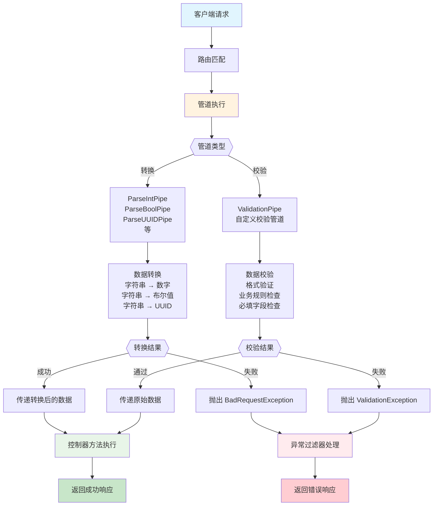

# 管道

**管道**（Pipe）是一个使用 `@Injectable()` 装饰器修饰，并实现了 `PipeTransform` 接口的类。



管道主要用于以下两类场景：

- **数据转换**：将输入数据转换为期望的格式（例如将字符串转换为整数）
- **数据校验**：验证输入数据的有效性，若数据有效则原样传递，若无效则抛出异常

在这两种场景中，管道都会作用于[控制器路由处理器](/controllers#获取路由参数)所接收的参数。Nest 会在调用控制器方法之前执行管道逻辑，将即将传入方法的参数作为输入进行处理。无论是转换还是校验操作，都会在这一阶段完成，随后控制器方法会接收到处理后的参数。

Nest 提供了多种可直接使用的内置管道，同时也支持开发者自定义管道。本章将介绍内置管道的使用方式及其绑定机制，并通过一个自定义管道的示例，演示如何从零实现一个管道。

<CalloutInfo>
  管道运行在异常捕获区域（exceptions zone）内。这意味着一旦管道抛出异常，Nest
  的异常处理机制（包括全局异常过滤器和当前上下文绑定的[异常过滤器](/exception-filters)）将会接管处理。因此，一旦管道发生异常，对应的控制器方法将不会被调用。这种机制为在系统边界处校验外部输入数据提供了良好的实践方式。
</CalloutInfo>

## 内置管道

Nest 提供了一系列内置管道，包括：

- `ValidationPipe`
- `ParseIntPipe`
- `ParseFloatPipe`
- `ParseBoolPipe`
- `ParseArrayPipe`
- `ParseUUIDPipe`
- `ParseEnumPipe`
- `DefaultValuePipe`
- `ParseFilePipe`
- `ParseDatePipe`

这些管道均由 `@nestjs/common` 包导出。

以下以 `ParseIntPipe` 为例，演示其用于类型转换的场景。该管道可确保方法参数被成功转换为 JavaScript 的整数类型，若转换失败，则会抛出异常。后文还将展示一个简化版的自定义 ParseIntPipe 实现，帮助理解其内部原理。

类似的用法同样适用于其他内置的类型转换管道（如 `ParseBoolPipe`、`ParseFloatPipe`、`ParseEnumPipe`、`ParseArrayPipe`、`ParseDatePipe` 和 `ParseUUIDPipe`，统称为 `Parse*` 管道）。

## 管道的绑定方式

要在应用中使用管道，需要将管道类绑定到适当的上下文中。以 `ParseIntPipe` 为例，我们希望在某个路由处理方法中使用它，并确保在方法执行前对参数进行处理。可以通过如下方式，在**方法参数级别**绑定管道：

```ts
@Get(':id')
async findOne(@Param('id', ParseIntPipe) id: number) {
  return this.catsService.findOne(id);
}
```

上述写法确保了两点：

- 若参数符合预期（即可转换为数字），则 `findOne()` 方法将正常执行；
- 若不符合预期，Nest 将在调用路由处理器之前抛出异常。

例如，若以以下方式调用路由：

```bash
GET localhost:3000/abc
```

Nest 会抛出类似如下的异常：

```json
{
  "statusCode": 400,
  "message": "Validation failed (numeric string is expected)",
  "error": "Bad Request"
}
```

该异常会阻止 `findOne()` 方法体的执行，避免应用处理无效或非法参数。

值得注意的是，在上述例子中我们传入的是类（`ParseIntPipe`）本身，而非其实例。此时框架会自动实例化该管道类，并支持依赖注入机制。类似守卫和拦截器，管道也可以传入实例对象，这对于需要传递自定义选项的场景非常有用。例如：

```ts
@Get(':id')
async findOne(
  @Param('id', new ParseIntPipe({ errorHttpStatusCode: HttpStatus.NOT_ACCEPTABLE }))
  id: number,
) {
  return this.catsService.findOne(id);
}
```

其他转换类管道（如所有 `Parse*` 系列）也遵循相同的绑定方式，常用于对路由参数、查询参数、请求体等进行类型转换和基本校验。

例如，绑定到查询参数：

```ts
@Get()
async findOne(@Query('id', ParseIntPipe) id: number) {
  return this.catsService.findOne(id);
}
```

再如，使用 `ParseUUIDPipe` 对字符串参数进行解析，并校验其是否为合法的 UUID：

```ts
@Get(':uuid')
async findOne(@Param('uuid', new ParseUUIDPipe()) uuid: string) {
  return this.catsService.findOne(uuid);
}
```

<CalloutInfo>
  `ParseUUIDPipe()` 默认支持校验 UUID 的第 3、4、5
  个版本。如需限制为特定版本，可通过构造参数进行配置。
</CalloutInfo>

以上内容展示了 `Parse*` 系列转换管道的常见绑定方式。对于校验类管道，其绑定方式略有不同，详见下节内容。

<CalloutInfo>更多关于校验管道的使用方法，请参考[校验技术](/techniques/validation)。</CalloutInfo>

## 自定义管道

如前所述，Nest 允许你自定义管道。尽管框架内置了功能强大的 `ParseIntPipe` 和 `ValidationPipe`，我们仍将从零开始实现一个简化版本，以帮助你更好地理解自定义管道的构建方式。

以下是一个最基础的 `ValidationPipe` 实现。它的初始版本仅接收输入值并原样返回，相当于一个恒等函数：

```ts filename='validation.pipe.ts'
import { PipeTransform, Injectable, ArgumentMetadata } from '@nestjs/common'

@Injectable()
export class ValidationPipe implements PipeTransform {
  transform(value: any, metadata: ArgumentMetadata) {
    return value
  }
}
```

<CalloutInfo>
 `PipeTransform<T, R>` 是所有管道必须实现的泛型接口，其中 `T` 表示输入值的类型，`R` 表示 `transform()` 方法的返回类型。
</CalloutInfo>

每个管道都必须实现 `transform()` 方法，以符合 `PipeTransform` 接口的约定。该方法接收两个参数：
• `value`：当前被处理的方法参数（在传递给控制器路由处理器之前）
• `metadata`：关于该参数的元数据对象，包含以下属性：

```ts
export interface ArgumentMetadata {
  type: 'body' | 'query' | 'param' | 'custom'
  metatype?: Type<unknown>
  data?: string
}
```

这些属性用于描述当前参数的上下文信息：

| 属性       | 描述                                                                                                                               |
| ---------- | ---------------------------------------------------------------------------------------------------------------------------------- |
| `type`     | 表示参数来源：请求体 `@Body()`、查询参数 `@Query()`、路由参数 `@Param()`，或自定义参数（详见[自定义装饰器](/custom-decorators)）。 |
| `metatype` | 参数的元类型，例如 `String`。注意：若方法参数未显式声明类型，或使用原生 JavaScript，则该值为 `undefined`。                         |
| `data`     | 装饰器中传入的字段名，例如 `@Body('name')` 中的 `'name'`。若装饰器未传入参数，则为 `undefined`。                                   |

<CalloutInfo type="warning">
  由于 TypeScript 接口在编译后会被移除，如果参数类型声明为接口而非类，`metatype` 的值将为 `Object`。
</CalloutInfo>

## 基于模式的校验

接下来，让我们进一步提升校验管道的实用性。以 `CatsController` 的 `create()` 方法为例，通常我们希望在调用服务方法之前，先确保请求体中的对象是有效的。

```ts
@Post()
async create(@Body() createCatDto: CreateCatDto) {
  this.catsService.create(createCatDto);
}
```

其中，`createCatDto` 的类型为 `CreateCatDto`：

```ts filename='create-cat.dto.ts'
export class CreateCatDto {
  name: string
  age: number
  breed: string
}
```

这正是管道发挥作用的场景。下面我们来完善校验管道的实现。

我们希望所有对 create 方法的请求体都包含一个有效的对象，因此需要对 createCatDto 的三个属性进行校验。虽然可以在路由处理器内部手动编写校验逻辑，但这违背了**单一职责原则**（SRP），使控制器代码变得臃肿。

另一种做法是为每个方法创建独立的校验器类，并在方法开头显式调用，但这种方式容易被遗漏，且重复性高。

也可以考虑在中间件中进行校验，但中间件无法感知**执行上下文**（即当前被调用的处理器及其参数），因此难以实现通用而灵活的校验逻辑。

这正是**管道**发挥作用的最佳场景。接下来，我们将完善校验管道的实现。

## 基于对象模式的参数校验

实现对象参数的校验有多种优雅的方式，其中较常见的一种是基于模式（schema-based）的校验方法。本节以 [Zod 库](https://zod.dev/)为例，演示如何构建一个基于 Zod 的参数校验管道。

首先，安装相关依赖：

```bash
$ npm install --save zod
```

下面的示例代码中，我们定义了一个自定义的校验管道类，该类接收一个 Zod schema，并通过 `schema.parse()` 方法对传入参数进行验证。

根据 NestJS 的设计规范，校验管道要么返回解析后的值，要么在校验失败时抛出异常。

在下一节中，我们将介绍如何使用 `@UsePipes()` 装饰器为控制器方法传入 schema，实现校验逻辑的复用与解耦。

```ts filename='zod-validation.pipe.ts'
import { PipeTransform, ArgumentMetadata, BadRequestException } from '@nestjs/common'
import { ZodSchema } from 'zod'

export class ZodValidationPipe implements PipeTransform {
  constructor(private schema: ZodSchema) {}

  transform(value: unknown, metadata: ArgumentMetadata) {
    try {
      const parsedValue = this.schema.parse(value)
      return parsedValue
    } catch (error) {
      throw new BadRequestException('Validation failed')
    }
  }
}
```

## 绑定校验管道

在前文中，我们已经介绍了如何绑定转换管道（如 `ParseIntPipe`）。同样地，绑定校验管道的方式也非常直观。

以 `ZodValidationPipe` 为例，使用流程如下：

1. 创建 `ZodValidationPipe` 实例
2. 在构造函数中传入对应的 Zod schema
3. 将管道通过装饰器绑定到控制器方法

以下是一个 Zod schema 的示例：

```ts
import { z } from 'zod'

export const createCatSchema = z
  .object({
    name: z.string(),
    age: z.number(),
    breed: z.string(),
  })
  .required()

export type CreateCatDto = z.infer<typeof createCatSchema>
```

通过 `@UsePipes()` 装饰器绑定该管道：

```ts filename='cats.controller.ts'
import { UsePipes } from '@nestjs/common'

@Post()
@UsePipes(new ZodValidationPipe(createCatSchema))
async create(@Body() createCatDto: CreateCatDto) {
  this.catsService.create(createCatDto)
}
```

<CalloutInfo type="warning">
  使用 `zod` 库时，请确保在 `tsconfig.json` 中启用了 `strictNullChecks` 选项。
</CalloutInfo>

## 类装饰器校验器

<CalloutInfo type="warning">
  本节内容仅适用于 TypeScript 项目，原生 JavaScript 不支持类装饰器的写法。
</CalloutInfo>

接下来介绍另一种常见且强大的校验方式。

Nest 与 [class-validator](https://github.com/typestack/class-validator) 库深度集成，该库允许你使用装饰器为类属性声明校验规则。这种基于装饰器的校验机制在 Nest 的管道系统中尤为强大，因为它可以配合参数的 `metatype` 实现自动验证。在开始之前，请先安装相关依赖：

```bash
$ npm i --save class-validator class-transformer
```

安装完成后，你可以直接在 `CreateCatDto` 类上添加装饰器。这样做的一个显著优势是：该类既定义了请求体的数据结构，同时也承担了数据校验的职责，无需单独创建校验逻辑。

```ts filename='create-cat.dto.ts'
import { IsString, IsInt } from 'class-validator'

export class CreateCatDto {
  @IsString()
  name: string

  @IsInt()
  age: number

  @IsString()
  breed: string
}
```

<CalloutInfo>
  更多 class-validator 更多装饰器的用法请参见 [class-validator
  官方文档](https://github.com/typestack/class-validator#usage)。
</CalloutInfo>

接下来我们实现一个简单的 `ValidationPipe`，用于解析注解并进行参数校验：

```ts filename='validation.pipe.ts'
import { PipeTransform, Injectable, ArgumentMetadata, BadRequestException } from '@nestjs/common'
import { validate } from 'class-validator'
import { plainToInstance } from 'class-transformer'

@Injectable()
export class ValidationPipe implements PipeTransform<any> {
  async transform(value: any, { metatype }: ArgumentMetadata) {
    if (!metatype || !this.toValidate(metatype)) {
      return value
    }
    const object = plainToInstance(metatype, value)
    const errors = await validate(object)
    if (errors.length > 0) {
      throw new BadRequestException('Validation failed')
    }
    return value
  }

  private toValidate(metatype: Function): boolean {
    const types: Function[] = [String, Boolean, Number, Array, Object]
    return !types.includes(metatype)
  }
}
```

<CalloutInfo>
  实际开发中无需手动实现验证管道，Nest 已内置了功能完善的
  `ValidationPipe`。此示例仅用于演示自定义管道的原理。更多用法详见
  [官方文档](/techniques/validation)。
</CalloutInfo>

<CalloutInfo type="success">
  上述示例中使用的 [class-transformer](https://github.com/typestack/class-transformer) 与
  **class-validator** 均由同一作者开发，两者结合使用效果最佳。
</CalloutInfo>

我们逐步解析上述逻辑：

- 首先，`transform()` 方法被声明为 `async`，因为 class-validator 支持异步校验（某些规则返回 Promise）。
- 使用解构获取 `ArgumentMetadata` 中的 `metatype` 字段，这是校验所依赖的目标类型。
- `toValidate()` 方法用于判断参数类型是否为原生 JavaScript 类型（如 `String`、`Boolean`、`Number` 等）。原生类型无法附加装饰器，因此无需校验。
- 接着，使用 class-transformer 的 `plainToInstance()` 将普通对象转换为具有类型信息的类实例，以便 class-validator 能识别并执行装饰器中的校验规则。注意：从请求中反序列化得到的对象本身没有类型信息，必须进行此转换。
- 最后，管道要么返回原值，要么在校验失败时抛出异常。

完成验证逻辑后，我们可以将自定义管道绑定到路由处理器的 `@Body()` 参数上，实现对请求体的自动校验：

```ts filename='cats.controller.ts'
@Post()
async create(
  @Body(new ValidationPipe()) createCatDto: CreateCatDto,
) {
  this.catsService.create(createCatDto)
}
```

这种参数级管道的方式适用于仅需校验特定字段的场景，使用灵活，语义清晰。

## 全局管道

由于 `ValidationPipe` 是一个通用管道，我们可以将其配置为**全局管道**，使其自动应用于整个应用中的所有控制器和路由处理器。

```ts filename='main.ts'
async function bootstrap() {
  const app = await NestFactory.create(AppModule)
  app.useGlobalPipes(new ValidationPipe())
  await app.listen(process.env.PORT ?? 3000)
}
```

<CalloutInfo type="warning">
  如果你使用的是[混合应用](/faq/hybrid-application)，请注意：`useGlobalPipes()`
  不会作用于网关和微服务部分。对于标准微服务应用，该方法仍会正确注册全局管道。
</CalloutInfo>

使用 `useGlobalPipes()` 注册的全局管道会自动应用于所有控制器和其处理器方法。

需要注意的是：此种方式注册的管道发生在模块系统之外，因此**无法使用依赖注入**。若你的管道依赖其他服务或配置项，推荐在模块内部以提供者的方式注册：

```ts filename='app.module.ts'
import { Module } from '@nestjs/common'
import { APP_PIPE } from '@nestjs/core'

@Module({
  providers: [
    {
      provide: APP_PIPE,
      useClass: ValidationPipe,
    },
  ],
})
export class AppModule {}
```

<CalloutInfo>
  通过提供者方式注册全局管道，不仅支持依赖注入，而且无论在哪个模块中声明，都会全局生效。
  建议在定义管道的模块中进行注册。此外，`useClass`
  并非唯一的自定义提供者形式，更多用法请参考[自定义提供者文档](/fundamentals/custom-providers)。
</CalloutInfo>

## 内置 ValidationPipe

再次强调，你无需自行实现通用的 `ValidationPipe`，因为 Nest 已已内建提供该功能。其内置的 `ValidationPipe` 拥有远比本章示例更丰富的配置选项和更完整的功能支持。本章的示例仅用于演示如何自定义管道的基本机制。若需了解 `ValidationPipe` 的完整用法及更多示例，请参考[验证](/techniques/validation)章节。

## 转换用例

自定义管道不仅可用于校验，也可用于转换输入数据格式。这是因为 `transform` 方法的返回值会完全替代原始参数值。

这种机制在实际开发中非常实用。例如，前端传递的参数往往是字符串格式，但后端可能需要将其转换为整数或布尔值才能正确处理；又如，当某些参数未提供时，我们希望为其设置默认值。这类逻辑可通过转换管道（transformation pipe）集中处理，实现前后端数据格式的自动适配。

以下是一个简单的 `ParseIntPipe` 示例，用于将字符串转换为整数。（Nest 本身提供了更完整的 `ParseIntPipe`，此处仅用于说明如何编写自定义转换管道。）

```ts filename='parse-int.pipe.ts'
import { PipeTransform, Injectable, ArgumentMetadata, BadRequestException } from '@nestjs/common'

@Injectable()
export class ParseIntPipe implements PipeTransform<string, number> {
  transform(value: string, metadata: ArgumentMetadata): number {
    const val = parseInt(value, 10)
    if (isNaN(val)) {
      throw new BadRequestException('Validation failed')
    }
    return val
  }
}
```

在控制器中使用方式如下：

```ts
@Get(':id')
async findOne(@Param('id', new ParseIntPipe()) id) {
  return this.catsService.findOne(id);
}
```

另一个常见的转换用例是：根据请求中的 id，从数据库中查找并注入对应的用户实体：

```ts
@Get(':id')
findOne(@Param('id', UserByIdPipe) userEntity: UserEntity) {
  return userEntity;
}
```

该管道的实现可作为练习尝试。其接收一个输入值（如 id），返回一个处理后的结果（如对应的 `UserEntity` 对象）。通过这种方式，我们可以将重复的逻辑从控制器中抽离，使代码更加声明式，符合 [DRY 原则](https://en.wikipedia.org/wiki/Don%27t_repeat_yourself)。

## 设置默认值

`Parse*` 系列管道要求参数值必须存在；若收到 `null` 或 `undefined`，则会抛出异常。为支持缺省参数值，我们可以在 `Parse*` 管道前插入 `DefaultValuePipe`，用于注入默认值。只需将 `DefaultValuePipe` 放在对应管道之前即可：

```ts
@Get()
async findAll(
  @Query('activeOnly', new DefaultValuePipe(false), ParseBoolPipe) activeOnly: boolean,
  @Query('page', new DefaultValuePipe(0), ParseIntPipe) page: number,
) {
  return this.catsService.findAll({ activeOnly, page });
}
```
