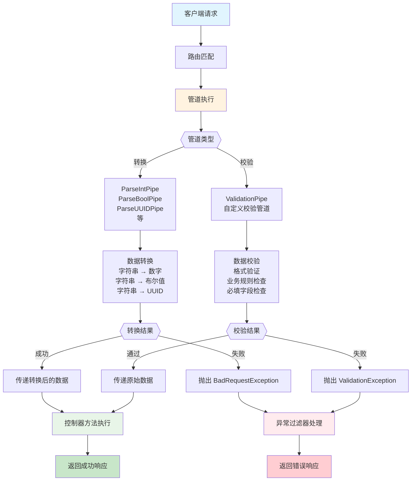

# 管道

**管道**（Pipe）是一种带有 `@Injectable()` 装饰器的类，并实现了 `PipeTransform` 接口。



它主要应用于两个核心场景：

- **数据转换**：将传入数据转换为目标格式，例如将字符串转为整数；
- **数据校验**：验证数据是否有效。若校验通过，数据将原样传入控制器；若不通过，则抛出异常。

无论是数据转换还是校验，管道的执行时机都发生在调用控制器方法之前 —— 它会拦截并处理控制器参数，确保传入方法的值已经是“干净且可用”的。

Nest 除了内置了一系列常用管道，也支持开发者自定义管道逻辑。本章节将介绍内置管道的使用方式、绑定机制，并通过一个实际示例带你从零实现一个自定义管道。

<CalloutInfo>
  所有管道都会在异常捕获区域（exceptions
  zone）中执行。换句话说，一旦管道抛出异常，Nest
  的异常处理机制（包括全局异常过滤器和当前上下文的[异常过滤器](/exception-filters)）会立即接手处理，阻止控制器方法继续执行。这一机制非常适合在系统边界对外部输入进行预处理和防御性校验。
</CalloutInfo>

## 内置管道

Nest 提供了一套常用的内置管道，用于在请求到达处理逻辑前对参数进行转换和验证。这些内置管道包括：

- `ValidationPipe`
- `ParseIntPipe`
- `ParseFloatPipe`
- `ParseBoolPipe`
- `ParseArrayPipe`
- `ParseUUIDPipe`
- `ParseEnumPipe`
- `DefaultValuePipe`
- `ParseFilePipe`
- `ParseDatePipe`

以上管道均由 `@nestjs/common` 包导出，可直接使用。

我们以 `ParseIntPipe` 为例，来说明其在类型转换场景中的典型用法。该管道用于将传入的参数转换为 JavaScript 的整数类型。如果转换失败，则会自动抛出异常，终止后续处理流程。

稍后我们还会演示一个简化版的自定义 `ParseIntPipe` 实现，以帮助你深入理解其背后的工作机制。

值得一提的是，`ParseBoolPipe`、`ParseFloatPipe`、`ParseEnumPipe`、`ParseArrayPipe`、`ParseDatePipe` 和 `ParseUUIDPipe` 等也遵循类似的使用模式，统称为 `Parse*` 类型转换管道。

## 管道的绑定方式

在 Nest 应用中使用管道（Pipe），需要将其绑定到合适的上下文中。以内置的 `ParseIntPipe` 为例，假设我们希望在某个路由处理方法中对传入参数进行类型转换，并在方法执行前完成处理，可以按如下方式在**方法参数级别**绑定管道：

```ts
@Get(':id')
async findOne(@Param('id', ParseIntPipe) id: number) {
  return this.catsService.findOne(id);
}
```

上述写法确保了两点：

- 如果传入参数符合预期（即可被转换为数字），则 `findOne()` 方法将正常执行；
- 如果参数不合法，Nest 会在调用处理器之前抛出异常，阻止方法执行。

例如，当路由被以下方式访问：

```bash
GET localhost:3000/abc
```

Nest 会返回如下错误响应：

```json
{
  "statusCode": 400,
  "message": "Validation failed (numeric string is expected)",
  "error": "Bad Request"
}
```

该机制能够有效拦截非法参数，避免无效请求进入业务逻辑。

值得注意的是，以上示例中传入的是 `ParseIntPipe` 类本身，而不是其实例。Nest 会在运行时自动实例化该类，并支持其依赖注入能力。类似于守卫和拦截器，我们也可以显式传入管道实例，这在需要传递配置选项时尤为有用。例如：

```ts
@Get(':id')
async findOne(
  @Param('id', new ParseIntPipe({ errorHttpStatusCode: HttpStatus.NOT_ACCEPTABLE }))
  id: number,
) {
  return this.catsService.findOne(id);
}
```

除了路由参数，`Parse*` 系列管道也常用于对查询参数、请求体等内容进行类型转换与基本验证。以下是一些典型示例：

#### 绑定到查询参数：

```ts
@Get()
async findOne(@Query('id', ParseIntPipe) id: number) {
  return this.catsService.findOne(id);
}
```

#### 使用 `ParseUUIDPipe` 校验 UUID 格式：

```ts
@Get(':uuid')
async findOne(@Param('uuid', new ParseUUIDPipe()) uuid: string) {
  return this.catsService.findOne(uuid);
}
```

<CalloutInfo>
  `ParseUUIDPipe()` 默认支持第 3、4、5 版本的
  UUID。若需要限制为特定版本，可通过构造参数进行配置。
</CalloutInfo>

以上内容介绍了 `Parse*` 系列转换管道的常见使用方式，他们主要用于对传入数据进行类型转换和初步校验。而对于更复杂的校验逻辑，可使用专门的**校验类管道**，其绑定方式略有不同，将在下节中详细说明。

<CalloutInfo>
  想了解更全面的校验机制，请参阅[校验技术](/techniques/validation)一节。
</CalloutInfo>

## 自定义管道

正如前文所述，Nest 允许我们编写自定义管道。虽然框架已经内置了功能强大的 `ParseIntPipe` 和 `ValidationPipe`，但为了帮助你更好地理解其实现机制，我们将从零开始构建一个简化版本的验证管道。

下面是一个最基础的 `ValidationPipe` 实现。当前它的功能非常简单：接收一个输入值并原样返回，等同于一个恒等函数：

```ts filename='validation.pipe.ts'
import { PipeTransform, Injectable, ArgumentMetadata } from '@nestjs/common'

@Injectable()
export class ValidationPipe implements PipeTransform {
  transform(value: any, metadata: ArgumentMetadata) {
    return value
  }
}
```

<CalloutInfo>
  所有自定义管道都需实现 `PipeTransform<T, R>` 接口，其中 `T` 表示输入值类型，`R` 表示 `transform()` 方法的返回类型。
</CalloutInfo>

每个管道必须实现 `transform()` 方法，以符合 `PipeTransform` 接口规范。该方法接收两个参数：

- `value`：当前控制器方法参数的原始值，在传入处理器方法前由管道拦截。
- `metadata`：参数的元数据对象，结构如下：

```ts
export interface ArgumentMetadata {
  type: 'body' | 'query' | 'param' | 'custom'
  metatype?: Type<unknown>
  data?: string
}
```

这三个属性的含义如下：

| 属性       | 描述                                                                                                                                                  |
| ---------- | ----------------------------------------------------------------------------------------------------------------------------------------------------- |
| `type`     | 表示参数的来源，例如：请求体（`@Body()`）、查询参数（`@Query()`）、路径参数（`@Param()`），或是自定义来源（详见[自定义装饰器](/custom-decorators)）。 |
| `metatype` | 参数的类型信息，例如 String、Number、自定义类等。注意：如果方法参数未显式声明类型，或使用的是原生 JavaScript 类型，则该值为 `undefined`。             |
| `data`     | 装饰器中传入的字段名，例如 `@Body('name')` 中的 `'name'`。如果未指定字段，则该值为 `undefined`。                                                      |

<CalloutInfo type="warning">
  请注意，TypeScript
  的接口类型在编译后会被擦除。如果参数使用接口声明类型（而非类），则运行时
  `metatype` 的值为 `Object`，这会影响基于类型的验证逻辑。
</CalloutInfo>

## 基于模式的校验

为了提升校验逻辑的可复用性和一致性，我们可以借助 Nest 提供的管道机制，对请求体进行结构化校验。以下以 `CatsController` 中的 `create()` 方法为例进行说明。

```ts
@Post()
async create(@Body() createCatDto: CreateCatDto) {
  this.catsService.create(createCatDto);
}
```

其中，`createCatDto` 的类型定义如下：：

```ts filename='create-cat.dto.ts'
export class CreateCatDto {
  name: string
  age: number
  breed: string
}
```

在调用服务方法前，我们通常希望先验证 createCatDto 是否符合预期格式——这是校验管道大显身手的场景。

为了确保每个 `create()` 方法的请求体都具备合法的 `name`、`age` 和 `breed` 字段，我们可以编写显式的校验逻辑。但如果将这些逻辑直接写入控制器，将破坏**单一职责原则**（SRP），使代码变得冗长难维护。

另一种做法是为每个处理器方法创建对应的校验器类，并手动调用他们。但这种方式不仅容易被忽略，还会引入大量重复代码。

也可以选择在中间件中实现统一校验，但中间件层无法获取当前的**执行上下文**（即调用的处理器方法及其参数信息），难以实现具备上下文感知能力的动态校验。

因此，Nest 的**管道机制**正好填补了这一空缺。它既支持自动注入 DTO，也能够结合元数据感知上下文信息，是实现灵活、可维护校验逻辑的最佳方式。

接下来，我们将继续完善并实现一个基于模式的通用校验管道。

## 基于对象模式的参数校验

在处理对象参数校验时，使用模式驱动（schema-based）的方式是一种优雅且常见的实践。本节将以 [Zod 库](https://zod.dev/)为例，演示如何构建一个基于 Zod 的参数校验管道。

### 安装依赖

首先，安装 Zod：

```bash
$ npm install zod
```

### 构建自定义校验管道

下面是一个基于 Zod 的自定义参数校验管道示例。该类接收一个 `ZodSchema` 实例，并在 `transform()` 方法中通过 `schema.parse()` 对入参进行验证。

根据 NestJS 的设计约定，管道应当返回验证通过后的值；若校验失败，则应抛出异常。

```ts filename='zod-validation.pipe.ts'
import {
  PipeTransform,
  ArgumentMetadata,
  BadRequestException,
} from '@nestjs/common'
import { ZodSchema } from 'zod'

export class ZodValidationPipe implements PipeTransform {
  constructor(private schema: ZodSchema) {}

  transform(value: unknown, metadata: ArgumentMetadata) {
    try {
      return this.schema.parse(value)
    } catch {
      throw new BadRequestException('Validation failed')
    }
  }
}
```

在下一节中，我们将介绍如何使用 `@UsePipes()` 装饰器将校验逻辑集成至控制器方法中，从而实现参数校验的复用与解耦。

## 绑定参数校验管道

在前文中，我们介绍了如何绑定类型转换管道（例如 `ParseIntPipe`）。同样地，参数校验管道的绑定方式也非常直观。

以下是使用 `ZodValidationPipe` 进行参数校验的典型流程：

1. 定义 Zod schema；
2. 创建 `ZodValidationPipe` 实例，并传入 schema；
3. 使用 `@UsePipes()` 装饰器将管道绑定到控制器方法。

### 定义参数校验规则

首先，通过 Zod 定义一个对象结构的参数校验规则：

```ts
import { z } from 'zod'

export const createCatSchema = z.object({
  name: z.string(),
  age: z.number(),
  breed: z.string(),
})

export type CreateCatDto = z.infer<typeof createCatSchema>
```

### 绑定校验管道

然后，在控制器中将校验管道应用到对应的处理方法上：

```ts filename='cats.controller.ts'
import { Controller, Post, Body, UsePipes } from '@nestjs/common'
import { createCatSchema, CreateCatDto } from './create-cat.schema'
import { ZodValidationPipe } from './zod-validation.pipe'

@Controller('cats')
export class CatsController {
  @Post()
  @UsePipes(new ZodValidationPipe(createCatSchema))
  async create(@Body() createCatDto: CreateCatDto) {
    return this.catsService.create(createCatDto)
  }
}
```

<CalloutInfo>
  使用 Zod 时，建议在 `tsconfig.json` 中启用 `strictNullChecks`
  选项，以确保类型检查的准确性。
</CalloutInfo>

## 类装饰器校验器

<CalloutInfo type="warning">
  本节内容仅适用于 TypeScript 项目，因为原生 JavaScript 不支持类装饰器语法。
</CalloutInfo>

除了手动编写逻辑外，Nest 还提供了另一种更优雅且功能强大的参数校验方式。

Nest 深度集成了 [class-validator](https://github.com/typestack/class-validator) 库，它允许你使用装饰器为类属性声明校验规则。这种方式与 Nest 的管道机制天然契合，能够结合参数的 `metatype` 自动完成类型转换与数据验证，大幅简化代码逻辑。

在开始之前，请先安装相关依赖：

```bash
npm install class-validator class-transformer
```

安装完成后，我们可以在 `CreateCatDto` 类中直接使用装饰器为字段添加校验规则。这样，该类既定义了数据结构，又承担了校验职责，做到结构与校验逻辑的统一：

```ts filename='create-cat.dto.ts'
import { IsString, IsInt } from 'class-validator'

export class CreateCatDto {
  @IsString()
  name: string

  @IsInt()
  age: number

  @IsString()
  breed: string
}
```

<CalloutInfo>
  更多装饰器与校验规则的用法，请参见 [class-validator
  官方文档](https://github.com/typestack/class-validator#usage)。
</CalloutInfo>

为了理解底层实现，我们来手动实现一个简单的 `ValidationPipe`，用于处理参数转换与校验：

```ts filename='validation.pipe.ts'
import {
  PipeTransform,
  Injectable,
  ArgumentMetadata,
  BadRequestException,
} from '@nestjs/common'
import { validate } from 'class-validator'
import { plainToInstance } from 'class-transformer'

@Injectable()
export class ValidationPipe implements PipeTransform<any> {
  async transform(value: any, { metatype }: ArgumentMetadata) {
    if (!metatype || !this.toValidate(metatype)) {
      return value
    }

    const object = plainToInstance(metatype, value)
    const errors = await validate(object)

    if (errors.length > 0) {
      throw new BadRequestException('Validation failed')
    }

    return value
  }

  private toValidate(metatype: Function): boolean {
    const primitiveTypes: Function[] = [String, Boolean, Number, Array, Object]
    return !primitiveTypes.includes(metatype)
  }
}
```

<CalloutInfo>
  实际开发中无需手动编写验证管道，Nest 已内置功能完善的
  `ValidationPipe`。上述代码仅用于帮助理解其工作原理。更多信息请参见[官方文档](/techniques/validation)。
</CalloutInfo>

<CalloutInfo type="success">
  示例中使用的
  [class-transformer](https://github.com/typestack/class-transformer) 与
  **class-validator** 来自同一作者，搭配使用效果最佳。
</CalloutInfo>

我们来逐步解析 `ValidationPipe` 实现逻辑：

- 首先，`transform()` 方法被声明为异步函数，以支持 class-validator 的异步校验能力（部分规则可能返回 Promise）。
- 从 `ArgumentMetadata` 中解构出 `metatype`，这是后续转换和校验的关键。
- `toValidate()` 方法用于判断类型是否为原生 JavaScript 类型（如 String、Boolean、Number 等），原生类型无法附加装饰器，因此无需校验。
- 接着，使用 `plainToInstance()` 将普通对象转换为带有类型信息的类实例，这样才能使 class-validator 正确识别并执行装饰器中的校验规则。注意：请求体中的对象是普通 JSON，无类型信息，必须先转换。
- 最终，若校验通过则返回原始值；否则抛出异常提示请求无效。

完成验证管道后，可以将其绑定在控制器方法参数上，实现对请求体的自动校验：

```ts filename='cats.controller.ts'
@Post()
async create(
  @Body(new ValidationPipe()) createCatDto: CreateCatDto,
) {
  this.catsService.create(createCatDto)
}
```

这种参数级管道的使用方式非常灵活，适用于仅需对部分参数进行验证的场景，语义清晰、职责明确。

## 全局管道

由于 `ValidationPipe` 是一个通用的内置管道，我们可以将其设置为**全局管道**，从而自动作用于整个应用中的所有控制器和路由处理器：

```ts filename='main.ts'
async function bootstrap() {
  const app = await NestFactory.create(AppModule)
  app.useGlobalPipes(new ValidationPipe())
  await app.listen(process.env.PORT ?? 3000)
}
```

<CalloutInfo type="warning">
  如果你正在构建[混合应用](/faq/hybrid-application)，请注意：`useGlobalPipes()`
  注册的全局管道**不会**作用于 WebSocket
  网关或微服务部分。不过，对于标准的微服务架构，该方法依然能够正常工作。
</CalloutInfo>

通过 `useGlobalPipes()` 注册的全局管道，会自动应用于所有控制器及其方法，无需手动声明。

但需要注意的是，这种方式注册的管道是在**模块系统之外**进行的，因此**无法使用依赖注入**。如果你的管道依赖其他服务或配置项，建议采用模块内部注册的方式，以提供者的形式声明：

```ts filename='app.module.ts'
import { Module } from '@nestjs/common'
import { APP_PIPE } from '@nestjs/core'

@Module({
  providers: [
    {
      provide: APP_PIPE,
      useClass: ValidationPipe,
    },
  ],
})
export class AppModule {}
```

<CalloutInfo>
通过提供者方式注册的全局管道，不仅支持依赖注入，而且可以在任意模块中声明并全局生效。建议在定义该管道的模块内完成注册。

此处使用的 `useClass` 只是众多自定义提供者用法之一，更多高级用法可参考[自定义提供者文档](/fundamentals/custom-providers)。

</CalloutInfo>

## 内置的 ValidationPipe

需要特别说明的是，Nest 框架已经内置了功能强大的 `ValidationPipe`，无需你手动实现通用的验证逻辑。相比本章的示例，官方提供的 `ValidationPipe` 拥有更全面的配置项与更完善的功能支持。

本章示例的目的仅在于演示自定义管道的实现方式与工作机制，并不用于实际项目中替代内置方案。

如果你想深入了解 `ValidationPipe` 的使用方法与更多实践示例，建议阅读[验证章节](/techniques/validation)。

## 转换用例

自定义管道不仅可用于校验输入数据的有效性，还可以实现数据的转换功能。因为 `transform` 方法的返回值会直接替代原始参数，因此它非常适合处理格式转换等预处理逻辑。

这种特性在实际开发中非常有用。比如，前端通常以字符串形式传递参数，而后端往往需要将其转换为整数、布尔值等合适的数据类型；又如，当某些参数缺省时，我们可能希望为其设置默认值。这类需求可以通过转换管道（transformation pipe）统一处理，从而实现前后端数据格式的自动对齐。

下面是一个自定义 `ParseIntPipe` 的示例，它用于将字符串形式的数字转换为整数。（需要注意的是，Nest 本身已提供了功能更完整的内置 `ParseIntPipe`，此处仅作为编写自定义转换管道的示范。）

```ts filename='parse-int.pipe.ts'
import {
  PipeTransform,
  Injectable,
  ArgumentMetadata,
  BadRequestException,
} from '@nestjs/common'

@Injectable()
export class ParseIntPipe implements PipeTransform<string, number> {
  transform(value: string, metadata: ArgumentMetadata): number {
    const val = parseInt(value, 10)
    if (isNaN(val)) {
      throw new BadRequestException('Validation failed')
    }
    return val
  }
}
```

在控制器中使用方式如下：

```ts
@Get(':id')
async findOne(@Param('id', new ParseIntPipe()) id: number) {
  return this.catsService.findOne(id);
}
```

另另一个常见的转换场景是：根据请求参数中的 id，从数据库中查找并注入对应的用户实体对象：

```ts
@Get(':id')
findOne(@Param('id', UserByIdPipe) user: UserEntity) {
  return user;
}
```

该管道的实现可以作为练习尝试：它接收一个输入值（如用户 ID），并返回一个已处理的实体对象（如对应的 `UserEntity` 实例）。通过将这类重复逻辑抽离到管道中，不仅让控制器更加简洁，还增强了代码的声明式风格，符合 [DRY 原则](https://en.wikipedia.org/wiki/Don%27t_repeat_yourself)（Don’t Repeat Yourself）。

## 设置默认值

`Parse*` 系列管道要求传入参数必须存在；如果参数值为 `null` 或 `undefined`，将会抛出异常。
为了支持参数的默认值设置，可以在 `Parse*` 管道之前添加 `DefaultValuePipe`，用于在值缺失时提供一个默认值。

只需将 `DefaultValuePipe` 插入到目标参数的管道链的前面即可。例如：

```ts
@Get()
async findAll(
  @Query('activeOnly', new DefaultValuePipe(false), ParseBoolPipe) activeOnly: boolean,
  @Query('page', new DefaultValuePipe(0), ParseIntPipe) page: number,
) {
  return this.catsService.findAll({ activeOnly, page });
}
```

在上述示例中：

- 若 `activeOnly` 未提供，将默认为 `false`；
- 若 `page` 未提供，则默认为 `0`。
