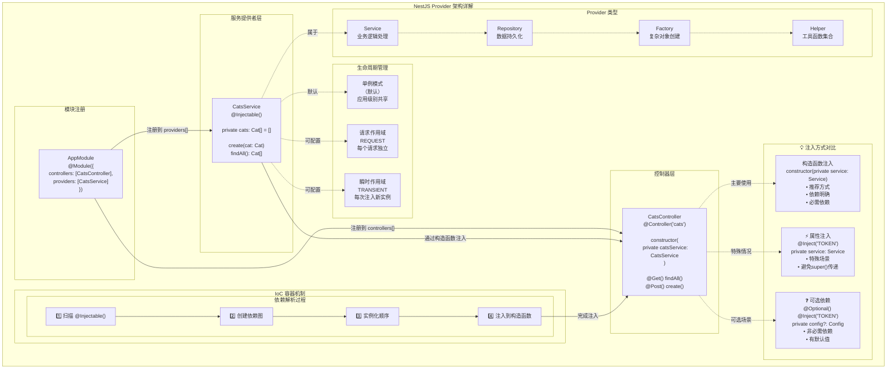

# 提供者

提供者（Provider）是 Nest 的核心概念之一。许多基础的 Nest 类，比如服务（Service）、仓库（Repository）、工厂（Factory）和辅助类（Helper），都可以被视为提供者。其核心思想是：**可以被注入为依赖项**，让对象之间建立多种关系。这些对象的“组装”工作，大多由 Nest 的运行时系统自动完成。



在上一章中，我们创建了一个简单的 `CatsController`。控制器负责处理 HTTP 请求，并将更复杂的任务委托给提供者。所谓提供者，其实就是在 NestJS 模块中通过 `providers` 声明的普通 JavaScript 类。更多细节可参考「模块」章节。

<CalloutInfo>
  由于 Nest 允许你以面向对象的方式设计和组织依赖关系，强烈建议遵循 [SOLID
  原则](https://en.wikipedia.org/wiki/SOLID)。
</CalloutInfo>

## 服务的定义与使用

我们先来创建一个简单的 `CatsService`，用于数据的存储和检索，并被 `CatsController` 调用。由于它主要负责应用的业务逻辑，非常适合被定义为一个服务提供者。

```ts filename='cats.service.ts'
import { Injectable } from '@nestjs/common'
import { Cat } from './interfaces/cat.interface'

@Injectable()
export class CatsService {
  private readonly cats: Cat[] = []

  create(cat: Cat) {
    this.cats.push(cat)
  }

  findAll(): Cat[] {
    return this.cats
  }
}
```

```js hideInDoc filename='cats.service.js'
import { Injectable } from '@nestjs/common'

@Injectable()
export class CatsService {
  constructor() {
    this.cats = []
  }

  create(cat) {
    this.cats.push(cat)
  }

  findAll() {
    return this.cats
  }
}
```

<CalloutInfo>
  <div>你可以通过 CLI 执行 `$ nest g service cats` 命令来快速创建一个服务。</div>
</CalloutInfo>

`CatsService` 是一个带有属性和两个方法的基础类，最重要的变化是添加了 `@Injectable()` 装饰器。该装饰器为类附加元数据，表明 `CatsService` 可以被 Nest [控制反转（Inversion of Control，IoC）](https://en.wikipedia.org/wiki/Inversion_of_control) 容器管理。

此外，示例中还用到了 `Cat` 接口，其定义大致如下：

```ts filename='interfaces/cat.interface.ts'
export interface Cat {
  name: string
  age: number
  breed: string
}
```

现在我们已经有了用于获取猫数据的服务类，接下来在 `CatsController` 中使用它：

```ts filename='cats.controller.ts'
import { Controller, Get, Post, Body } from '@nestjs/common'
import { CreateCatDto } from './dto/create-cat.dto'
import { CatsService } from './cats.service'
import { Cat } from './interfaces/cat.interface'

@Controller('cats')
export class CatsController {
  constructor(private catsService: CatsService) {}

  @Post()
  async create(@Body() createCatDto: CreateCatDto) {
    this.catsService.create(createCatDto)
  }

  @Get()
  async findAll(): Promise<Cat[]> {
    return this.catsService.findAll()
  }
}
```

```js hideInDoc filename='cats.controller.js'
import { Controller, Get, Post, Body, Bind, Dependencies } from '@nestjs/common'
import { CatsService } from './cats.service'

@Controller('cats')
@Dependencies(CatsService)
export class CatsController {
  constructor(catsService) {
    this.catsService = catsService
  }

  @Post()
  @Bind(Body())
  async create(createCatDto) {
    this.catsService.create(createCatDto)
  }

  @Get()
  async findAll() {
    return this.catsService.findAll()
  }
}
```

`CatsService` 通过类构造函数被注入。注意这里使用了 `private` 关键字，这是一种简写方式，可以在同一行中声明并初始化 `catsService` 成员，从而简化了代码。

## 依赖注入机制

Nest 构建于强大的设计模式 —— 依赖注入（Dependency Injection）之上。建议阅读官方 [Angular 文档](https://angular.dev/guide/di) 对该概念的精彩介绍。

在 Nest 中，得益于 TypeScript，依赖管理变得非常简单，依赖会根据类型自动解析。如下例，Nest 会自动创建并返回 `CatsService` 的实例（单例模式下返回已存在实例），并注入到控制器的构造函数中：

```ts
constructor(private catsService: CatsService) {}
```

## 提供者的作用域

提供者通常拥有与应用生命周期一致的作用域。当应用启动时，每个依赖都必须被解析，也就是每个提供者都会被实例化。应用关闭时，所有提供者都会被销毁。当然，也可以将提供者设置为**请求作用域**，即生命周期与单个请求绑定。更多内容见[注入作用域](/fundamentals/injection-scopes)章节。

## 自定义提供者

Nest 内置了控制反转（IoC）容器，用于管理提供者关系。这是依赖注入的基础，但实际上功能远不止如此。定义提供者有多种方式：可以使用普通值、类、同步或异步工厂等。更多示例见[依赖注入](/fundamentals/dependency-injection)章节。

## 可选依赖

有时，依赖项并非必须。例如，类可能依赖于一个配置对象，但如果没有提供该对象，则应使用默认值。这种情况下，该依赖被视为可选，缺少配置提供者时不会抛出错误。

要将提供者标记为可选，可以在构造函数参数上使用 `@Optional()` 装饰器：

```ts
import { Injectable, Optional, Inject } from '@nestjs/common'

@Injectable()
export class HttpService<T> {
  constructor(@Optional() @Inject('HTTP_OPTIONS') private httpClient: T) {}
}
```

上例中，使用了自定义提供者，因此需要传入 `HTTP_OPTIONS` 这个自定义**令牌（token）**。前面的示例展示了基于构造函数的注入方式。关于自定义提供者及其令牌，详见[自定义提供者](/fundamentals/custom-providers)章节。

## 属性注入方式

目前为止我们用到的都是基于构造函数的注入方式。在某些场景下，属性注入（Property-based Injection）也很有用。例如，顶层类依赖多个提供者且需通过 `super()` 层层传递时，可能会变得繁琐。此时可直接在属性上使用 `@Inject()` 装饰器：

```ts
import { Injectable, Inject } from '@nestjs/common'

@Injectable()
export class HttpService<T> {
  @Inject('HTTP_OPTIONS')
  private readonly httpClient: T
}
```

<CalloutInfo type="warning">
  如果类没有继承其他类，通常建议优先使用**基于构造函数**的注入方式。构造函数能清晰表明所需依赖，有助于提升代码可读性和可维护性，相比用
  `@Inject` 注解的类属性更直观。
</CalloutInfo>

## 注册提供者

现在我们已经定义了一个提供者（`CatsService`）和一个消费者（`CatsController`），接下来需要将服务注册到 Nest 中，这样它才能被正确注入。只需编辑模块文件（`app.module.ts`），将服务添加到 `@Module()` 装饰器的 `providers` 数组即可：

```ts filename='app.module.ts'
import { Module } from '@nestjs/common'
import { CatsController } from './cats/cats.controller'
import { CatsService } from './cats/cats.service'

@Module({
  controllers: [CatsController],
  providers: [CatsService],
})
export class AppModule {}
```

这样，Nest 就能解析 `CatsController` 的依赖了。

此时，我们的目录结构应如下所示：

<FileTree
  data={[
    {
      name: 'src',
      children: [
        {
          name: 'cats',
          children: [
            { name: 'dto', children: [{ name: 'create-cat.dto.ts' }] },
            { name: 'interfaces', children: [{ name: 'cat.interface.ts' }] },
            { name: 'cats.controller.ts' },
            { name: 'cats.service.ts' },
          ],
        },
        { name: 'app.module.ts' },
        { name: 'main.ts' },
      ],
    },
  ]}
/>

## 手动实例化提供者

前文介绍了 Nest 如何自动处理依赖解析。但在某些情况下，你可能需要绕过内置依赖注入系统，手动获取或实例化提供者。常见方式有：

- 若需动态获取现有实例或实例化提供者，可使用[模块引用](/fundamentals/module-ref)。
- 若需在 `bootstrap()` 函数中获取提供者（如独立应用或启动阶段用配置服务），请参考[独立应用（Standalone applications）](/standalone-applications)。
