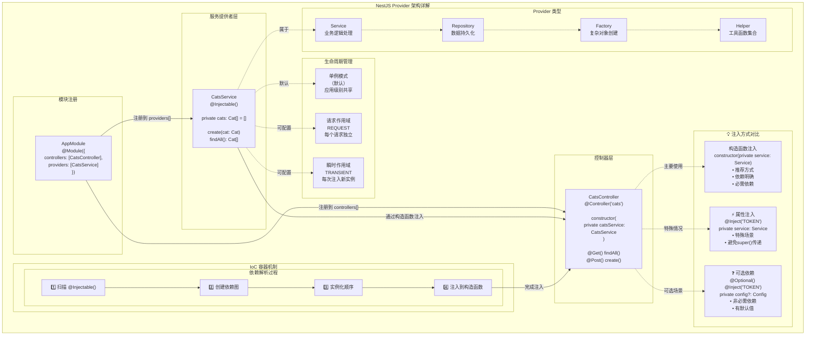

# 提供者

**提供者**（Provider）是 Nest 框架的核心概念之一。在 Nest 中，服务（Service）、仓库（Repository）、工厂（Factory）以及各种工具类（Helper）等，本质上都属于提供者。其核心理念是：**作为依赖注入的目标，实现对象之间的解耦与协作**。这种依赖关系的管理与注入，大多由 Nest 的运行时系统自动完成，无需手动组装。



在上一章中，我们创建了一个用于接收和处理客户端 HTTP 请求的 `CatsController`。然而，复杂的业务逻辑通常不宜直接堆积在控制器中，而应交由专门的提供者处理。在 Nest 中，任何在模块的 `providers` 数组中注册的普通类，都可以作为提供者被注入和使用。关于模块的详细内容，请参考后续的[模块](/modules)章节。

<CalloutInfo title="实用知识">
  由于 Nest
  天然支持面向对象的设计思想，开发者可以以清晰、优雅的方式组织和管理依赖关系。建议在设计服务或提供者时，遵循
  [SOLID
  原则](https://zh.wikipedia.org/wiki/SOLID_(面向对象设计)))，以提升代码的可维护性与扩展性。
</CalloutInfo>

## 定义与使用服务

接下来，我们将创建一个简单的 `CatsService`，用于封装猫咪数据的存储与读取逻辑，并在控制器中调用。由于服务专注于处理业务逻辑，因此非常适合被设计为一个**服务提供者**。

```ts filename='cats.service.ts'
import { Injectable } from '@nestjs/common'
import { Cat } from './interfaces/cat.interface'

@Injectable()
export class CatsService {
  private readonly cats: Cat[] = []

  create(cat: Cat) {
    this.cats.push(cat)
  }

  findAll(): Cat[] {
    return this.cats
  }
}
```

<CalloutInfo>
  你可以使用 CLI 命令 `nest g service cats` 快速生成服务文件和相关模板。
</CalloutInfo>

上面的 `CatsService` 是一个包含属性与方法的基础类，其中最关键的是使用了 `@Injectable()` 装饰器。该装饰器用于标记当前类为可注入的服务，Nest 会为其附加必要的元数据，以便将其实例交由框架的[控制反转](https://zh.wikipedia.org/wiki/控制反转)（Inversion of Control，简称 IoC）容器统一管理。

此外，示例中引用了一个名为 `Cat` 的接口，其定义如下：

```ts filename='interfaces/cat.interface.ts'
export interface Cat {
  name: string
  age: number
  breed: string
}
```

完成服务定义后，我们便可以在控制器中注入并使用它：

```ts filename='cats.controller.ts'
import { Controller, Get, Post, Body } from '@nestjs/common'
import { CreateCatDto } from './dto/create-cat.dto'
import { CatsService } from './cats.service'
import { Cat } from './interfaces/cat.interface'

@Controller('cats')
export class CatsController {
  constructor(private catsService: CatsService) {}

  @Post()
  async create(@Body() createCatDto: CreateCatDto) {
    this.catsService.create(createCatDto)
  }

  @Get()
  async findAll(): Promise<Cat[]> {
    return this.catsService.findAll()
  }
}
```

在控制器中，`CatsService` 通过构造函数注入。这里使用的 `private` 关键字不仅表示 `catsService` 是一个私有属性，还能让 TypeScript 自动为我们声明并初始化该属性，简化了代码结构。

## 依赖注入机制

Nest 框架的核心构建理念之一是**依赖注入**（Dependency Injection，简称 DI） —— 这是一种久经验证的软件设计模式，旨在提升模块间的解耦性与可测试性。建议参考[官方 Angular 文档](https://angular.dev/guide/di)，其中对该模式有深入且通俗的讲解。

在 Nest 中，借助 TypeScript 强大的类型系统，依赖注入的实现变得尤为简洁高效。框架会根据构造函数参数的类型自动解析并注入对应的依赖，无需显式配置。例如，Nest 会自动创建 `CatsService` 的实例（在默认的单例作用域下复用同一个实例），并将其注入至控制器中：

```ts
constructor(private catsService: CatsService) {}
```

通过这种方式，开发者可以专注于业务逻辑，而无需关心依赖的实例化细节，极大提升了开发效率与代码可维护性。

## 提供者的作用域

在 Nest 中，提供者默认拥有**全局作用域**，其生命周期与整个应用保持一致：应用启动时，所有依赖会被统一解析并实例化；应用关闭时，相关的提供者也会随之销毁。

除了全局作用域，Nest 还支持**请求作用域**。设置为请求作用域后，提供者会为每个进入的 HTTP 请求创建全新的实例，实现请求级别的隔离与状态管理。更多详情可参考[依赖注入的作用域](/fundamentals/injection-scopes)章节。

## 自定义提供者

Nest 构建在控制反转（IoC）容器之上，用于集中管理应用中的依赖关系。这一机制不仅是依赖注入的核心基础，也为开发者提供了极高的灵活性与可扩展性。

你可以通过多种方式自定义提供者，例如：直接提供一个值、绑定到某个类、使用同步或异步的工厂函数等。具体示例和用法请参阅后续的[自定义提供者](/fundamentals/custom-providers)章节。

## 可选依赖

在实际开发中，并非所有依赖都是必需的。有些类可能依赖一个配置对象，但即使该对象未被提供，程序也应能正常运行，并使用默认配置作为回退。这类不会影响核心功能、具备可选性的依赖被称为**可选依赖**。对于此类情况，Nest 在运行时不会因依赖缺失而抛出错误。

要声明某个依赖为可选，可以使用 `@Optional()` 装饰器将其标记为构造函数参数：

```ts
import { Injectable, Optional, Inject } from '@nestjs/common'

@Injectable()
export class HttpService<T> {
  constructor(@Optional() @Inject('HTTP_OPTIONS') private httpClient: T) {}
}
```

在上面的示例中，`HttpService` 依赖于一个名为 `'HTTP_OPTIONS'` 的自定义提供者。由于使用了字符串令牌进行注入，因此需要配合 `@Inject()` 装饰器显式声明。

关于自定义提供者与令牌机制的更多信息，请参阅[自定义提供者](/fundamentals/custom-providers) 一章。

## 属性注入（Property-based Injection）

在前面的示例中，我们始终采用的是**构造函数注入** —— 这是 Nest 官方推荐的默认依赖注入方式。然而，在某些特定场景下，**属性注入**也能发挥独特作用。

例如：当类的层级较深，构造函数需要逐层传递多个依赖时，构造函数参数容易变得冗长、杂乱，影响可读性。此时，可以使用 `@Inject()` 装饰器，将依赖直接注入到类的属性上：

```ts
import { Injectable, Inject } from '@nestjs/common'

@Injectable()
export class HttpService<T> {
  @Inject('HTTP_OPTIONS')
  private readonly httpClient: T
}
```

<CalloutInfo type="success" title="实用建议">
  尽管属性注入在某些情况下更灵活，**但在类未继承其他基类的前提下，仍建议优先使用构造函数注入**。构造函数能显式展示类的依赖项，有助于提升代码的可读性、可维护性以及类型安全性，相比属性注入更为清晰直观。
</CalloutInfo>

## 注册提供者

到目前为止，我们已经定义了一个服务（`CatsService`）和一个控制器（`CatsController`）。接下来，需要将该服务注册到 Nest 的依赖注入容器中，使其能够在应用中被自动解析和注入使用。

只需在模块文件（`app.module.ts`）中，将 `CatsService` 添加到 `@Module()` 装饰器的 `providers` 数组中，示例如下：

```ts filename='app.module.ts'
import { Module } from '@nestjs/common'
import { CatsController } from './cats/cats.controller'
import { CatsService } from './cats/cats.service'

@Module({
  controllers: [CatsController],
  providers: [CatsService],
})
export class AppModule {}
```

完成注册后，Nest 会在创建 `CatsController` 实例时，自动注入对应的 `CatsService`，无需手动实例化。

此时，项目的目录结构大致如下所示：

<FileTree
  data={[
    {
      name: 'src',
      children: [
        {
          name: 'cats',
          children: [
            { name: 'dto', children: [{ name: 'create-cat.dto.ts' }] },
            { name: 'interfaces', children: [{ name: 'cat.interface.ts' }] },
            { name: 'cats.controller.ts' },
            { name: 'cats.service.ts' },
          ],
        },
        { name: 'app.module.ts' },
        { name: 'main.ts' },
      ],
    },
  ]}
/>

## 手动获取或实例化提供者

在大多数情况下，Nest 会自动解析并注入所需的依赖。然而，在某些特殊场景中，你可能希望绕过框架默认的依赖注入机制，手动获取或创建某个提供者实例。

常见的做法包括：

- 使用模块引用（ModuleRef）：当你需要动态获取某个已注册的实例，或希望手动创建一个新的提供者实例时，可以通过 `ModuleRef` 来实现。详细说明见：[模块引用](/fundamentals/module-ref)。
- 在应用启动阶段访问提供者：如果你希望在 `bootstrap()` 函数中访问某个服务（例如在独立应用中使用配置服务 `ConfigService`），请参考：[独立应用](/standalone-applications)。
