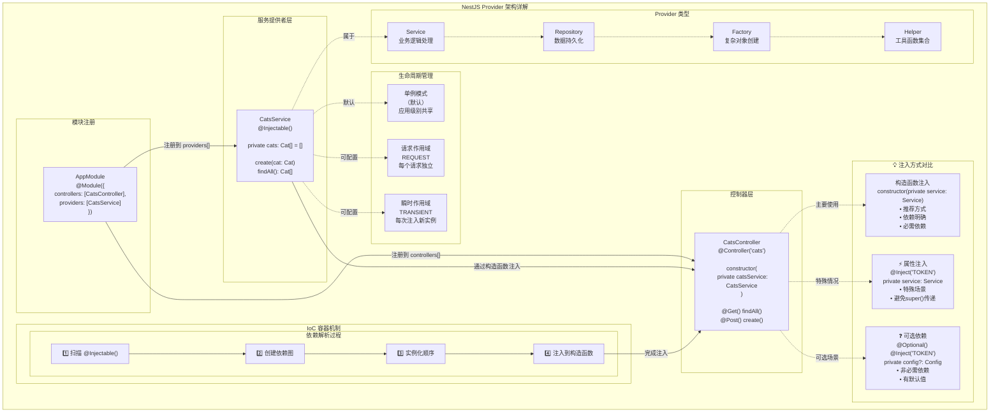

# 提供者

提供者（Provider）是 Nest 框架的核心概念之一。许多常见的基础类——如服务（Service）、仓库（Repository）、工厂（Factory）以及辅助类（Helper），本质上都属于提供者的范畴。其核心理念在于：**可以被注入为依赖项**，从而使对象之间能够灵活地建立关联关系。这些对象的依赖组装工作，大多由 Nest 的运行时系统自动完成。



在上一章中，我们创建了一个简单的 `CatsController`，它用于接收并处理来自客户端的 HTTP 请求，但更复杂的任务通常应交由专门的提供者来完成。所谓“提供者”，其实就是在 Nest 模块中通过 `providers` 数组声明的普通 JavaScript 类。关于模块的更多内容，可参考后续的[模块](/modules)章节。

<CalloutInfo>
  得益于 Nest
  对面向对象设计理念的支持，开发者可以优雅地组织和管理依赖关系。强烈建议在设计服务和提供者时遵循
  [SOLID 原则](https://en.wikipedia.org/wiki/SOLID)。
</CalloutInfo>

## 服务的定义与使用

下面我们来创建一个简单的 `CatsService`，用于实现对猫数据的存储与读取功能，并供控制器调用。由于它主要负责处理应用的业务逻辑，因此非常适合被设计为一个服务提供者。

```ts filename='cats.service.ts'
import { Injectable } from '@nestjs/common'
import { Cat } from './interfaces/cat.interface'

@Injectable()
export class CatsService {
  private readonly cats: Cat[] = []

  create(cat: Cat) {
    this.cats.push(cat)
  }

  findAll(): Cat[] {
    return this.cats
  }
}
```

<CalloutInfo>
  <div>你可以通过 CLI 命令 `nest g service cats` 快速生成一个服务模板。</div>
</CalloutInfo>

`CatsService` 是一个包含属性和两个方法的基础类，最关键的特征是它使用了 `@Injectable()` 装饰器。该装饰器用于为类添加元数据，标识该类可以被 Nest 的[控制反转（Inversion of Control，IoC）](https://en.wikipedia.org/wiki/Inversion_of_control)容器所管理。

此外，示例中还引用了一个名为 `Cat` 的接口，其定义如下：

```ts filename='interfaces/cat.interface.ts'
export interface Cat {
  name: string
  age: number
  breed: string
}
```

当服务定义完成后，我们就可以在控制器中注入并使用它：

```ts filename='cats.controller.ts'
import { Controller, Get, Post, Body } from '@nestjs/common'
import { CreateCatDto } from './dto/create-cat.dto'
import { CatsService } from './cats.service'
import { Cat } from './interfaces/cat.interface'

@Controller('cats')
export class CatsController {
  constructor(private catsService: CatsService) {}

  @Post()
  async create(@Body() createCatDto: CreateCatDto) {
    this.catsService.create(createCatDto)
  }

  @Get()
  async findAll(): Promise<Cat[]> {
    return this.catsService.findAll()
  }
}
```

`CatsService` 通过构造函数注入到控制器中。值得注意的是，这里使用了 `private` 关键字，它不仅用于修饰构造函数参数，还能自动声明并初始化 `catsService` 成员变量，从而简化了代码编写。

## 依赖注入机制

Nest 构建于一种强大的软件设计模式 —— 依赖注入（Dependency Injection, DI）之上。推荐阅读官方 [Angular 文档](https://angular.dev/guide/di) 对该概念的精彩解析。

在 Nest 中，依赖管理得益于 TypeScript 的强类型系统变得尤为简洁。框架会根据类型信息自动解析并注入依赖。如下所示，Nest 会自动创建 `CatsService` 的实例（在单例模式下返回已存在实例），并注入到控制器的构造函数中：

```ts
constructor(private catsService: CatsService) {}
```

## 提供者的作用域

提供者通常具有与应用生命周期一致的作用域。当应用启动时，所有依赖都会被解析并实例化；在应用关闭时，相应的提供者也会被销毁。

除了默认的全局作用域，Nest 还支持设置为**请求作用域**，即提供者的生命周期与单个请求绑定。更多内容详见[注入作用域](/fundamentals/injection-scopes)章节。

## 自定义提供者

Nest 内置了一个控制反转（IoC）容器，用于管理依赖关系。这不仅是依赖注入的核心机制，也为我们提供了高度灵活的依赖注册能力。

你可以通过多种方式自定义提供者：包括使用值、类、同步工厂函数或异步工厂函数等。详见[依赖注入](/fundamentals/dependency-injection)章节中的示例。

## 可选依赖

有时，某些依赖并非必需。例如，某个类可能依赖于一个配置对象，但当该对象未提供时，应当退回默认值。这类依赖就属于可选依赖，在未注入时不会抛出错误。

你可以使用 `@Optional()` 装饰器将某个构造函数参数标记为可选：

```ts
import { Injectable, Optional, Inject } from '@nestjs/common'

@Injectable()
export class HttpService<T> {
  constructor(@Optional() @Inject('HTTP_OPTIONS') private httpClient: T) {}
}
```

上述示例中，使用了自定义提供者，因此需要通过**令牌**（Token） `'HTTP_OPTIONS'` 显式注入。前面的示例演示了构造函数注入的基本用法，关于自定义提供者及其令牌的更多内容，请参考[自定义提供者](/fundamentals/custom-providers) 章节。

## 属性注入方式

前文示例均采用**构造函数注入**，这是 Nest 推荐的默认注入方式。但在某些特殊场景下，属性注入（Property-based Injection）也非常有用。

比如，当类层级较深、构造函数需要层层透传多个依赖时，构造函数会变得冗长而繁琐。此时，可以直接在属性上使用 `@Inject()` 进行注入：

```ts
import { Injectable, Inject } from '@nestjs/common'

@Injectable()
export class HttpService<T> {
  @Inject('HTTP_OPTIONS')
  private readonly httpClient: T
}
```

<CalloutInfo type="warning">
  如果类没有继承其他类，**仍推荐优先使用构造函数注入**。构造函数能清晰表达类的依赖，有助于提升代码的可读性和可维护性，相比属性注入更直观明确。
</CalloutInfo>

## 注册提供者

目前我们已经定义了一个提供者（`CatsService`）和一个消费者（`CatsController`），接下来需要将该服务注册到 Nest 的依赖注入系统中，以便它能被正常注入和使用。

你只需在模块文件（`app.module.ts`）中，将该服务添加到 `@Module()` 装饰器的 `providers` 数组中，代码如下：

```ts filename='app.module.ts'
import { Module } from '@nestjs/common'
import { CatsController } from './cats/cats.controller'
import { CatsService } from './cats/cats.service'

@Module({
  controllers: [CatsController],
  providers: [CatsService],
})
export class AppModule {}
```

完成以上操作后，Nest 就能自动解析 `CatsController` 所依赖的 `CatsService` 实例。

此时，项目目录结构应如下所示：

<FileTree
  data={[
    {
      name: 'src',
      children: [
        {
          name: 'cats',
          children: [
            { name: 'dto', children: [{ name: 'create-cat.dto.ts' }] },
            { name: 'interfaces', children: [{ name: 'cat.interface.ts' }] },
            { name: 'cats.controller.ts' },
            { name: 'cats.service.ts' },
          ],
        },
        { name: 'app.module.ts' },
        { name: 'main.ts' },
      ],
    },
  ]}
/>

## 手动实例化提供者

前文中我们提到，Nest 能够自动解析依赖。但在某些特定场景下，你可能希望绕过框架内置的依赖注入机制，手动获取或实例化提供者。

常见方式包括：

- 若需动态获取某个已有实例或创建一个新的提供者实例，可使用[模块引用](/fundamentals/module-ref)。
- 若需在 `bootstrap()` 函数中获取提供者（如在独立应用中使用配置服务），请参考[独立应用](/standalone-applications)。
