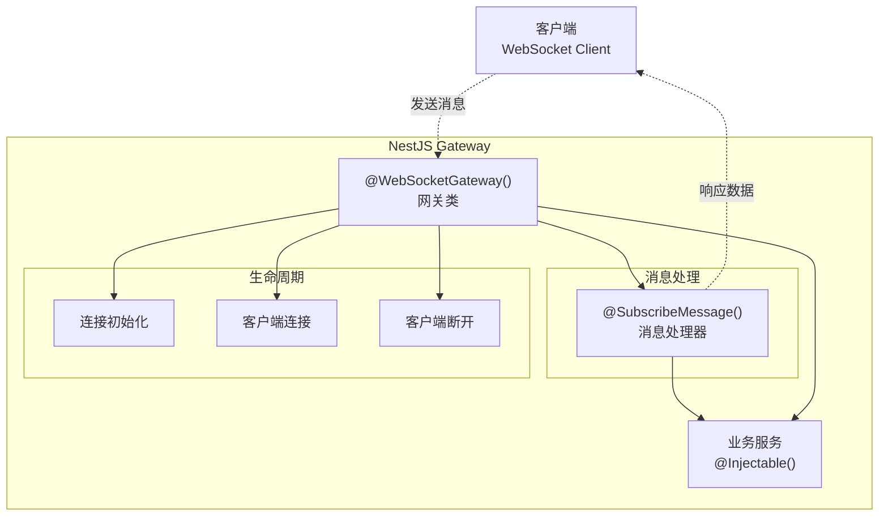

# 网关

本指南其他部分讨论的大多数概念，例如依赖注入、装饰器、异常过滤器、管道、守卫和拦截器，同样适用于网关（Gateway）。Nest 尽可能地对实现细节进行了抽象，使得相同的组件能够在基于 HTTP 的平台、WebSocket 通信和微服务之间通用。本节将介绍 Nest 针对 WebSocket 通信的专有内容。

在 Nest 中，网关其实就是一个使用 `@WebSocketGateway()` 装饰器标记的类。从技术角度来看，网关是平台无关的，这意味着只要实现了适配器（Adapter），它就可以兼容任何 WebSocket 库。目前，Nest 原生支持两种 WebSocket 平台：[socket.io](https://github.com/socketio/socket.io) 和 [ws](https://github.com/websockets/ws)。你可以根据实际需求选择最适合的方案。当然，你也可以按照[本指南](/websockets/adapter)自定义实现自己的适配器。



<CalloutInfo>
  网关可以被视为[提供者](/providers)，这意味着他们可以通过类构造函数注入依赖。同时，网关也可以被其他类（如提供者和控制器）注入使用。
</CalloutInfo>

## 安装

要开始构建基于 WebSocket 通信的应用，首先需要安装相关依赖包：

```bash
$ npm i --save @nestjs/websockets @nestjs/platform-socket.io
```

## 概述

通常情况下，每个网关都会监听与 **HTTP 服务器**相同的端口，除非你的应用不是一个 Web 应用，或者你手动更改了端口。你可以通过为 `@WebSocketGateway(80)` 装饰器传递参数（如 `80`，即你选择的端口号）来修改这一默认行为。你还可以通过如下方式为网关设置一个[命名空间（namespace）](https://socket.io/docs/v4/namespaces/)：

```ts
@WebSocketGateway(80, { namespace: 'events' })
```

<CalloutInfo type="warning">
  只有当网关被引用到某个已存在模块（Module）的 providers 数组中时，网关才会被实例化。
</CalloutInfo>

你可以将任何受支持的[选项（option）](https://socket.io/docs/v4/server-options/) 作为第二个参数传递给 `@WebSocketGateway()` 装饰器，例如：

```ts
@WebSocketGateway(81, { transports: ['websocket'] })
```

此时，网关已经开始监听，但我们还没有订阅任何传入消息。接下来，我们创建一个处理器（handler），用于订阅 `events` 消息，并将收到的数据原样返回给用户。

```ts filename='events.gateway.ts'
@SubscribeMessage('events')
handleEvent(@MessageBody() data: string): string {
  return data;
}
```

<CalloutInfo>
  `@SubscribeMessage()` 和 `@MessageBody()` 装饰器需从 `@nestjs/websockets` 包中导入。
</CalloutInfo>

网关创建完成后，我们可以在模块中注册它。

```ts filename='events.module.ts'
import { Module } from '@nestjs/common'
import { EventsGateway } from './events.gateway'

@Module({
  providers: [EventsGateway],
})
export class EventsModule {}
```

你还可以为装饰器传递属性键（property key），以便从传入的消息体中提取对应属性：

```ts filename='events.gateway.ts'
@SubscribeMessage('events')
handleEvent(@MessageBody('id') id: number): number {
  // id === messageBody.id
  return id;
}
```

如果你不想使用装饰器，也可以采用如下等效写法：

```ts filename='events.gateway.ts'
@SubscribeMessage('events')
handleEvent(client: Socket, data: string): string {
  return data;
}
```

在上述示例中，`handleEvent()` 方法接收两个参数。第一个参数是平台相关的 [socket 实例](https://socket.io/docs/v4/server-api/#socket)，第二个参数是客户端发送的数据。但这种方式并不推荐，因为在每次单元测试时都需要模拟 socket 实例。

当收到 `events` 消息时，处理器会用相同的数据进行响应。此外，你还可以通过特定库的方法（如 `client.emit()`）主动发送消息。要访问已连接的 socket 实例，可以使用 `@ConnectedSocket()` 装饰器。

```ts filename='events.gateway.ts'
@SubscribeMessage('events')
handleEvent(
  @MessageBody() data: string,
  @ConnectedSocket() client: Socket,
): string {
  return data;
}
```

<CalloutInfo>
  <div>`@ConnectedSocket()` 装饰器需从 `@nestjs/websockets` 包中导入。</div>
</CalloutInfo>

但需要注意，这种情况下你将无法使用拦截器。如果你不需要响应用户，可以省略 `return` 语句（或显式返回 `undefined` 等“假值”）。

现在，当客户端这样发送消息时：

```ts
socket.emit('events', { name: 'Nest' })
```

`handleEvent()` 方法就会被执行。若要监听处理器内部主动发送的消息，客户端需要添加对应的回调函数：

```ts
socket.emit('events', { name: 'Nest' }, (data) => console.log(data))
```

## 多次响应

确认消息只会被分发一次。此外，原生 WebSocket 实现并不支持该特性。为了解决这个限制，你可以返回一个包含两个属性的对象：`event`（要发送的事件名称）和 `data`（需要转发给客户端的数据）。

```ts filename='events.gateway.ts'
@SubscribeMessage('events')
handleEvent(@MessageBody() data: unknown): WsResponse<unknown> {
  const event = 'events';
  return { event, data };
}
```

<CalloutInfo>
  <div>`WsResponse` 接口从 `@nestjs/websockets` 包中导入。</div>
</CalloutInfo>

<CalloutInfo type="warning">
  如果你的 `data` 字段依赖于 `ClassSerializerInterceptor`，你应该返回一个实现了 `WsResponse`
  的类实例，因为该拦截器会忽略普通的 JavaScript 对象响应。
</CalloutInfo>

为了监听传入的响应，客户端需要添加另一个事件监听器。

```ts
socket.on('events', (data) => console.log(data))
```

## 异步响应

消息处理器（message handler）既可以同步响应，也可以**异步**响应。因此，`async` 方法是被支持的。消息处理器还可以返回一个 `Observable`（可观察对象），此时结果值会在流（stream）结束前持续发出。

```ts filename='events.gateway.ts'
@SubscribeMessage('events')
onEvent(@MessageBody() data: unknown): Observable<WsResponse<number>> {
  const event = 'events';
  const response = [1, 2, 3];

  return from(response).pipe(
    map(data => ({ event, data })),
  );
}
```

在上面的示例中，消息处理器会**响应 3 次**（每次响应数组中的一个元素）。

## 生命周期钩子（Lifecycle Hook）

NestJS 提供了 3 个非常实用的生命周期钩子。他们都有对应的接口，具体说明如下表：

| 接口                  | 说明                                                                                                |
| --------------------- | --------------------------------------------------------------------------------------------------- |
| `OnGatewayInit`       | 要求实现 `afterInit()` 方法。该方法会接收特定库的服务器实例作为参数（如有需要，也可接收其他参数）。 |
| `OnGatewayConnection` | 要求实现 `handleConnection()` 方法。该方法会接收特定库的客户端 socket 实例作为参数。                |
| `OnGatewayDisconnect` | 要求实现 `handleDisconnect()` 方法。该方法会接收特定库的客户端 socket 实例作为参数。                |

<CalloutInfo>
  <div>每个生命周期接口都由 `@nestjs/websockets` 包导出。</div>
</CalloutInfo>

## 服务器与命名空间

有时，你可能希望直接访问底层的**平台相关**服务器实例。该对象的引用会作为参数传递给 `afterInit()` 方法（`OnGatewayInit` 接口）。另一种方式是使用 `@WebSocketServer()` 装饰器。

```ts
@WebSocketServer()
server: Server;
```

你也可以通过 `namespace` 属性获取对应的命名空间，示例如下：

```ts
@WebSocketServer({ namespace: 'my-namespace' })
namespace: Namespace;
```

<CalloutInfo>
  <div>`@WebSocketServer()` 装饰器需从 `@nestjs/websockets` 包中导入。</div>
</CalloutInfo>

Nest 会在服务器实例准备就绪后，自动将其实例赋值到该属性。

## 示例

你可以在[这里](https://github.com/nestjs/nest/tree/master/sample/02-gateways)查看完整示例。
